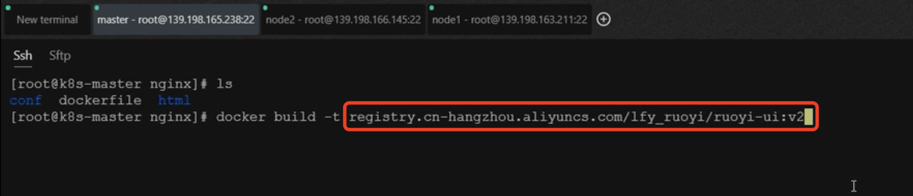
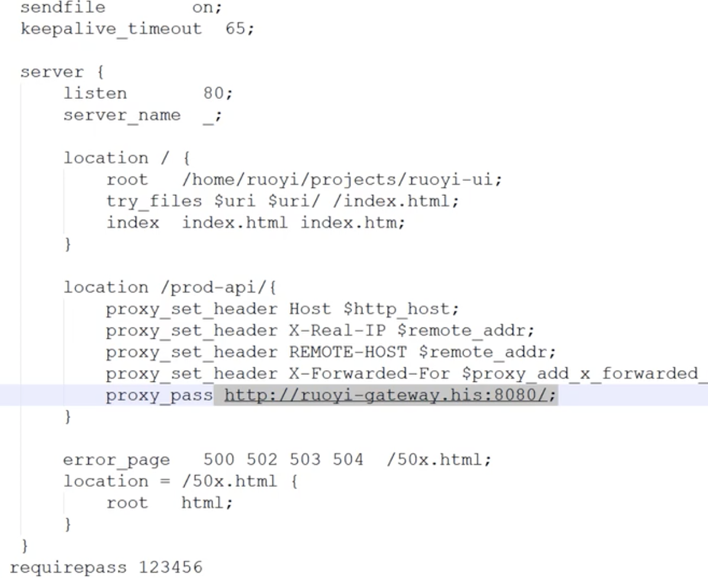

# 36.kubernetes应用部署实战-Java微服务上云-前端上云&测试

​	我们前面把所有的微服务和网关都部署好了，现在就差前端UI的部署了

​	首先ruoyi-ui是使用vue写的，他的打包方式和我们java的不一样

​	其实无论是什么语言写的对于我们上云无非就是这么几步

​		1.把写的代码打成制品包，无论是jar包还是什么

​		2.然后制作成镜像

​		3.然后在云上部署

​	所以我们前端语言呢，打成的包其实是一些页面，css，js等文件程序，然后制作成镜像，这个镜像其实就是nginx镜像--我们做好页面交给nginx运行就可以了，然后最终上云部署

我们使用这个发布命令

其实运行的就是这个命令

​	打包前我们需要在vue.config配置一下devServer，里面配置的代理--使用线上的环境网关地址

打包：

打完之后会提示包在dist中，这个dist就是打包好的文件

​	我们将这个dist文件单独拿出来--dist就是我们前端项目真正的内容，而把这些内容交给我们的nginx就行了，nginx能展示所有的页面

​	在ruoyi的项目中有一个nginx的打包模板

我们查看这个dockerfile发现 是将这个打包好的dist文件放到html路径下

路径是这样的

我们还需要修改一下nginx.conf配置文件

​	nginx我们的server_name，配置为_这个意思就是无论你的请求来自哪里我的nginx都来处理，所有的80端口请求到这个nginx都会给处理

​	这个处理的请求就会给打到/prod-api/那么最终请求的就是 ruoyi项目的网关地址，所以网关地址是哪个我们就改为哪个地址，使用生产环境的网关地址

配置好网关地址：

我们现在做成压缩包传给服务器

我们使用sftp直接拖上来

解压缩包--然后cd到nginx文件夹下

我们现在就规划好镜像名称是阿里云的名称

​	后面还得加-f 指定dockerfile 然后还有个点，点代表在当前目录进行工作

​	推送镜像到阿里云镜像仓库

#### 开始部署UI前端服务

​	服务-无状态服务

获取镜像--其实这个镜像就是nginx拖的前端页面

使用80端口--然后同步主机时区

​	一直下一步，这里注意下，我们需要外网访问--外网暴露

服务创建好了

我们查看日志--也算启动成功

我们可以看到对外暴露的30842端口

我们访问一下--没有问题

登录--首先验证码可以切换那就没什么大问题-因为每个切换都需要给后台发请求

​	登录成功没有问题

​	比如我们创建一个用户试试，创建用户会在线上的数据库保存数据

我们连接线上数据库查看一下，没有问题

​	我们捋一下思路：首先ruoyi的前端是一个nginx项目，我们把这个nginx部署上之后呢，在nginx里面配置了nginx.conf中的server_name为_接收所有的访问此nginx的请求，然后配置了只要到生产环境的请求我们就代理到网关服务

​	而且我们网关在vue.config.js中也配置了一次

​	请求进来，会随便的打到我们集群暴露的端口的节点上，然后进入UI前端，前端界面再交给网关，网关再负载均衡到其他微服务，每个微服务再操作数据库

​	而且整个过程只有前端对外暴露了ip及端口，剩下都是集群内的地址

​		集群内访问地址的优势是：1、访问速度快，2、免流量

我们现在只是部署了一个ruoyi的大框架，但是一些真正的项目上云还需要解决更多的问题，我们现在手工的这么操作也是容错率比较低，迭代起来也比较慢，所以我们未来就期望有没有一个自动化的工程，能够帮助我们把这些所有的部署工作都自动化的做了

​	未来我们希望只要我们有发布版本，我们给github提交发布版本，这些机器就会自动化的把代码拉取过来，给我们自动的打包，制作镜像，然后给我们部署

​	虽然我们现在使用这个kubesphere感觉点点点也很快，但是如果一旦面对大量应用，我们的微服务有成千上百个这样手工部署就太慢了

https://www.bilibili.com/video/BV13Q4y1C7hS?p=104&spm_id_from=pageDriver&vd_source=243ad3a9b323313aa1441e5dd414a4ef

