# 37.kubernetes应用部署实战-nacos的存活探针

​		我们已经将ruoyi的分布式系统部署完成，但是有一个问题，就是我们在某一次关机再开机之后发现有一些应用出现了异常的情况--这三个微服务报错

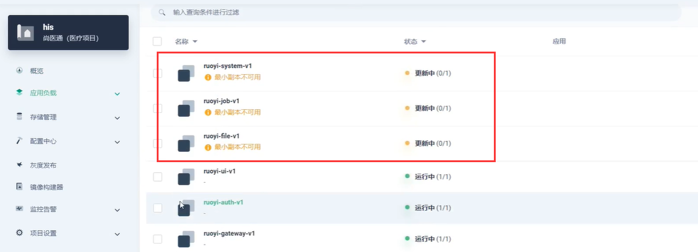

​		而报错的原因--我们排查，是在部署**有状态的副本集**中的Nacos的问题，因为我们现在的Nacos是连向数据库的，如果我们关机在开机之后可能会导致 Nacos服务启动去访问数据库，但可能数据库还没有准备就绪，就会导致Nacos无法连接到数据库，这样就会出现服务的异常情况。

​		而且在数据库恢复正常运行后，Nacos也不会尝试重新连接数据库

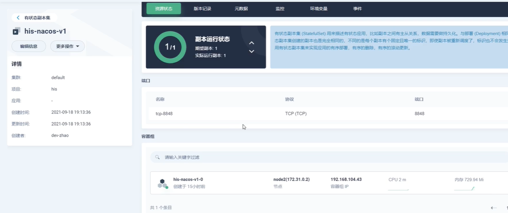

​	所以Nacos的服务中就会看到有 No DataSource set 没有数据库的报错

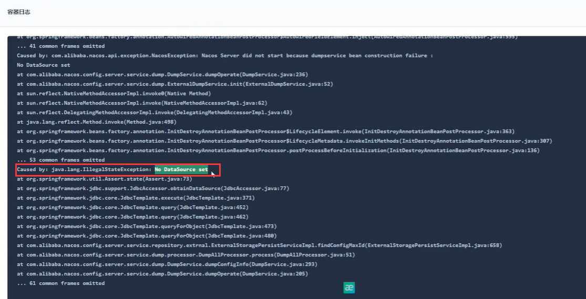

​	如果Nacos无法正常使用，那么我们的服务将会有大面积的不可用

#### 1、解决Nacos连接数据库的问题

​		我们如何解决呢？我们的思路是能不能等到数据库启动成功后，我们再让Nacos启动Pod，按顺序启动这个有点麻烦

​		另外的解决方案是，比如我们让k8s启动Nacos-pod的时候，我们明确的告诉k8s，Nacos在什么情况下才算是真正的启动成功，如果Nacos没有启动成功，我们就让k8s重试，我们通过请求来判断Nacos是否启动成功，如果是启动失败就让k8s把这个Pod重新启动---这个机制叫**健康检查机制**

​		健康检查机制，可以让k8s不断的给这个pod发送请求，比如我们每隔1秒就由k8s发起一个请求，只要这个请求是通过的那么这个Pod就是健康的，如果不通过就说明这个pod有问题，k8s就会不断的让他尝试重启

​	我们现在在Nacos中编辑配置模板

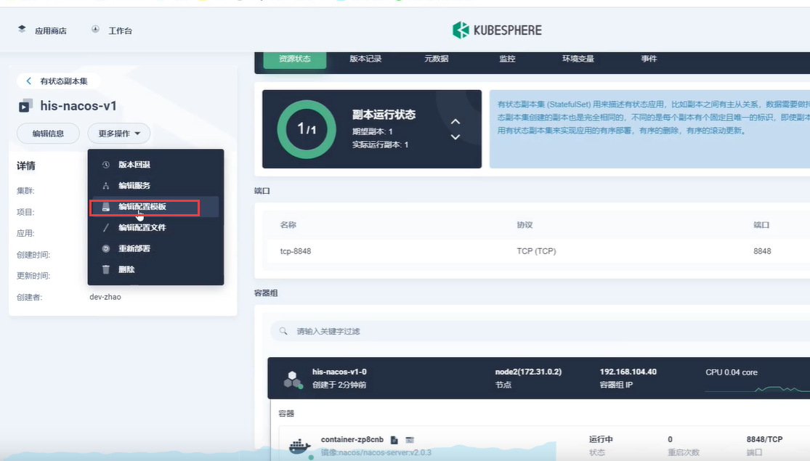

​	然后在容器组模板--点击编辑

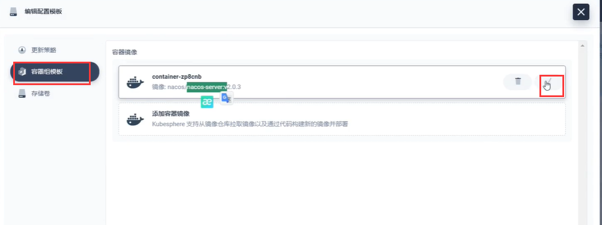

​	滑到下面--我们勾选一下**健康检查器**--然后是容器就绪检查

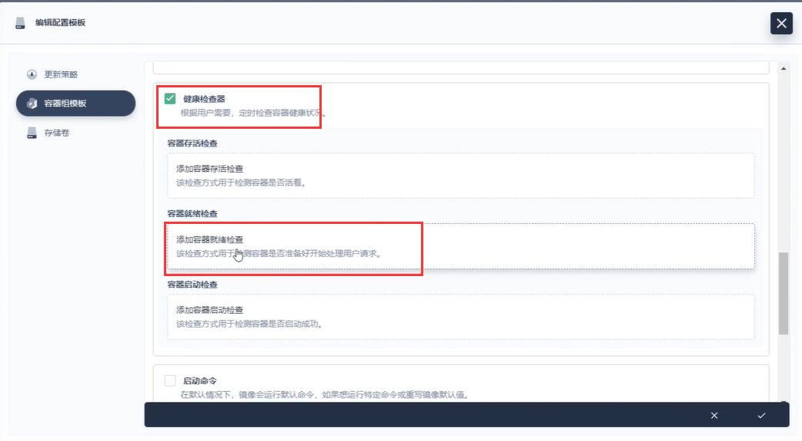

​		这个就绪检查--如果就绪了说明可以接收到我们的请求了，我们现在就绪不是特别重要，我们现在主要是判断是否存活，如果Nacos的8848端口没有访问通就算是Nacos没有存活

​	我们选择容器存活检查

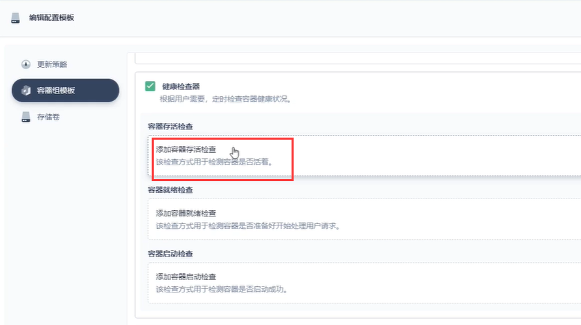

​	设置请求路径及端口，然后设置延迟20秒后开始检查存活，超时时间我们设置个3秒

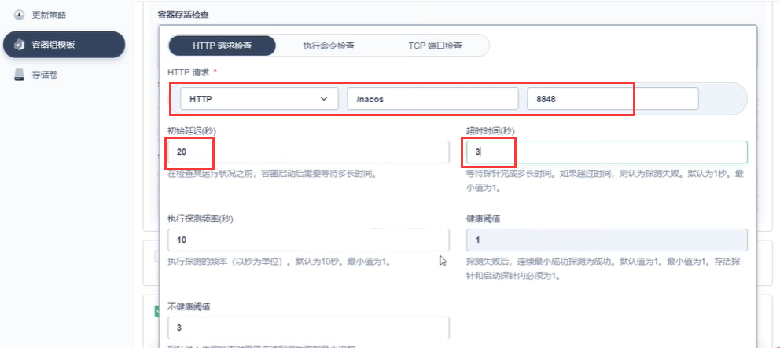

​	探测频率10--就算每隔10秒发送一次请求--然后点击对勾

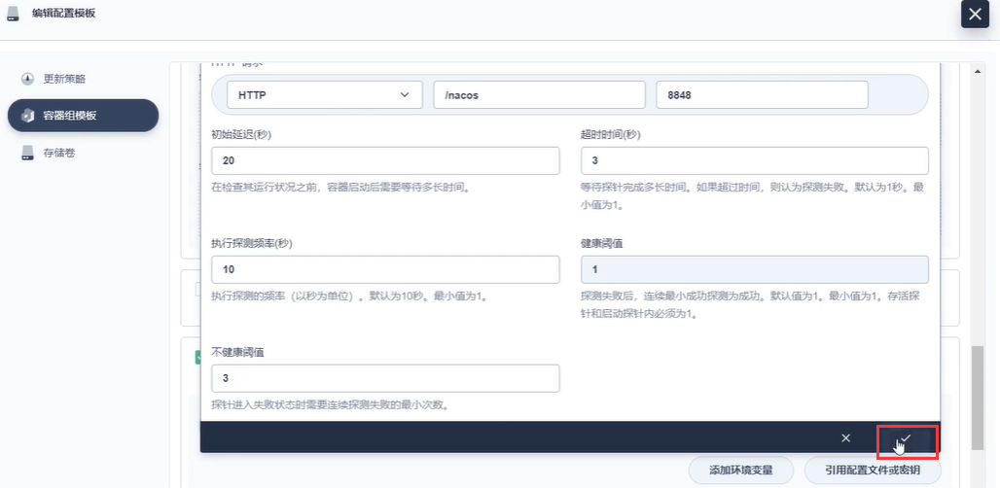

然后保存配置

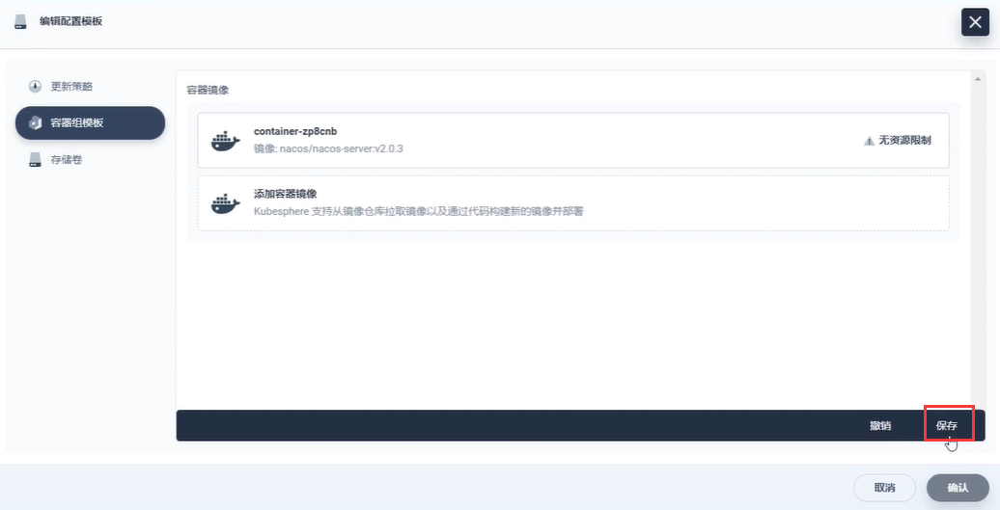

​	这样我们以后的Nacos是否存活我们的K8s就会进行一个判断

​	k8s会利用这个探针，通过这个探针进行检查

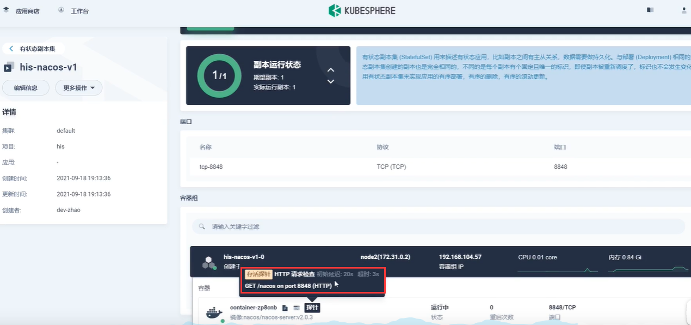

​	那么以后就算是数据库没有就绪，Nacos先启动报错也没事，k8s会一直探针检查，如果有问题就重新启动Nacos，总有一次Nacos启动后连接的是就绪的数据库

​	现在我们的服务就正常了

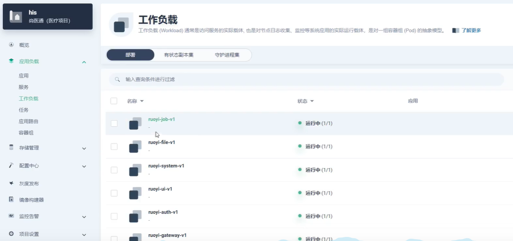

https://www.bilibili.com/video/BV13Q4y1C7hS?p=105&vd_source=243ad3a9b323313aa1441e5dd414a4ef

