# 4.kubesphere-平台安装-前置环境-安装默认存储类型


​	前面我们安装好了kubernetes集群，想要在它之上安装kubesphere还得装一下他的前置环境


​	我们参照kubesphere的官方文档

​		注意版本问题和kubernetes搭配，还需要有集群的默认存储类型--这个很重要--例如我们以前使用过nfs作为k8s的存储，我们以前使用的是静态供应，我们现在希望使用的是动态供应，也就是说我只要写一个申请书，假如我们申请10G空间，它可以帮助我们自动的创建一个10G的PV--这就是动态供应

​		而不是像我们以前我们都提前创建好申请书来了以后看那个合适再绑定那个机器

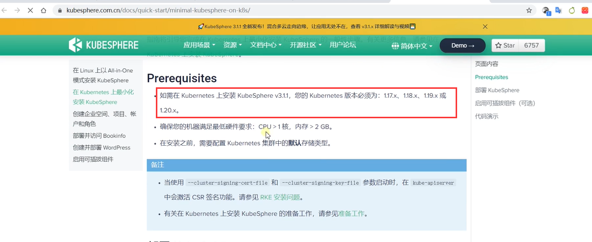


# 安装KubeSphere前置环境

## 1、nfs文件系统

### 1、安装nfs-server

```bash
# 在每个机器。
yum install -y nfs-utils


# 在master 执行以下命令 
echo "/nfs/data/ *(insecure,rw,sync,no_root_squash)" > /etc/exports


# 执行以下命令，启动 nfs 服务;创建共享目录
mkdir -p /nfs/data


# 在master执行
systemctl enable rpcbind
systemctl enable nfs-server
systemctl start rpcbind
systemctl start nfs-server

# 使配置生效
exportfs -r


#检查配置是否生效
exportfs
```

​	3台机器都先安装nfs的工具类

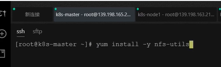


​	在nfs主服务器运行以下命令：

​				/nfs/data/。。。这个是在nfs主节点准备暴露这个文件夹，以非安全的方式别的客户端都可以连接成功---可以进行数据同步

​			mkdir -p /nfs/data----这个文件夹得先在主节点创建出来

​			systemctl-----这些命令是启动nfs的各种服务

​			然后让配置生效exportfs -r，最后是检查配置是否生效

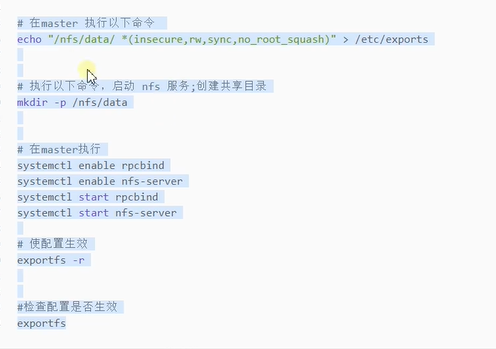

​		在master节点执行，当然此master代表的是nfs的master，可以与k8s集群的master一致也可以不一致

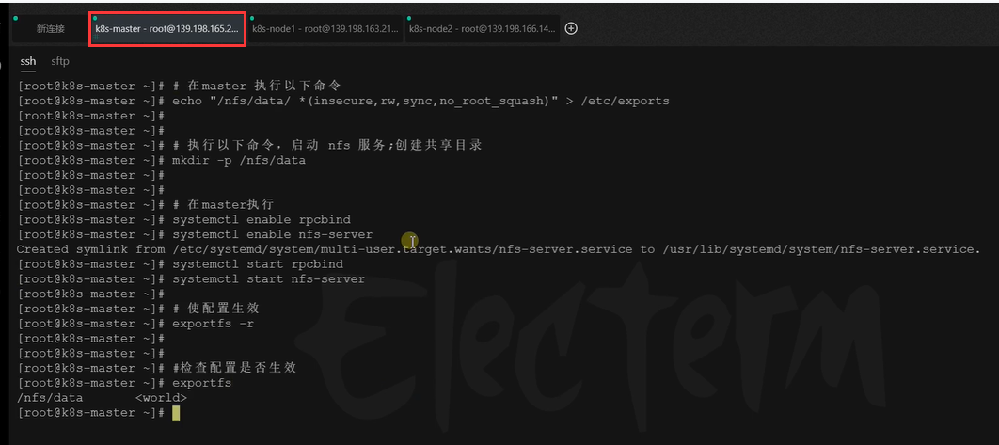


### 2、配置nfs-client（选做）

​		这个我们还是做一下吧，因为在其他节点相当于客户端，要同步nfs的master节点暴露的文件夹就需要做这步操作，如果不需要同步就不用做这个操作了

​		这里的IP地址指的是nfs主节点的IP地址

```bash
showmount -e 172.31.0.4

mkdir -p /nfs/data

mount -t nfs 172.31.0.4:/nfs/data /nfs/data
```


### 3、配置默认存储

​	配置默认存储让他有动态供应的能力

```yaml
## 创建了一个存储类
apiVersion: storage.k8s.io/v1
kind: StorageClass
metadata:
  name: nfs-storage
  annotations:
    storageclass.kubernetes.io/is-default-class: "true"
provisioner: k8s-sigs.io/nfs-subdir-external-provisioner
parameters:
  archiveOnDelete: "true"  ## 删除pv的时候，pv的内容是否要备份

---
apiVersion: apps/v1
kind: Deployment
metadata:
  name: nfs-client-provisioner
  labels:
    app: nfs-client-provisioner
  # replace with namespace where provisioner is deployed
  namespace: default
spec:
  replicas: 1
  strategy:
    type: Recreate
  selector:
    matchLabels:
      app: nfs-client-provisioner
  template:
    metadata:
      labels:
        app: nfs-client-provisioner
    spec:
      serviceAccountName: nfs-client-provisioner
      containers:
        - name: nfs-client-provisioner
          image: registry.cn-hangzhou.aliyuncs.com/lfy_k8s_images/nfs-subdir-external-provisioner:v4.0.2
          # resources:
          #    limits:
          #      cpu: 10m
          #    requests:
          #      cpu: 10m
          volumeMounts:
            - name: nfs-client-root
              mountPath: /persistentvolumes
          env:
            - name: PROVISIONER_NAME
              value: k8s-sigs.io/nfs-subdir-external-provisioner
            - name: NFS_SERVER
              value: 172.31.0.4 ## 指定自己nfs服务器地址
            - name: NFS_PATH  
              value: /nfs/data  ## nfs服务器共享的目录
      volumes:
        - name: nfs-client-root
          nfs:
            server: 172.31.0.4
            path: /nfs/data
---
apiVersion: v1
kind: ServiceAccount
metadata:
  name: nfs-client-provisioner
  # replace with namespace where provisioner is deployed
  namespace: default
---
kind: ClusterRole
apiVersion: rbac.authorization.k8s.io/v1
metadata:
  name: nfs-client-provisioner-runner
rules:
  - apiGroups: [""]
    resources: ["nodes"]
    verbs: ["get", "list", "watch"]
  - apiGroups: [""]
    resources: ["persistentvolumes"]
    verbs: ["get", "list", "watch", "create", "delete"]
  - apiGroups: [""]
    resources: ["persistentvolumeclaims"]
    verbs: ["get", "list", "watch", "update"]
  - apiGroups: ["storage.k8s.io"]
    resources: ["storageclasses"]
    verbs: ["get", "list", "watch"]
  - apiGroups: [""]
    resources: ["events"]
    verbs: ["create", "update", "patch"]
---
kind: ClusterRoleBinding
apiVersion: rbac.authorization.k8s.io/v1
metadata:
  name: run-nfs-client-provisioner
subjects:
  - kind: ServiceAccount
    name: nfs-client-provisioner
    # replace with namespace where provisioner is deployed
    namespace: default
roleRef:
  kind: ClusterRole
  name: nfs-client-provisioner-runner
  apiGroup: rbac.authorization.k8s.io
---
kind: Role
apiVersion: rbac.authorization.k8s.io/v1
metadata:
  name: leader-locking-nfs-client-provisioner
  # replace with namespace where provisioner is deployed
  namespace: default
rules:
  - apiGroups: [""]
    resources: ["endpoints"]
    verbs: ["get", "list", "watch", "create", "update", "patch"]
---
kind: RoleBinding
apiVersion: rbac.authorization.k8s.io/v1
metadata:
  name: leader-locking-nfs-client-provisioner
  # replace with namespace where provisioner is deployed
  namespace: default
subjects:
  - kind: ServiceAccount
    name: nfs-client-provisioner
    # replace with namespace where provisioner is deployed
    namespace: default
roleRef:
  kind: Role
  name: leader-locking-nfs-client-provisioner
  apiGroup: rbac.authorization.k8s.io
```

​	

​	注意这个yaml有2处IP地址，这个IP地址是nfs主节点的IP

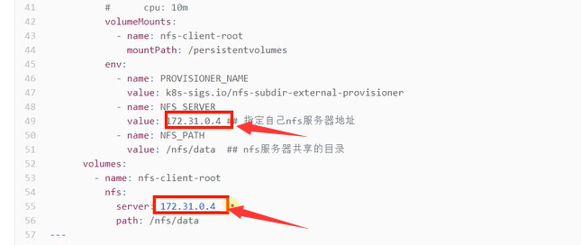


拷贝yaml内容

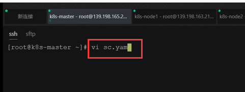

然后应用一下

​		默认是storageclass是空的，等我们应用完这个存储类就有了

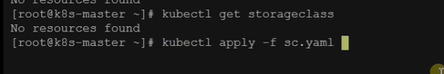

这就可以看到存储类了--default是默认的存储类

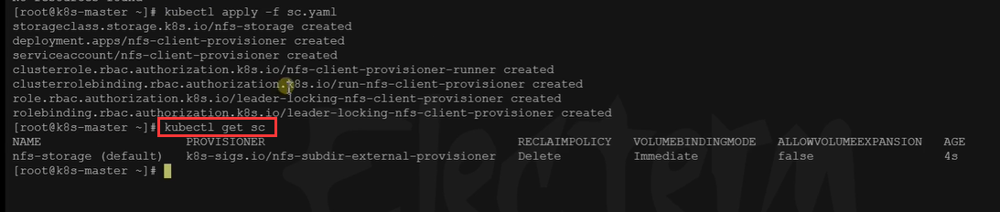

​	我们按kubesphere官方文档的要求，先配置一个**默认的存储类型**

​	我们这个存储类型相当于以后默认使用nfs存储的，以后我们写的申请书可以动态的为我们创建出空间


​	我们测试一下动态供应

​	先检查一下Pod是否都创建完成了--都是running完成了

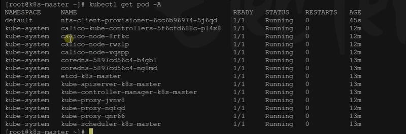


我们先创建一个PVC也就是申请书，复制我们之前练习过的一段yaml--不包括最后一行，最后一行是指定存储类名称是nfs的意思，但是我们系统现在默认不叫nfs，现在是叫nfs-storage，如果想复制就改为这个名称，如果不复制就是使用k8s默认的存储

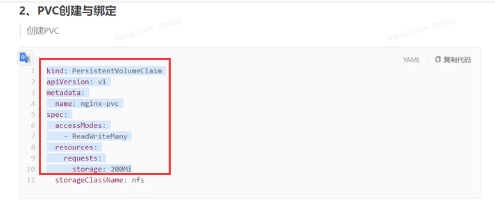

​	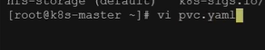


​	应用一下

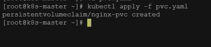


​	我们看一下这个pvc，可以看到我们这个pvc的状态是Bound，绑定了一个pv，然后我们再看一下这个PV

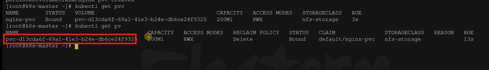

​	我们发现这个PV的名字很长，我们从来没有创建过这个PV，而且我们的申请书要多大空间我们的这个PV就自动给创建多大的空间-----这个就是**动态供应**

​		这就k8s的默认存储就没有什么问题了。


https://www.bilibili.com/video/BV13Q4y1C7hS?p=71&spm_id_from=pageDriver


