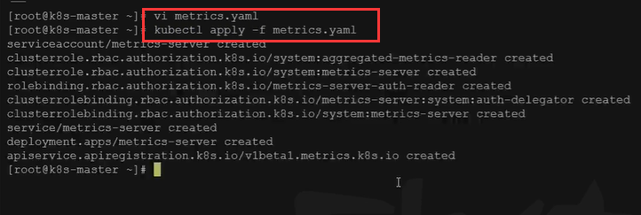
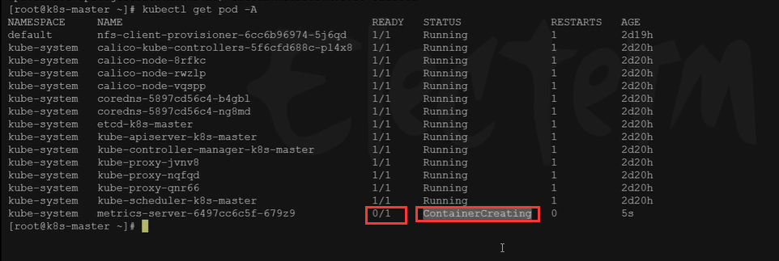
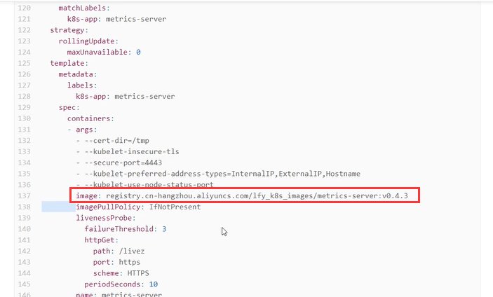
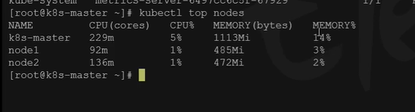
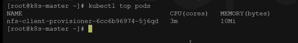
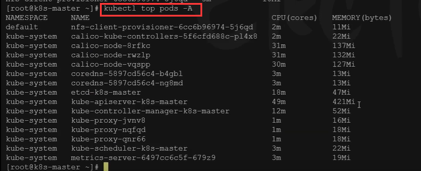

# 5.kubesphere-平台安装-前置环境-安装metrics-server

​		安装metrics-server是用来监控我们集群一些指标信息的。比如我们的CPU占用率，内存占有率等等。


## metrics-server

集群指标监控组件

```yaml
apiVersion: v1
kind: ServiceAccount
metadata:
  labels:
    k8s-app: metrics-server
  name: metrics-server
  namespace: kube-system
---
apiVersion: rbac.authorization.k8s.io/v1
kind: ClusterRole
metadata:
  labels:
    k8s-app: metrics-server
    rbac.authorization.k8s.io/aggregate-to-admin: "true"
    rbac.authorization.k8s.io/aggregate-to-edit: "true"
    rbac.authorization.k8s.io/aggregate-to-view: "true"
  name: system:aggregated-metrics-reader
rules:
- apiGroups:
  - metrics.k8s.io
  resources:
  - pods
  - nodes
  verbs:
  - get
  - list
  - watch
---
apiVersion: rbac.authorization.k8s.io/v1
kind: ClusterRole
metadata:
  labels:
    k8s-app: metrics-server
  name: system:metrics-server
rules:
- apiGroups:
  - ""
  resources:
  - pods
  - nodes
  - nodes/stats
  - namespaces
  - configmaps
  verbs:
  - get
  - list
  - watch
---
apiVersion: rbac.authorization.k8s.io/v1
kind: RoleBinding
metadata:
  labels:
    k8s-app: metrics-server
  name: metrics-server-auth-reader
  namespace: kube-system
roleRef:
  apiGroup: rbac.authorization.k8s.io
  kind: Role
  name: extension-apiserver-authentication-reader
subjects:
- kind: ServiceAccount
  name: metrics-server
  namespace: kube-system
---
apiVersion: rbac.authorization.k8s.io/v1
kind: ClusterRoleBinding
metadata:
  labels:
    k8s-app: metrics-server
  name: metrics-server:system:auth-delegator
roleRef:
  apiGroup: rbac.authorization.k8s.io
  kind: ClusterRole
  name: system:auth-delegator
subjects:
- kind: ServiceAccount
  name: metrics-server
  namespace: kube-system
---
apiVersion: rbac.authorization.k8s.io/v1
kind: ClusterRoleBinding
metadata:
  labels:
    k8s-app: metrics-server
  name: system:metrics-server
roleRef:
  apiGroup: rbac.authorization.k8s.io
  kind: ClusterRole
  name: system:metrics-server
subjects:
- kind: ServiceAccount
  name: metrics-server
  namespace: kube-system
---
apiVersion: v1
kind: Service
metadata:
  labels:
    k8s-app: metrics-server
  name: metrics-server
  namespace: kube-system
spec:
  ports:
  - name: https
    port: 443
    protocol: TCP
    targetPort: https
  selector:
    k8s-app: metrics-server
---
apiVersion: apps/v1
kind: Deployment
metadata:
  labels:
    k8s-app: metrics-server
  name: metrics-server
  namespace: kube-system
spec:
  selector:
    matchLabels:
      k8s-app: metrics-server
  strategy:
    rollingUpdate:
      maxUnavailable: 0
  template:
    metadata:
      labels:
        k8s-app: metrics-server
    spec:
      containers:
      - args:
        - --cert-dir=/tmp
        - --kubelet-insecure-tls
        - --secure-port=4443
        - --kubelet-preferred-address-types=InternalIP,ExternalIP,Hostname
        - --kubelet-use-node-status-port
        image: registry.cn-hangzhou.aliyuncs.com/lfy_k8s_images/metrics-server:v0.4.3
        imagePullPolicy: IfNotPresent
        livenessProbe:
          failureThreshold: 3
          httpGet:
            path: /livez
            port: https
            scheme: HTTPS
          periodSeconds: 10
        name: metrics-server
        ports:
        - containerPort: 4443
          name: https
          protocol: TCP
        readinessProbe:
          failureThreshold: 3
          httpGet:
            path: /readyz
            port: https
            scheme: HTTPS
          periodSeconds: 10
        securityContext:
          readOnlyRootFilesystem: true
          runAsNonRoot: true
          runAsUser: 1000
        volumeMounts:
        - mountPath: /tmp
          name: tmp-dir
      nodeSelector:
        kubernetes.io/os: linux
      priorityClassName: system-cluster-critical
      serviceAccountName: metrics-server
      volumes:
      - emptyDir: {}
        name: tmp-dir
---
apiVersion: apiregistration.k8s.io/v1
kind: APIService
metadata:
  labels:
    k8s-app: metrics-server
  name: v1beta1.metrics.k8s.io
spec:
  group: metrics.k8s.io
  groupPriorityMinimum: 100
  insecureSkipTLSVerify: true
  service:
    name: metrics-server
    namespace: kube-system
  version: v1beta1
  versionPriority: 100
```


​	这个yaml也不需要做任何的改动，我们在k8s的master节点vi metrics.yaml




我们查看一下集群的Pod状态--等他running就ok了




​	其实我们再安装kubesphere的时候也是会安装他的，但是很多时候kubesphere会安装不下来它，所以我们就提前 把它安装好。


​	注意这个镜像的地址：现在已经做到aliyun上了所以就应该比较快，如果安装不下来寻找一下其他的镜像地址试试




​	接下来我们运行一下kubectl top nodes---就可以显示出CPU核心数使用了多少（这个是1核=1000M），还有显示我们内存使用了多少




​	我们还可以查看运行的Pod他们的cpu和内存占用了多少--这个是默认的




如果加上——A就看的是全部的Pod了




​	等我们有了kubesphere之后，这些东西就可以以可视化界面的方式展现出来了。


​	至此--我们的kubesphere的前置环境就都安装好了


