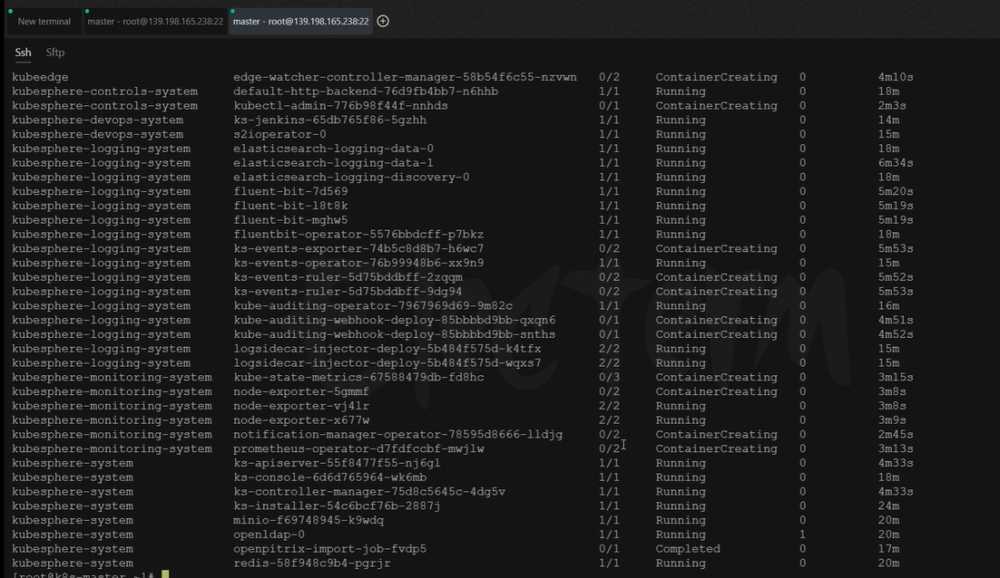
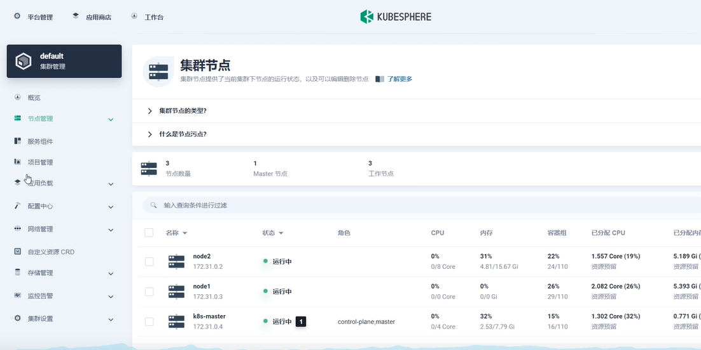

# 6.kubesphere-平台安装-全功能安装完成

​	我们安装好了前置的环境后，我们现在就可以来安装kubesphere了，我们参照官方文档。


我们在之前的前置环境都已经满足以下条件


# 安装KubeSphere

https://kubesphere.com.cn/

## 1、下载核心文件

这个yaml的文件最好我们先下载过来用wget命令下载--如果不能使用wget命令就安装一下wget

​		yum install -y wget

如果下载不到，请复制附录的内容

```bash
# 这个是kubesphere的安装器
wget https://github.com/kubesphere/ks-installer/releases/download/v3.1.1/kubesphere-installer.yaml

# 这个是集群的配置文件
wget https://github.com/kubesphere/ks-installer/releases/download/v3.1.1/cluster-configuration.yaml
```

下载好了--这个安装器没什么需要改的，主要是这个集群配置文件需要修改一下


## 2、修改cluster-configuration

在 cluster-configuration.yaml中指定我们需要开启的功能

参照官网“启用可插拔组件” 

https://kubesphere.com.cn/docs/pluggable-components/overview/


​	其实我们需要修改的就是spec下面的东西，如persistence是存储相关的，如果我们没有默认存储，需要在storageClass指定存储类，如果我们有就什么也不用管


​	然后接下来就是把我们所看到的false都改为true，所谓的改为true就是开启相关的功能

​	例如这里改为true就是开启etcd的监控功能


这块的内容我们怎么知道这些代表什么呢，我们可以到官网--启用可插拔组件里查看一下


​	比如我们需要应用商店--我们就点击对应的组件查阅文档


​	然后给etcd的监控配一下ip地址，这个ip是master节点的ip而且是私域的ip地址


然后我们开启了redis，alerting-系统告警功能，注意es先不用开因为es需要认证用户名密码等等我们还没有es


​	auditing审计功能，devops功能，events集群事件功能，logging日志功能，这些都打开，metrics-server这个不需要打开，因为我们前置环境已经安装过了，而且也千万不要打开因为kubesphere默认是从官方下载镜像的这个镜像一般下载不下来经常会导致安装失败


​	还有network--网络策略打开--指定type：calico因为我们使用的网络插件就是calico。


​	还有openprtrix--应用商店打开，servicemesh--微服务治理功能打开。

​	kubeedge--边缘服务-这个是边缘计算使用的这个不需要打开，打开的话我们也体验不到，因为我们没有一些边缘计算的设备，也可以打开就是体验不到。


​	然后wq退出保存


## 3、执行安装

​	执行安装--先是kubesphere的安装器yaml


​	然后是kubesphere的集群配置的yaml应用


```yaml
kubectl apply -f kubesphere-installer.yaml

kubectl apply -f cluster-configuration.yaml


```


​	然后我们查看一下kubesphere的安装过程

​	首先是创建出安装器


## 4、检查安装日志

​	这个命令的作用就是我们可以检查集群安装到哪一步了，一个用于检查集群安装过程的日志

```
kubectl logs -n kubesphere-system $(kubectl get pod -n kubesphere-system -l app=ks-install -o jsonpath='{.items[0].metadata.name}') -f

```


如果发生这个错误就是说我们的安装器还没有安装好呢，等安装kubesphere好了才可以执行此命令


我们再次执行的时候就可以看到目前kubesphere的安装进度了


​	比如这块可以看到一些汇总报告，这块不应该有失败的--然后下面start就是帮我们安装这些服务了开始


大概15分钟左右就安装好了


然后会有一个默认的账号和密码，还有默认端口是30880---注意安全策略组要放行这个端口，而且这个是访问任意集群机器的30880的端口都是可以的


访问任意机器的 30880端口

账号 ： admin

密码 ： P@88w0rd


登录前我们最好再确认一下，所有的Pod都是正常运转的

​	例如--我们现在看到还有很多东西没有运行完成，我们就再等等




​	如果我们等待了很久还是没有运行完成，那么就需要排查一下了

​	例如这个Pod一直在创建中


​	使用kubectl describe pod -n ***


​	只要是Pulling image 就是正在下载镜像中--那还好并没有发生错误


​	比如我们在检查到这个普罗米修斯的时候发现有点问题--他是用于监控功能的


​	报挂载失败-faileMount---挂载失败的原因是，秘钥secret “kube-etcd-client-certs”这个秘钥没有找到


然后我们使用以下命令处理etcd这个文件找不到的报错--也就是 etcd监控证书找不到---**这些问题都是在官方文档中有解决方案的**

```
kubectl -n kubesphere-monitoring-system create secret generic kube-etcd-client-certs  --from-file=etcd-client-ca.crt=/etc/kubernetes/pki/etcd/ca.crt  --from-file=etcd-client.crt=/etc/kubernetes/pki/apiserver-etcd-client.crt  --from-file=etcd-client.key=/etc/kubernetes/pki/apiserver-etcd-client.key
```


​	然后我们继续等待，等待kubesphere的所有Pod都创建完成变为running


​	我们使用任意集群机器的公网IP+端口访问


第一次登陆，还会提示我们修改密码


进入到了主界面


​	点击平台管理


比如我们进入集群管理中




​	之后我们再研究这些功能的使用


​	至此：我们的kubesphere基于kubernetes的安装就完成了，如果大家觉得这个过程有点太麻烦，我们只是想把玩一下不想体验这么复杂的过程，我们在之后再了解一下如何在单节点或者是多节点在Linux上直接一键部署，也会安装的非常快。


​	还有就是如果想快速体验也可以在官方点击demo，账号是demo1密码是Demo123


