# 7.kubesphere-平台安装-单节点上kubeKey一键安装完整平台

​	下面我们了解kubesphere的第二种安装方式


## 在Linux单节点部署Kubesphere

#### 1、开通服务器

​			比如我们现在有一个4core 8g的服务器，CentOS7.9，防火墙开启30000-32767端口

​			指定个hostname--一般我们都要指定一下方便我们理解这个是哪个服务器

```
# 指定hostname
hostnamectl set-hostname node1

```


#### 2、安装

​	我们想一键的把kubesphere及k8s整个一键安装上来


​	我们参照kubesphere的官方文档

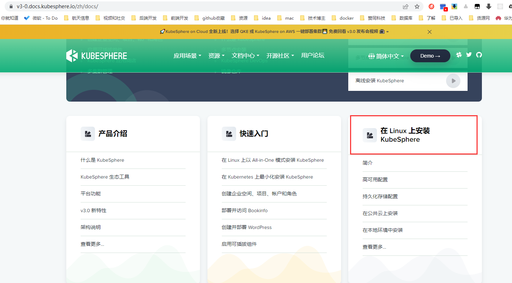


​	然后我们查看硬件的配置：

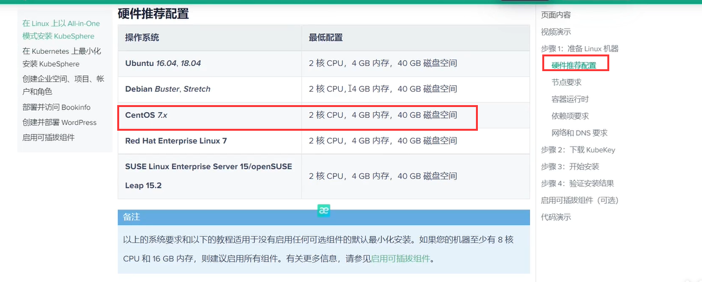


##### 2.1下载kubekey

​	然后我们需要下载kubesphere官方为我们提供的一个KubeKey

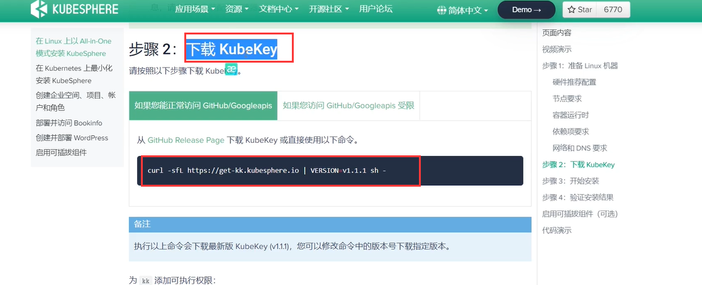


​		如果访问google受限，我们使用另外一种下载方式

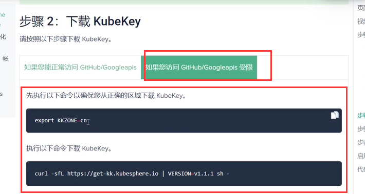


​	准备kubekey---我们使用这个新的服务器为例

```
# 首先运行以下命令，以确保您从正确的区域下载 KubeKey。
export KKZONE=cn

# 运行以下命令来下载 KubeKey：
curl -sfL https://get-kk.kubesphere.io | VERSION=v1.0.1 sh -

```


​	官方提供的命令先设置导出一下地区export KKZONE = CN，然后执行下载命令

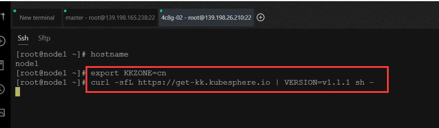

​		显示kubekey DownLoad Complete就下载完成了


下载完成后会有 kk的可执行文件，还有kubekey的压缩文件

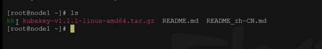


然后是给kk添加可执行权限--只要是绿色就有权限，chmod +x是最高权限

```
chmod +x kk
```


##### 2.2 使用kubekey引导安装集群

​	我们现在开的是新的机器，是非常纯净的Linux系统，我们现在希望把kubesphere及k8s一整套全部的安装好。

​	

```shell
#可能需要下面命令
yum install -y conntrack

# 这个命令是使用kubekey创建一个集群，k8s的版本使用的是1.20.4，kubesphere版本是3.1.1
./kk create cluster --with-kubernetes v1.20.4 --with-kubesphere v3.1.1
```


创建的时候可能会提示这个，就是我们的环境可能没有准备就绪，比如这个conntrack和网络有关的

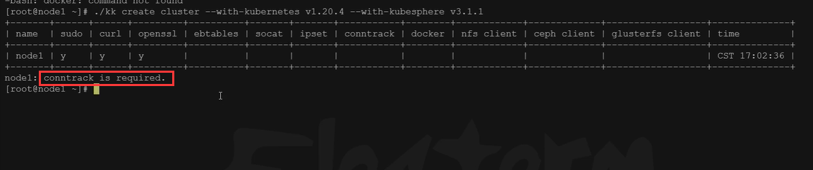


然后就是安装一下conntrack

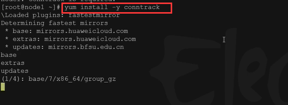


然后在执行kubekey的命令，会提示是否安装输入yes，然后我们就什么都不用管了等待安装完成

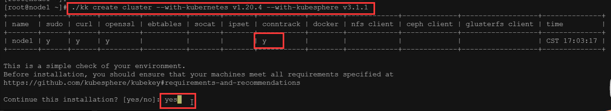


等到显示这个 Please wait 就安装的差不多了

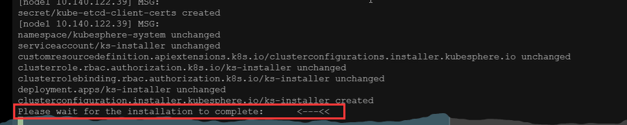


我们也可以使用命令kubectl get pod来查看安装的进度

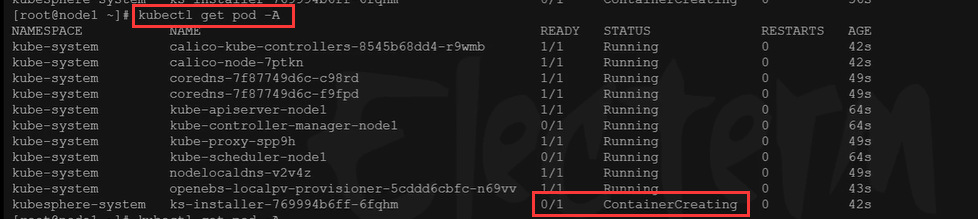


安装完成后会有提示

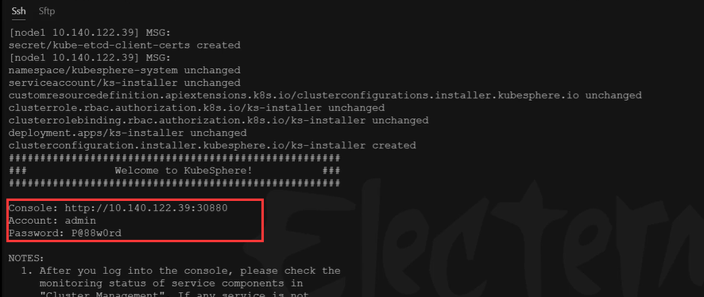


​		这种方式安装很方便，就是无人值守，一键安装，我们在开发期间如果想测试这个平台就可以这么来用。

但这块的安装大家会发现会少很多东西，因为他安装的不是全功能平台，这个**默认安装的是最小化安装。**


​	如果我们想要启动一些功能，那么就查看官方文档--进入启用可插拔组件

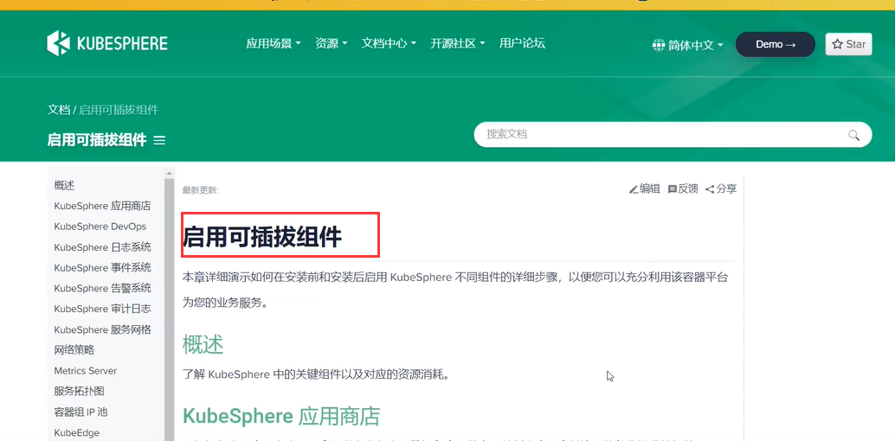


#### 3、安装后启用功能

比如开启devops

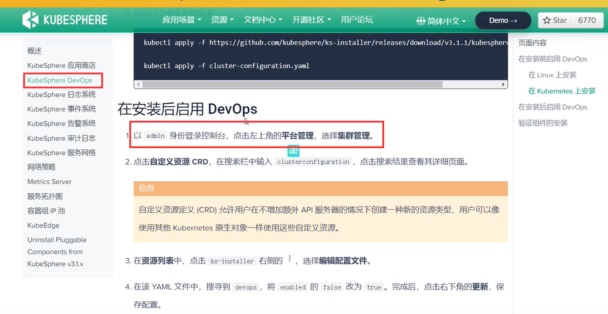


​	然后就是自定义资源CRD输入 clusterconfiguration

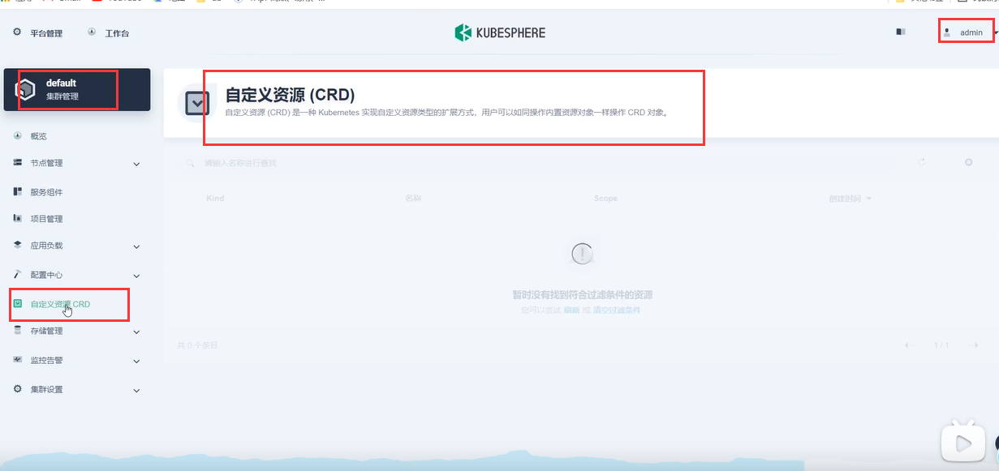


然后点击这个集群的配置

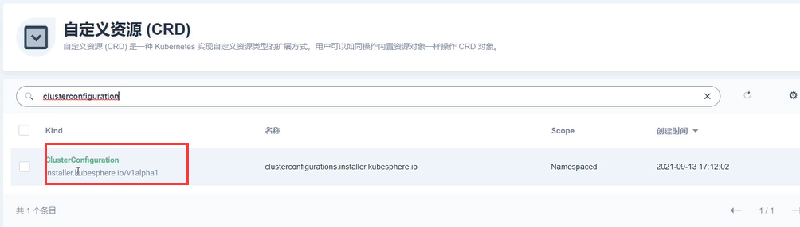


可以看到kubesphere的安装器，点击编辑配置文件

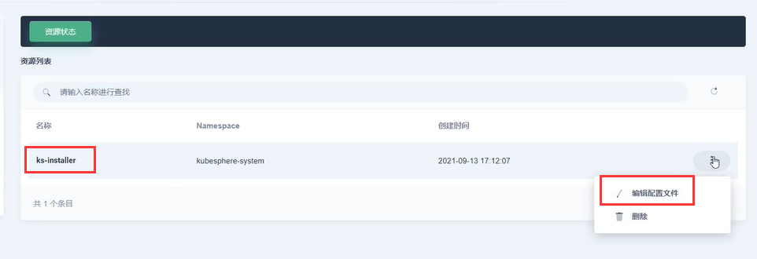


​	然后就看到我们以前配置过的yaml配置，我们在spec下想开启什么功能就把false改为true就可以了

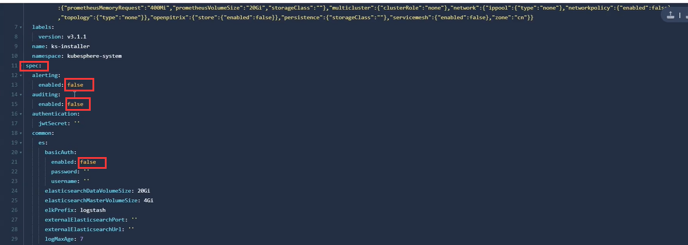


比如我们开启devops---设置为true，然后点击更新

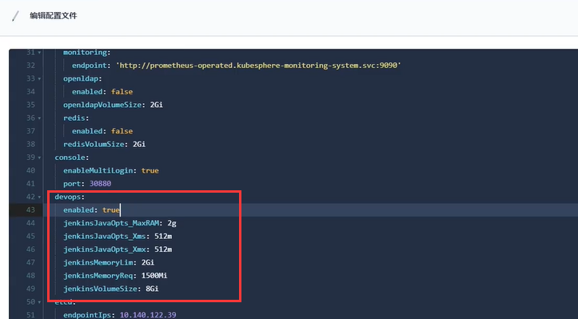


如果后期我们想关闭一些功能也是这样，关闭改为false就可以了

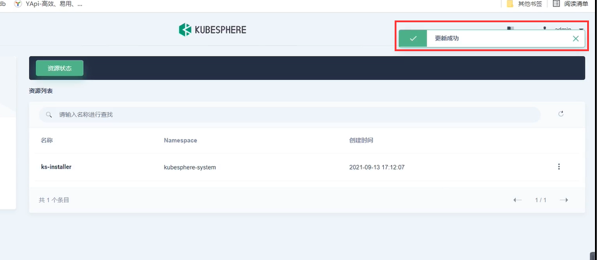


原来是没有devops的--我们应用后一会在组件状态中就会显示devops

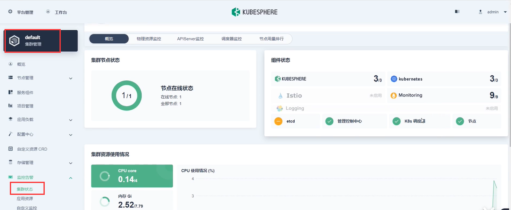


​	注意：**因为这个是单节点，目前适用于只有一个节点的Linux系统，适用于我们开发用来测试**


