# 8.kubesphere-平台安装-多节点上kubekey-一键安装集群

# 1、准备三台服务器

- 4c8g （master）
- 8c16g * 2（worker）
- centos7.9
- 内网互通
- 每个机器有自己域名
- 防火墙开放30000~32767端口


我们可以参照文档中心的，多节点安装

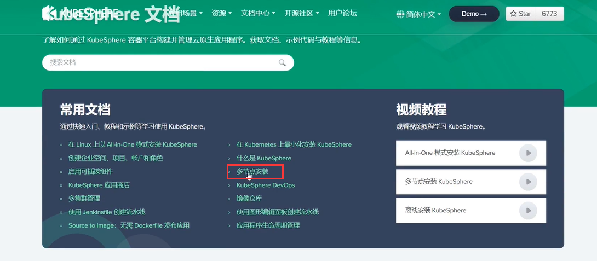


## 2、使用kubekey创建集群

#### 1、下载kubekey

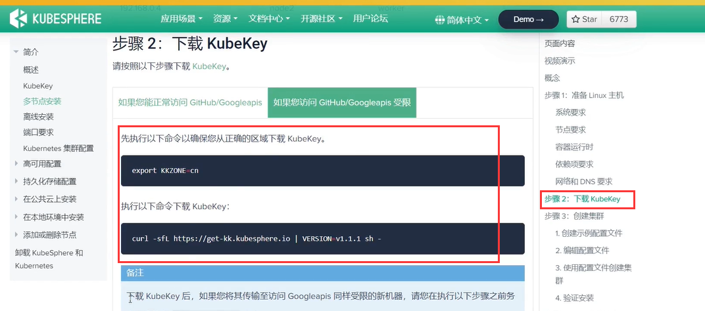


只需要在master节点执行就可以

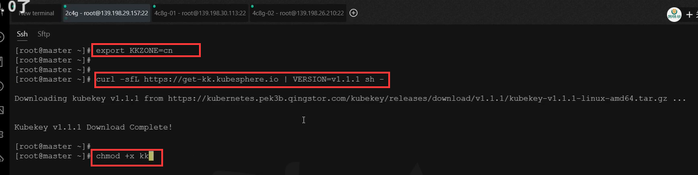


#### 2、创建集群

​	我们现在需要创建一个集群的配置文件，因为我们希望他在安装的时候，让他知道我们这是3台机器的集群，而且哪个是master哪个是worker节点

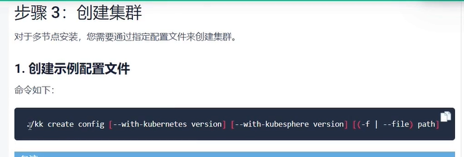


```bash
./kk create config --with-kubernetes v1.20.4 --with-kubesphere v3.1.1
```

​	这个命令会创建出一个配置文件config-sample.yaml,我们最终会根据这个配置文件创建我们的集群

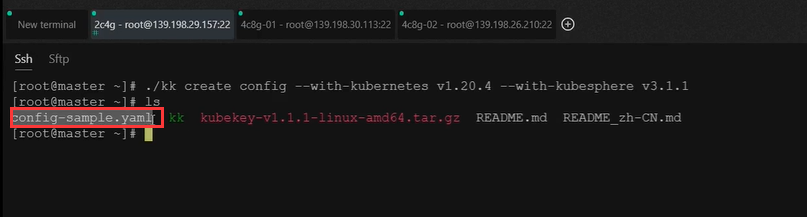

​	

然后我们对这个配置文件进行一些修改就可以了，注意先安装一下vim工具yum install -y vim


​		在这个配置文件中重要的地方有这么几处，1.host在这里要列举出所有的集群机器，我们有3个机器就是3行，name是节点域名，address是内网IP地址，internalAddress也是内网IP，因为它需要连接机器帮我们安装所以需要配置节点的用户名user，和密码password

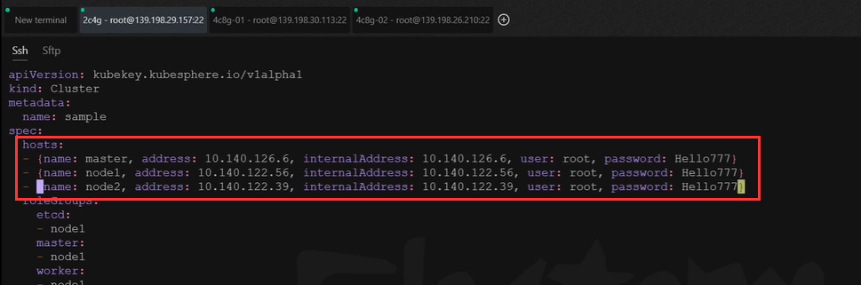


​	然后是roleGroups这个下面有 etcd我们安装在哪个节点需要配置，master是那个节点需要指定，

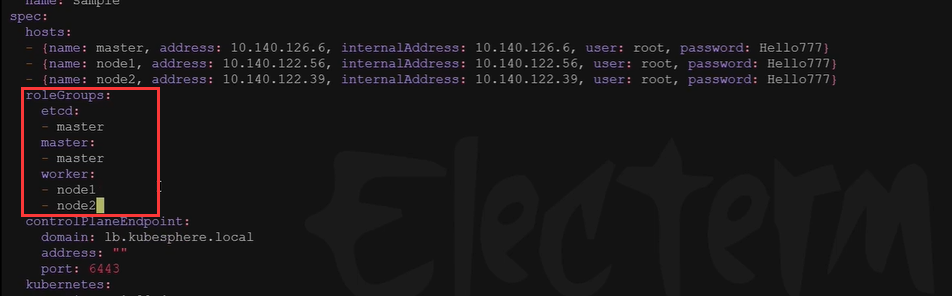

​		剩下的配置都不需要修改了，如果我们需要加一些可插拔的功能可以设置下面的功能为true


#### 3、创建集群

我们使用kubekey的命令来创建集群，使用我们刚刚配置好的集群配置文件

```
./kk create cluster -f config-sample.yaml
```


​	命令的 -f是指定的意思

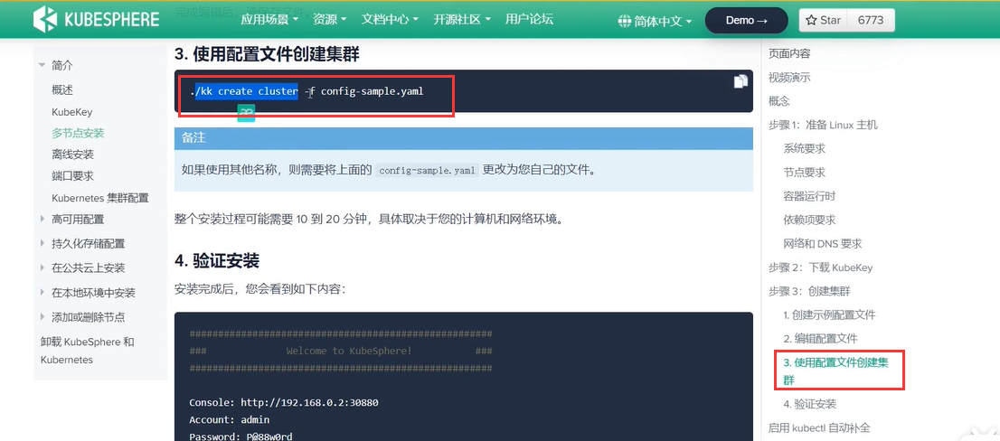


可能会提示这个没有安装，我们安装一下conntrack

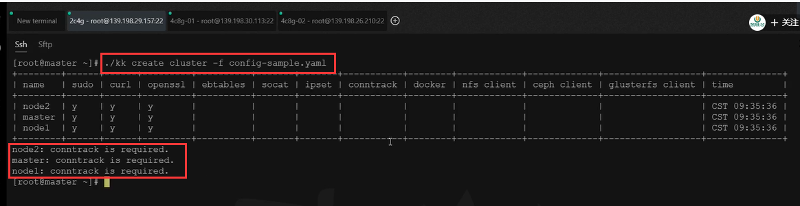

​	创建集群：

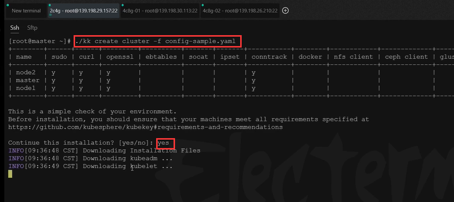

​	大概3个节点的安装需要等待20分钟左右

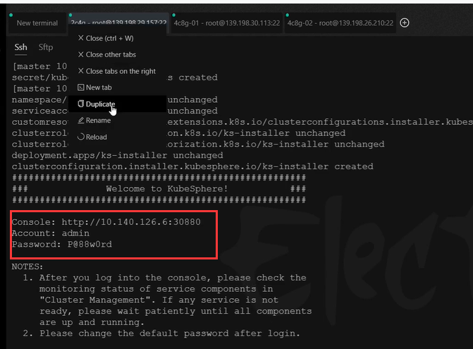


#### 4、查看进度

```
kubectl logs -n kubesphere-system $(kubectl get pod -n kubesphere-system -l app=ks-install -o jsonpath='{.items[0].metadata.name}') -f
```


​	我们这个仅仅限于开发测试环境，如果我们想搭建一个生产环境的高可用集群包括对接我们生产的存储也可以参照kubesphere的官方文档

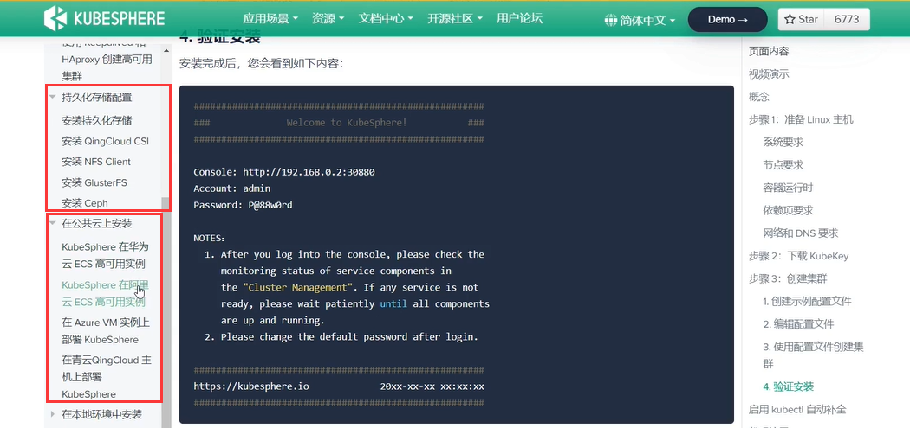


https://www.bilibili.com/video/BV13Q4y1C7hS?p=75&spm_id_from=pageDriver


