# 9.kubesphere-多租户-hr账户为系统添加用户

​	kubesphere所有的实战文档都在文档中心---然后选择对应的版本

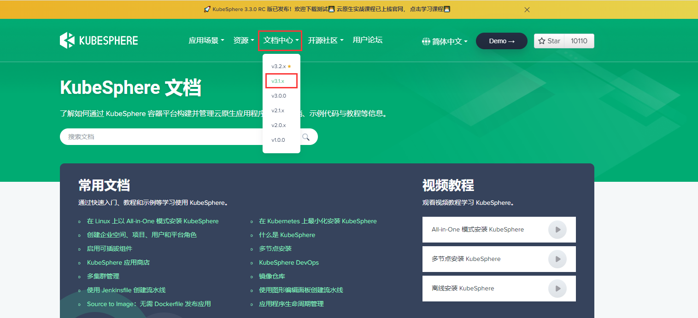

​	我们先了解一下多租户，文档在--创建企业空间、项目、用户和平台角色

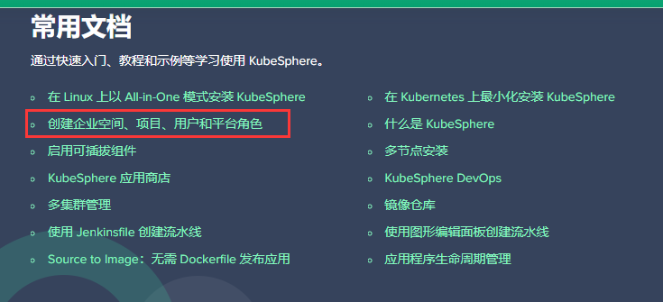

#### 什么是多租户？

​	

​	在我们登录kubesphere平台后，平台管理中 有个访问控制

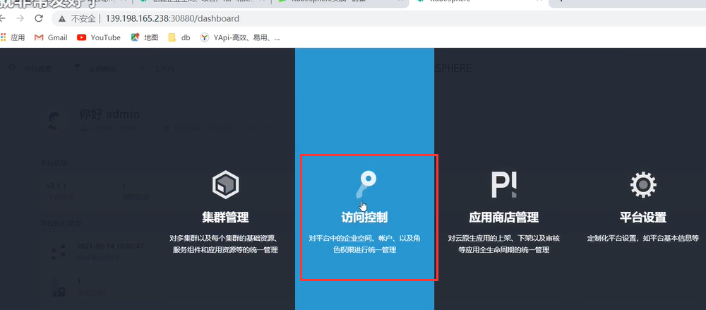

​	访问控制中就是来控制我们集群中每个租户，也就是说每一个用户的角色权限。

​		多租户：分为这么几个层级，首先是集群也就是集群的用户，第二个是我们的企业空间，第三个是项目，他们之间是什么区别，我们需要实战后才知道，我们先实战在集群环节的

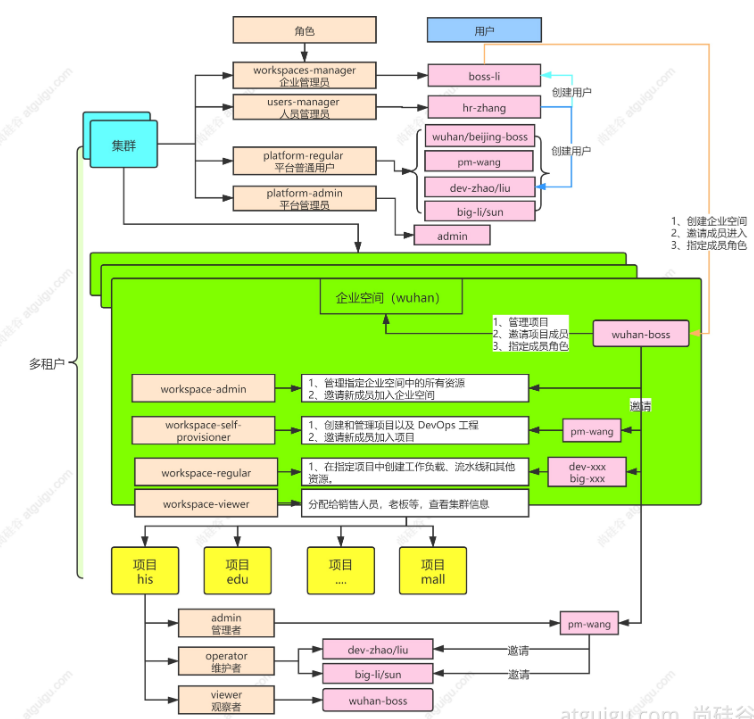

​	我们来到kubesphere的访问控制--账户管理，可以看到目前只有一个用户叫admin，它的角色是platfrom-admin---平台管理员，在集群中是最大的权限

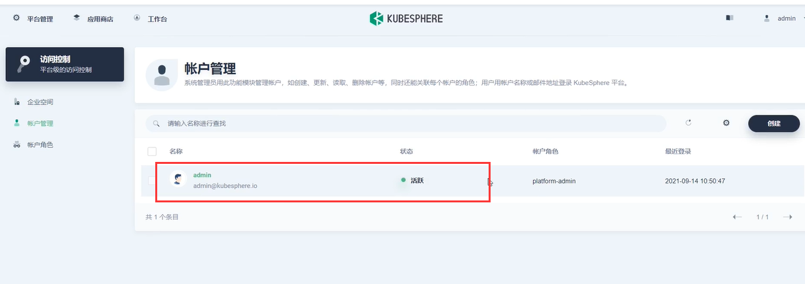

​	我们现在模拟一个公司的架构，我们使用平台管理员创建公司的用户

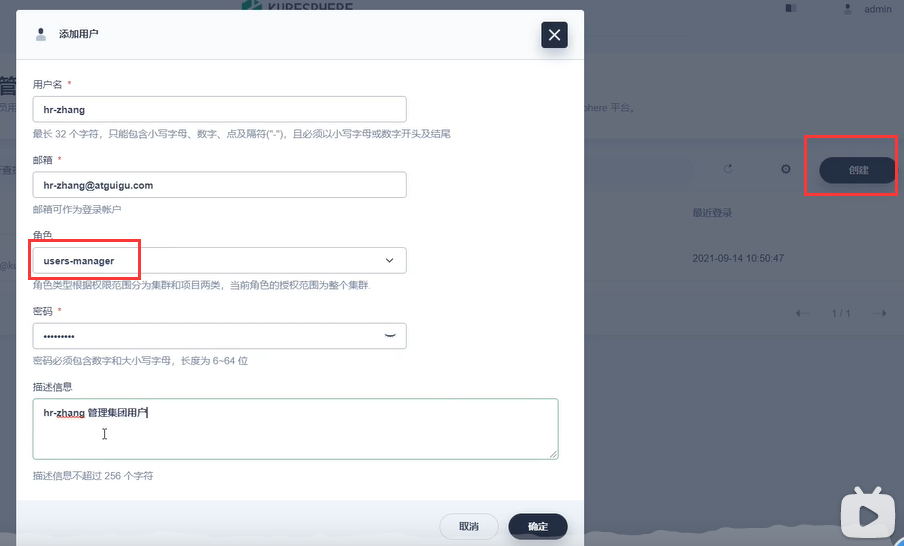

​	创建好了然后我们退出一下系统

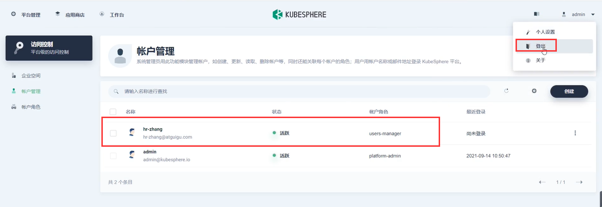

​	使用hr-zhang登录，登录后发现hr-zhang-在平台管理中只有访问控制这个功能

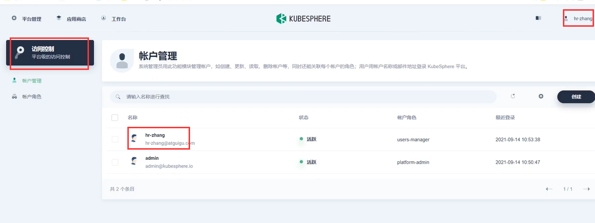

然后使用hr-zhang这个账户再创建一个老板的账号boss-li，角色我们选workspace--平台企业空间的管理员，至于他是干什么的我们一会来体会--比如这个boss可以控制各个分公司或办事处，由boss-li可以创建出我们的分布--这个所谓的分布在kubesphere就叫企业空间

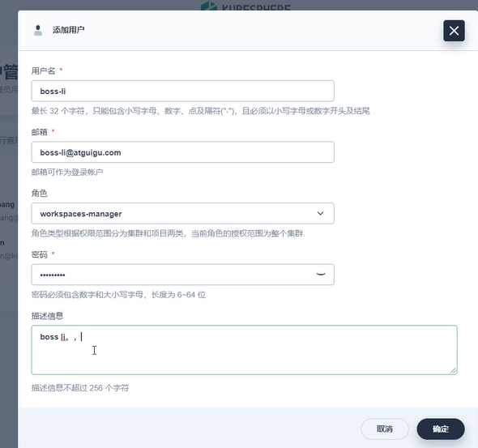

​	我们现在使用boss-li登录，我们的boss-li的权限也有访问控制，但是boss-li不能创建用户，只能创建企业空间，企业空间里面有一个默认的空间system-workspace是kubesphere默认的企业空间--然后我们创建企业空间

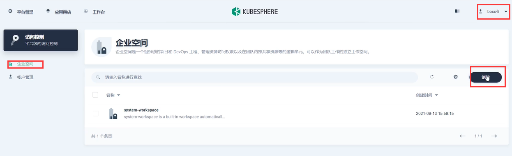

比如我们的分公司武汉

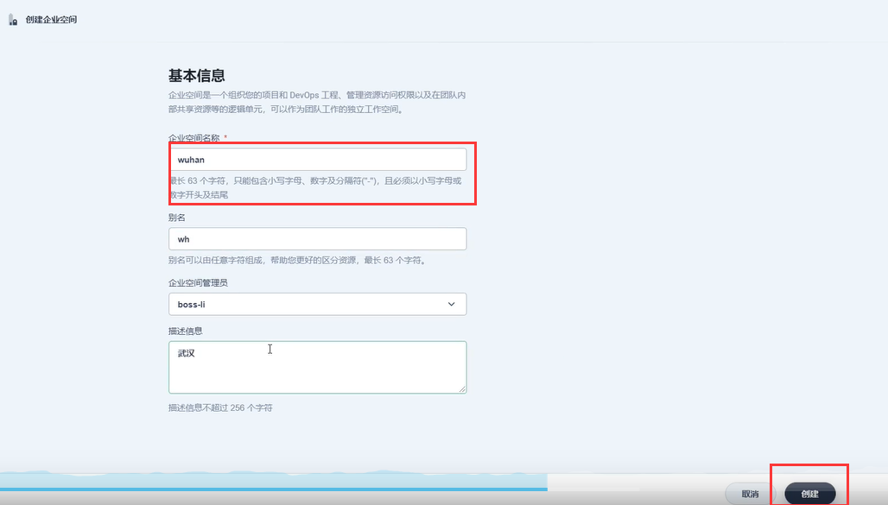

然后我们现在由hr-zhang创建几个分公司的账户，如武汉的boss，深圳的boss---角色是platform-regular也就是普通用户角色

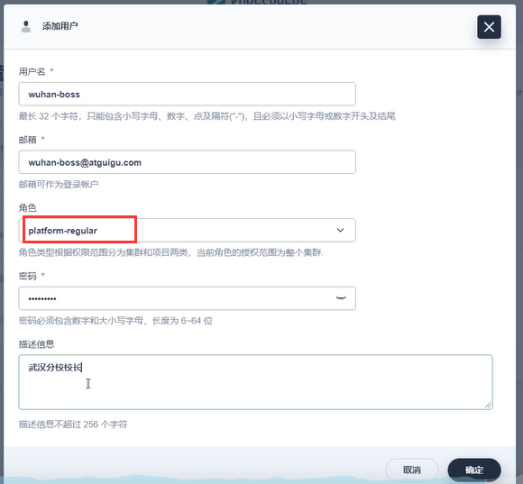

我们由hr-zhang这个用户创建了很多的用户，未来武汉的分布由武汉的boss控制，深圳的分部由深圳的boss控制。

https://www.bilibili.com/video/BV13Q4y1C7hS?p=76&spm_id_from=pageDriver

