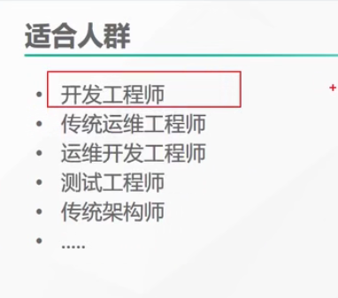
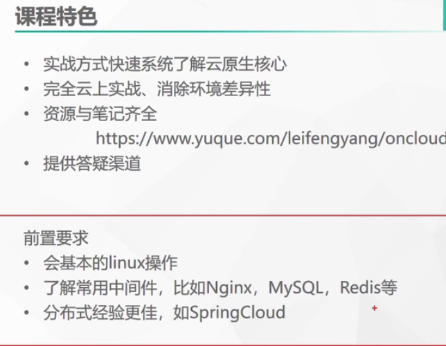
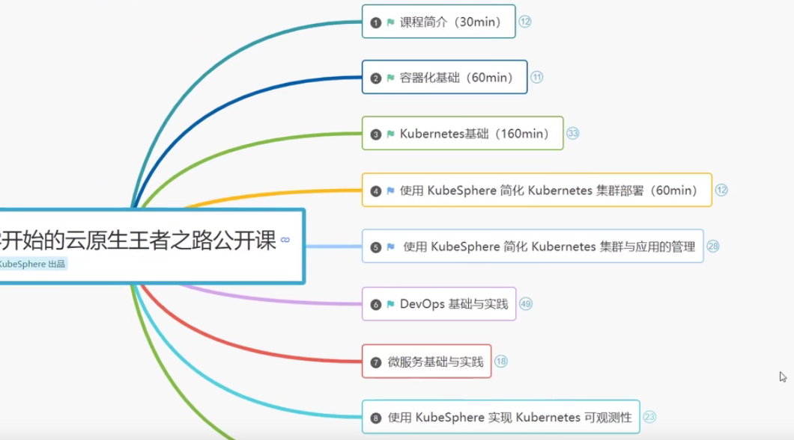
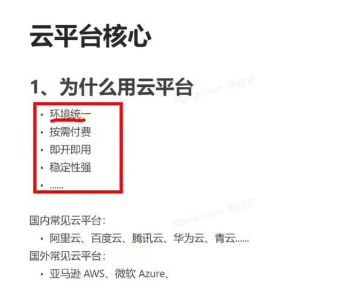
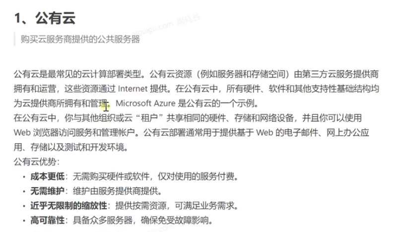
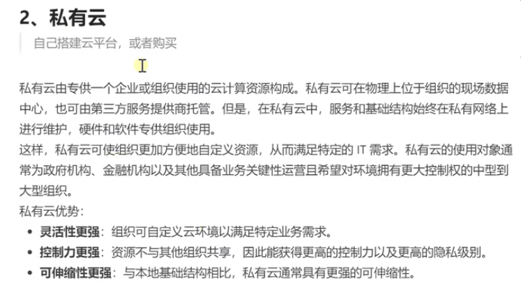
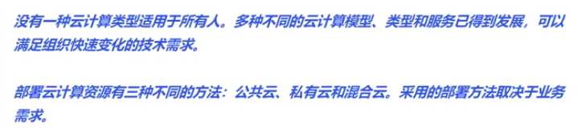

# 1、云原生实战介绍

​	云原生：可以分为俩个词来理解 云、原生

​			原生：比如 java，c，python等使用这些任意编程语言开发的应用叫做原生应用，而我们开发的应用最后部署到云上----云原生--可以理解为 原生应用 上云的过程。以及云上的一系列解决方案;

基本要求：

课程的内容：

## 2、云计算的简单概念

​	

我们将使用青云--我们使用青云的原因是 kubeSphere 是由青云开源的

#### 1、公有云

#### 2、私有云

混合云：一部分应用放在公有云平台上，一部分放在私有云平台上--这样的部署方式为混合云

https://www.bilibili.com/video/BV13Q4y1C7hS?p=2&spm_id_from=pageDriver

