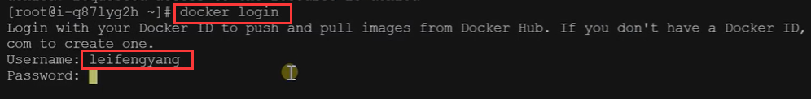

# 10.容器化-命令-镜像推送


## 5、推送远程仓库

推送镜像到docker hub；应用市场

​	其实这种方式最方便了，我们推送到仓库，然后想使用的时候直接从仓库下载就好了


想要真正的推送到docker hub 的仓库 必须先有账户，需要先注册登录


登录后就可以查看到自己之前推送过的一些镜像，还有下载的次数


如果想删除掉某个镜像的话--点击settings


​	然后点击删除资源


我们在推送镜像的时候，先在docker hub 上面创建一个仓库


设置一个仓库的名称（一般就是我们推送镜像的名称）--设置公共的或者是私有的

​	右侧有Pro tip 提示，就是如何能将镜像推送到此仓库的命令


创建


docker tag local-image:tagname new-repo:tagname

 这个命令的理解是 tag 打标签 local-image.tagname 是本地镜像的标签名称   new-repo:tagname是新的仓库名称和版本名称


我们查看一下镜像--发现多了一个镜像，而且他多了一个标识头/


接下来我们就push 往上推送就可以了

​		我们在推送的时候发现需要登录才可以--需要先登录才可以


docker login---输入的用户名和密码，就是登录docker hub的用户名和密码




登录成功后会有提示 Succeeded --只需要登录一次就可以无限的推送了

​		一般我们推送完成后还是建议推出， docker logout


推送成功


推送成功后我们就可以在docker hub中的仓库里查看的到了


```bash
docker tag local-image:tagname new-repo:tagname
docker push new-repo:tagname
# 把旧镜像的名字，改成仓库要求的新版名字
docker tag guignginx:v1.0 leifengyang/guignginx:v1.0

# 登录到docker hub
docker login       


docker logout（推送完成镜像后退出）

# 推送
docker push leifengyang/guignginx:v1.0


# 别的机器下载
docker pull leifengyang/guignginx:v1.0
```


我们在其他服务器上进行下载：

​		首先找到镜像copy 下载命令


进行下载


下载完成--我们查看一下这个镜像


然后我们再启动一下这个镜像


没有问题，请求到的就是我们上传修改过的镜像


如果是我们使用的内网，或者是不方便使用外网，那么就使用下载到U盘来存储的tar压缩包的方式来相互传输使用


实验完成后，别忘记把服务器关机，因为我们是按量付费的，关机后会减少一些费用


