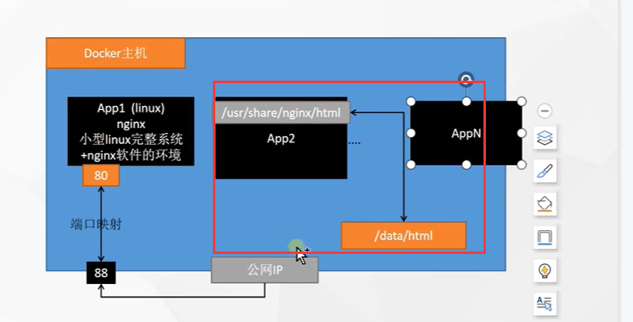
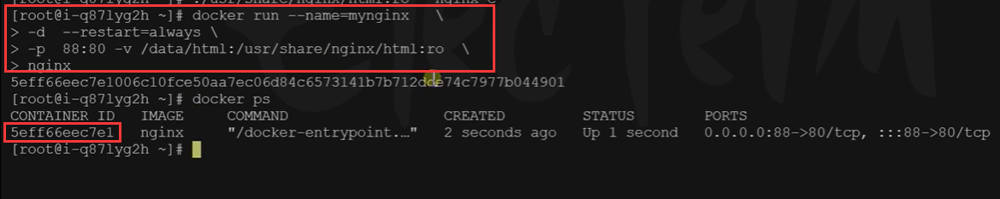
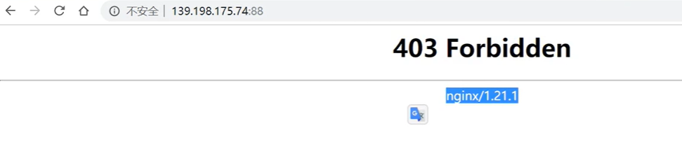
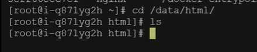
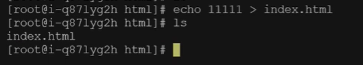
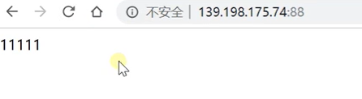

# 11.容器化-命令-挂载


什么叫挂载数据？

​	我们以前是想修改镜像里面的内容，还需要进入到镜像的内部，使用docker exec 进入某个镜像后修改内容

​	每次都需要进入到容器中去修改有些麻烦，我们考虑能不能通过 **容器内部的地址和 外部的 服务器路径能够建立好挂载的关系，修改容器外部的内容就相当于修改了容器内部的内容**，这样我们就不需要进入容器内部来修改了





那么我们需要使用到的是 在配置项中加入 -v 就是挂载的意思

如： -v /data/html(前面的是主机的):/usr/share/nginx/html（这个是容器的路径）

​	如果后面再加上 ：ro 就是只读 （指容器内部不可修改） rw就是读写




我们现在访问一下403了




因为在挂载的路径下是空的目录--所以就403了




我们设置一个页面




然后再次请求，就可以请求的到了



​		**挂载需要注意的点是：如果你挂载了服务的配置文件等，一定要保证挂载的内容是存在的否则是会报错发生问题的。。**


### 2、挂载数据到外部修改

```bash
docker run --name=mynginx   \
-d  --restart=always \
-p  88:80 -v /data/html:/usr/share/nginx/html:ro  \
nginx

# 修改页面只需要去 主机的 /data/html
```


## 


