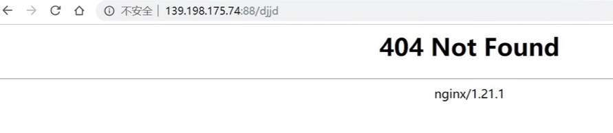
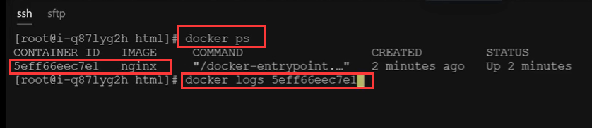
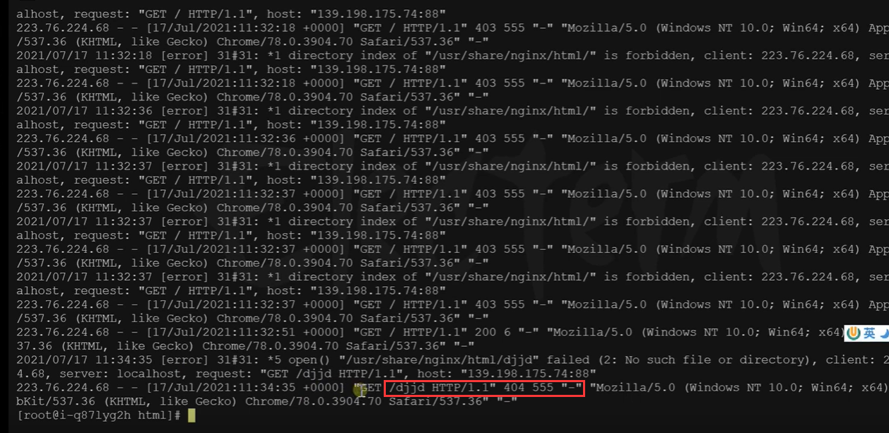
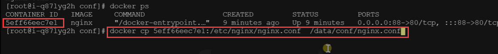
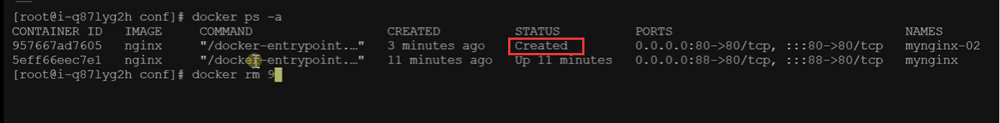

# 12.容器化-命令-补充

​	之前有了挂载之后，我们修改东西就方便多了，修改容器只需要修改本机挂载的地址内容就可以了


接下来我们补充几个常用的命令：

​	比如我们访问了nginx报错了，为什么呢我们需要排查一下错误原因



就需要查看一些日志情况，使用命令docker logs 容器的id或名称




​	因为容器内没有这个路径




docker exec -it 这个命令是要进入到容器内部


如果我们想把容器内的一些文件拿到服务器中怎么办？**不用进入容器就可以直接复制的**

使用docker cp 可以办到

```
docker cp 容器id：容器路径  服务器路径
```

这样就是把容器的配置文件放到了 服务器上的指定路径下了




特别有意思的是，如果我们反向写，就是把服务器的内容copy到容器中了

```sh
#把外面的内容复制到容器里面
docker cp  /data/conf/nginx.conf  5eff66eec7e1:/etc/nginx/nginx.conf
```


## 补充

```bash
docker logs 容器名/id   排错

docker exec -it 容器id /bin/bash


# docker 经常修改nginx配置文件--将首页和配置文件都挂载到服务器路径下
docker run -d -p 80:80 \
-v /data/html:/usr/share/nginx/html:ro \
-v /data/conf/nginx.conf:/etc/nginx/nginx.conf \
--name mynginx-02 \
nginx


#把容器指定位置的东西复制出来 
docker cp 5eff66eec7e1:/etc/nginx/nginx.conf  /data/conf/nginx.conf
#把外面的内容复制到容器里面
docker cp  /data/conf/nginx.conf  5eff66eec7e1:/etc/nginx/nginx.conf
```


我们在查看运行的容器的时候，如果看到有失败的，我们将他删除掉

docker rm 容器id




https://www.bilibili.com/video/BV13Q4y1C7hS?p=18&spm_id_from=pageDriver


