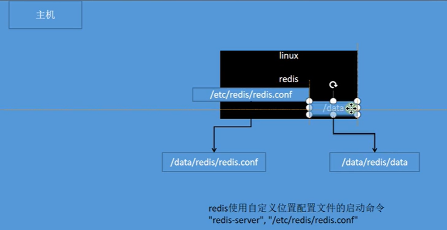
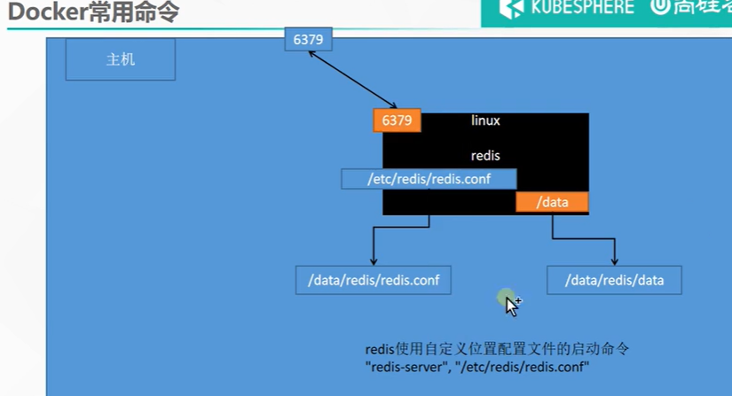
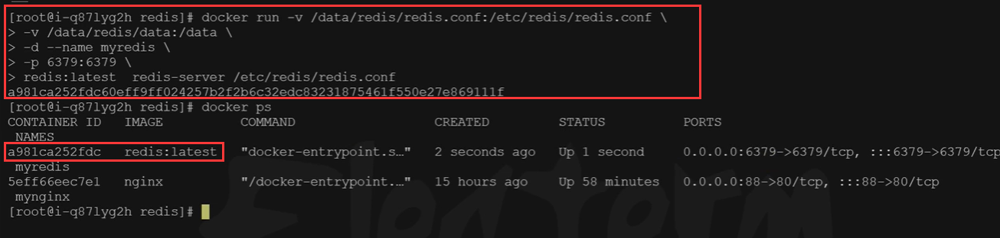
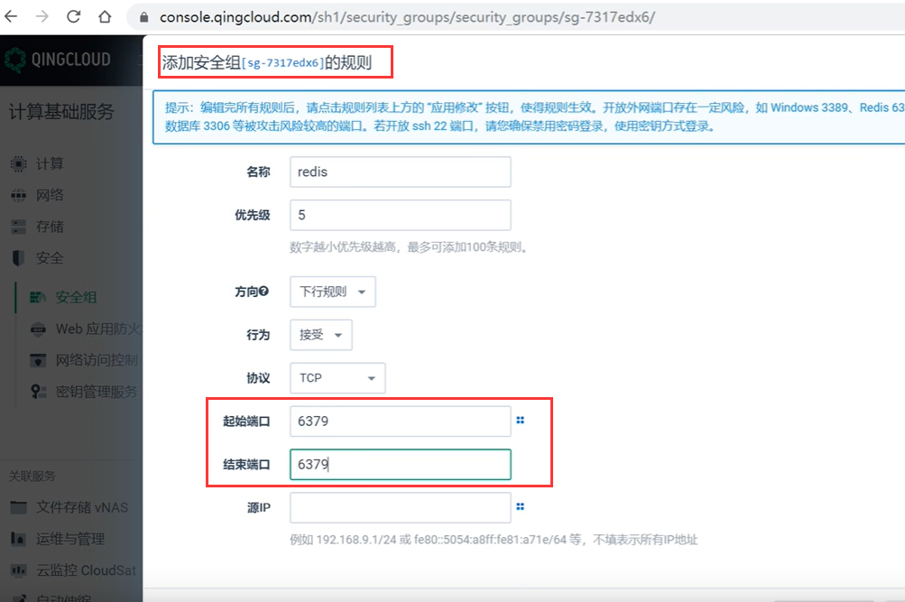
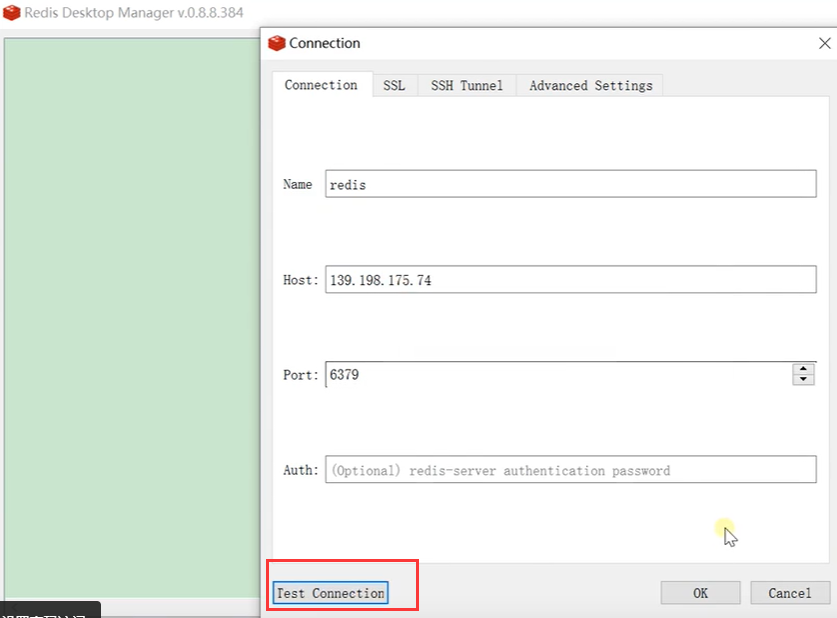

# 13.容器化-进阶-创建java应用


## 进阶实战


### 1、编写一个自己的应用

​	比如java程序，编写一个helloworld的程序，我们如何使用docker进行部署

​	https://start.spring.io/


​	示例代码：  https://gitee.com/leifengyang/java-demo.git


### 2、将应用打包成镜像

​	编写Dockerfile将自己的应用打包镜像


### 1、以前

Java为例

- SpringBoot打包成可执行jar
- 把jar包上传给服务

- 服务器运行java -jar


### 2、现在

​	所有机器都安装Docker，任何应用都是镜像，所有机器都可以运行


### 3、怎么打包-Dockerfile


```dockerfile
FROM openjdk:8-jdk-slim
LABEL maintainer=leifengyang

COPY target/*.jar   /app.jar

ENTRYPOINT ["java","-jar","/app.jar"]
```


```bash
docker build -t java-demo:v1.0 .
```


思考：

每个应用每次打包，都需要本地编译、再上传服务器、再进行docker构建，如果有1000个应用要打包镜像怎么办？有没有更好的方式？


### 3、启动容器

启动应用容器


```bash
docker run -d -p 8080:8080 --name myjava-app java-demo:v1.0 
```


分享镜像

```bash
# 登录docker hub
docker login

#给旧镜像起名
docker tag java-demo:v1.0  leifengyang/java-demo:v1.0

# 推送到docker hub
docker push leifengyang/java-demo:v1.0

# 别的机器
docker pull leifengyang/java-demo:v1.0

# 别的机器运行
docker run -d -p 8080:8080 --name myjava-app java-demo:v1.0 
```


### 4、部署中间件

​	 部署一个Redis+应用，尝试应用操作Redis产生数据。

​	我们想将redis的镜像下载安装最新版本，并且把配置文件和持久化的数据都放在docker外部，需要进行挂载操作--也就是放在linux服务器上。



```
docker run [OPTIONS] IMAGE [COMMAND] [ARG...]

#redis使用自定义配置文件启动

docker run -v /data/redis/redis.conf:/etc/redis/redis.conf \
-v /data/redis/data:/data \
-d --name myredis \
-p 6379:6379 \
redis:latest  redis-server /etc/redis/redis.conf
 
 
 
```


整个完整命令启动过程




启动redis镜像




注意：启动镜像要放行一下安全组的端口




测试连接redis




