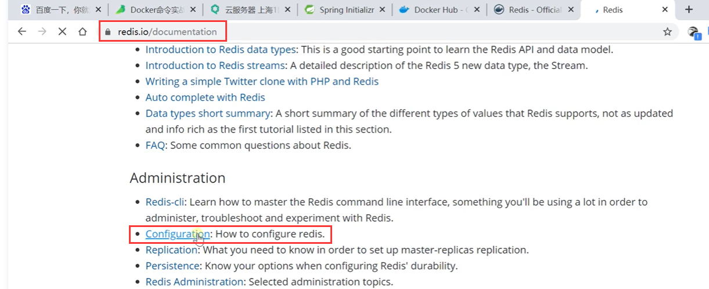
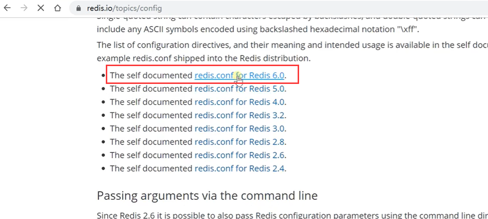
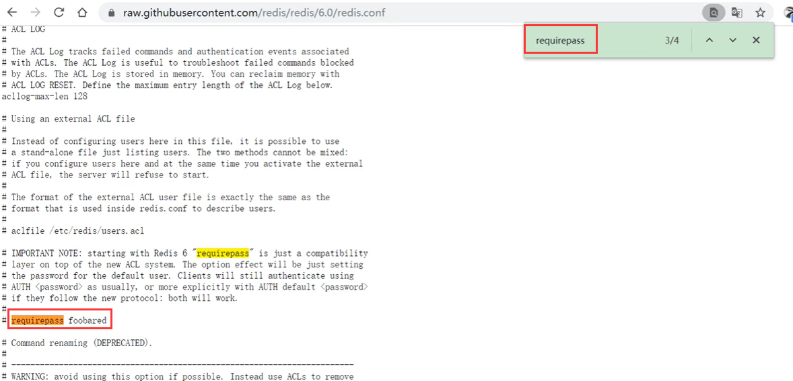
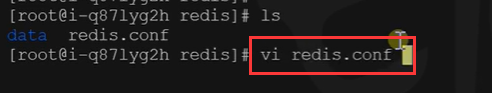
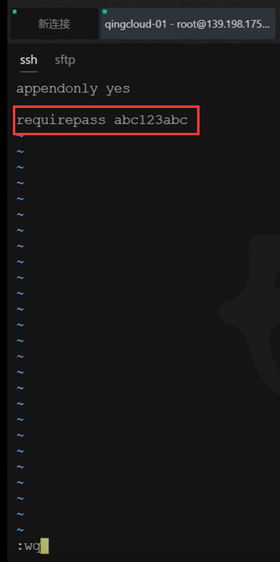
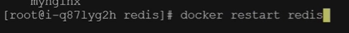
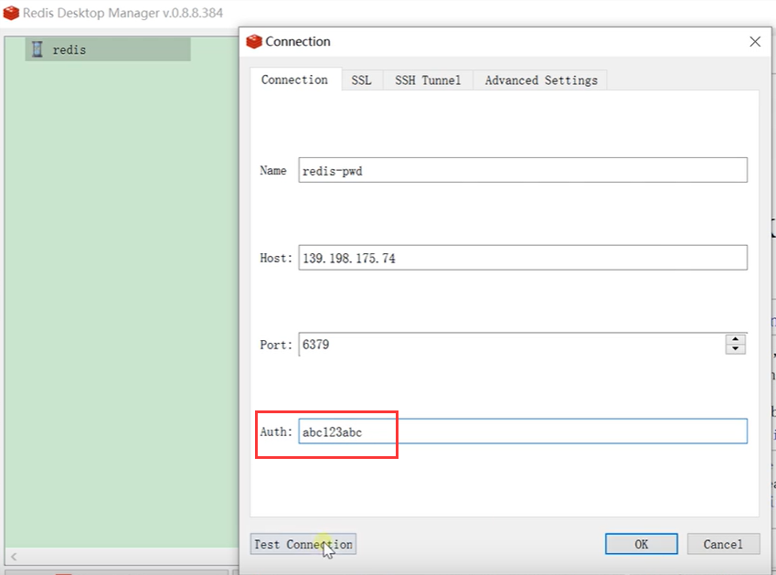

# 14.容器化-进阶-redis设置密码访问

​	我们之前启动的redis镜像连接是没有问题的，但是并没有设置密码

如果我们不设置密码，可能会被别人扫描到连接进行操作，所以安全考虑还是加上密码为好--万一被入侵变为矿机就不好了

​	密码设置参照redis的官方文档

然后找到需要配置的版本

搜索一下requirepass

在容器中我们设置一下redis密码，修改配置文件

设置requirepass 密码为 abc123abc

重新启动redis，docker restart redis

然后我们输入密码进行连接测试

​	到此我们redis的部署就完成了

