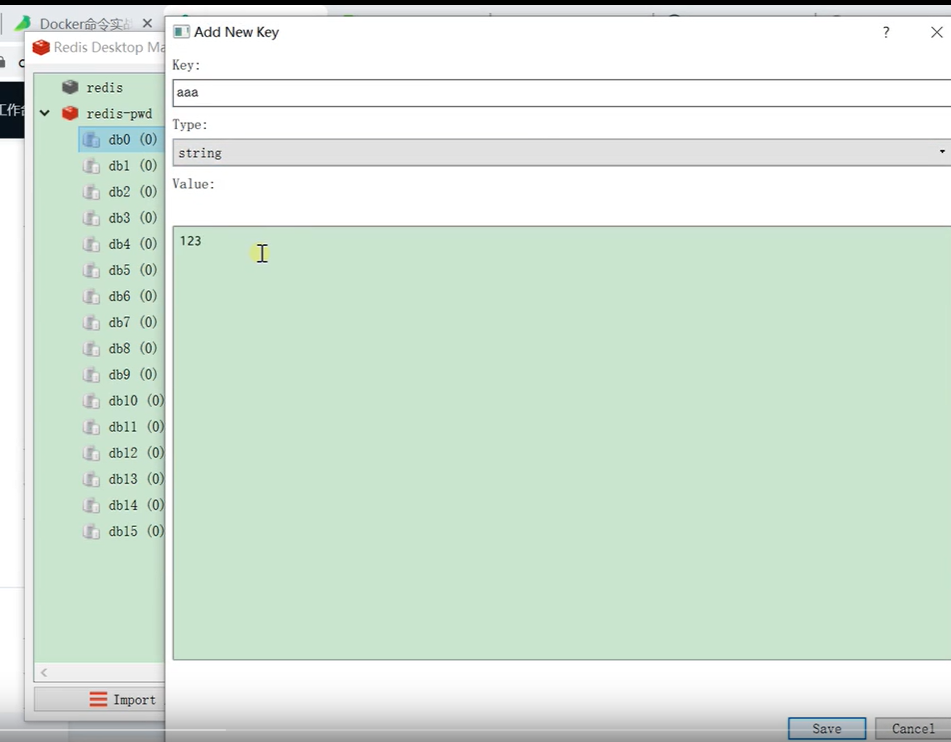
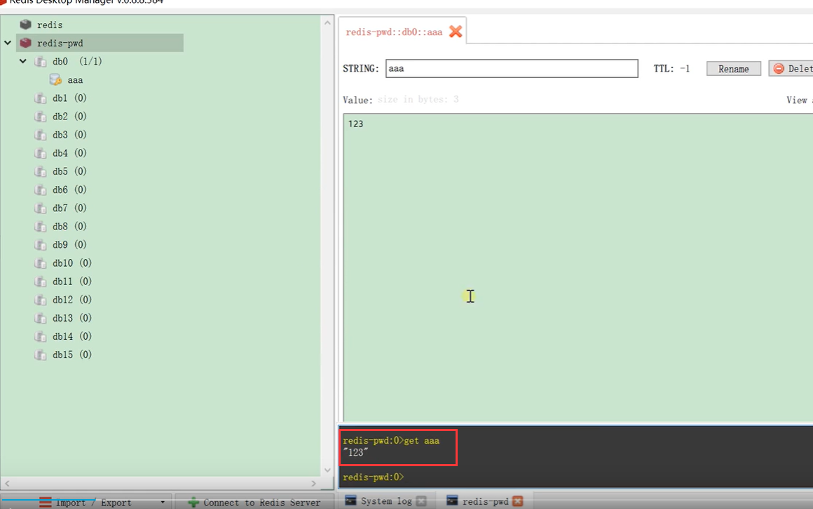
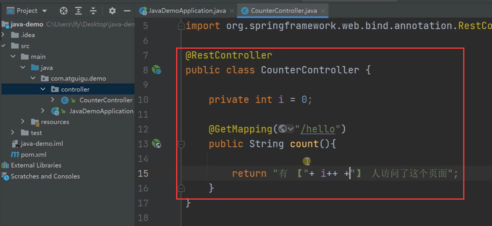
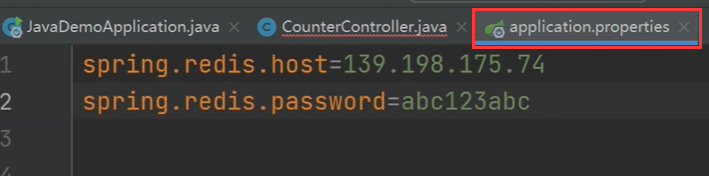
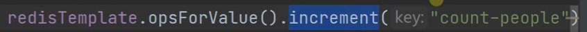
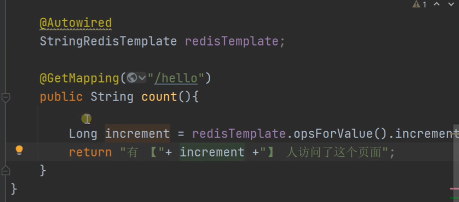
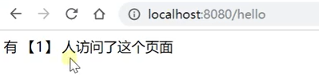
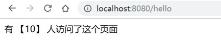

# 15.容器化-进阶-统计访问人数场景

## 1.redis的客户端工具常规操作

​	我们可以使用客户端工具添加一些redis的值

还可以命令行操作：如get aaa

那么redis就可以完成我们的k v数据库的存储功能

## 2.写一个控制器来模拟访问人数的场景

​	这个代码就可以实现了，这样是如果我们使用一个单机的应用是没有问题的，如果我们是集群的方式就不好使了

​	我们存放到redis中的操作

​	先配置一下redis的主机地址和密码

​	然后我们就可以使用redisTemplate来进行对redis数据的操作了

​	redisTemplate的方法opsForValue是可以操作一个KV，然后我们操作那个key就会使用到increment这个方法，在这个方法里放入需要操作的key，这样每次都会对这个key的value进行加1操作

然后启动测试一下：

​	

一直刷新会一直累计

如果我们的这个应用停机了，那么别的从节点启动访问还是正确的数据

