# 16.容器化-进阶-Dockerfile构建任意应用镜像

## 将应用打包成镜像

​	以前：我们就是将java应用，打包为jar包或者war包来进行部署的

​				把jar包或者是war包上传到服务器

​	这样的不好的地方就是，每次部署每次都需要部署一个可执行的环境，配置jdk，环境变量等等。今天一个java的明天一个python的后天一个前端的，每天整的都玩环境了，比较繁琐。

​	我们希望以后，所有机器都安装docker，任何应用都是镜像，所有机器都可以运行镜像

​	现在：我们就希望将所有的应用都打包为镜像

​			就会使用到dockerfile这个dockerfile就是来指定我们如何打包的

​			比如一个java的应用：先创建一个dockerfile文件

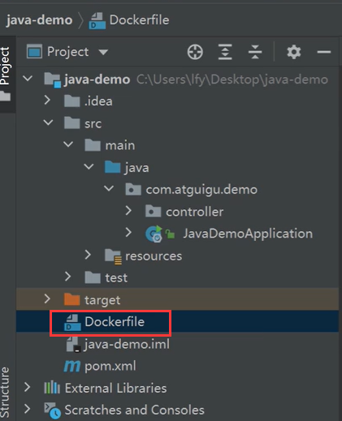

然后这个dockerfile中的内容该如何来写呢？

​	任何应用都需要一个基础的环境，那么就需要打包的基础命令FROM--那么我们是java应用，就需要java的基础环境，我们到docker hub中去寻找一下

​	java环境我们一般使用的是openJDK

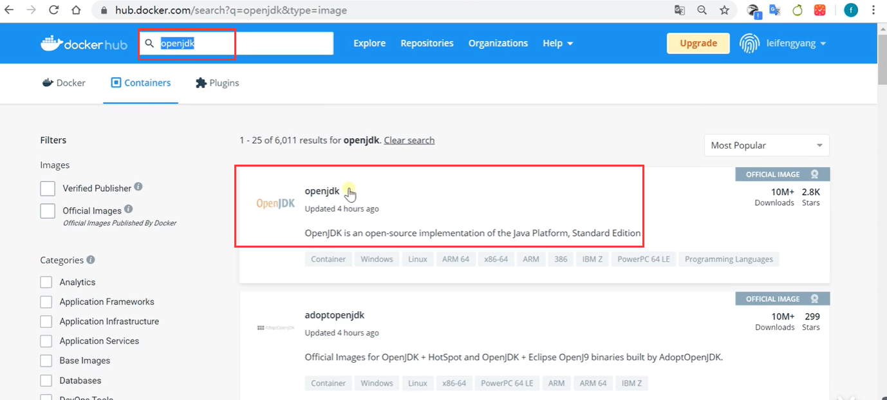

然后我们搜索一下jdk的版本比如8，在tags中搜索8-jdk

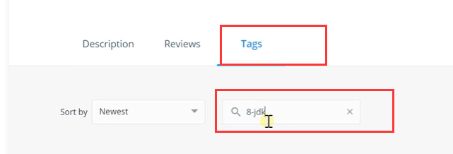

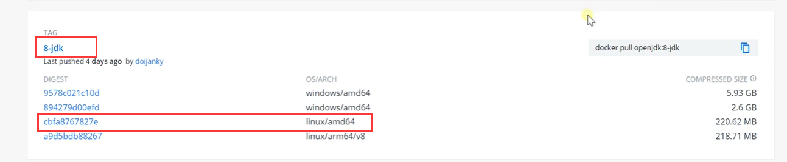

然后dockerfile中在from中加入jdk的版本

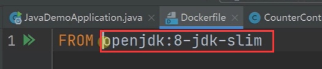

然后就是LABLE maintainer= 作者姓名  这个是固定的写法

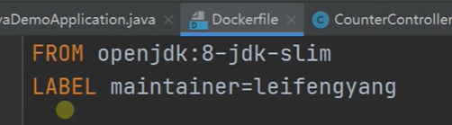

​	然后再往下就需要写EntryPoint这个就是镜像的启动命令 或者 写CMD都可以

​	这个意思就是 java -jar java-demo.....

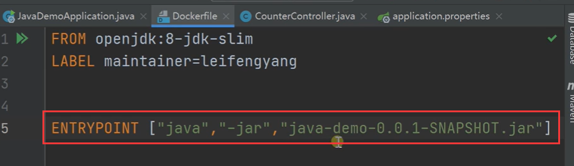

那么这个命令执行的时候这个jar包从哪里获取过来呢？

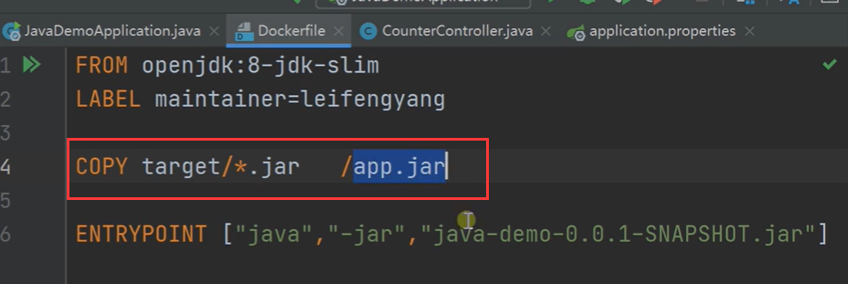

​	**这步非常重要**

​	我们需要从target中copy  jar 包到 容器中（相当于小linux中的根目录的app.jar）--然后启动命令中的jar包也需要修改一下，修改为copy过来的jar包

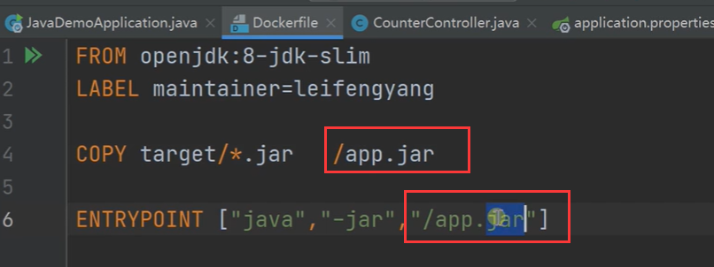

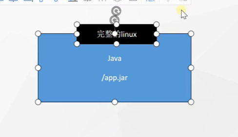

​	我们现在需要将target（需要target下的jar包） 和 dockerfile 上传到linux服务器

我们通过ftp的方式将文件拖入到linux服务器中（aaa文件夹中放的就是target文件和dockerfile文件）

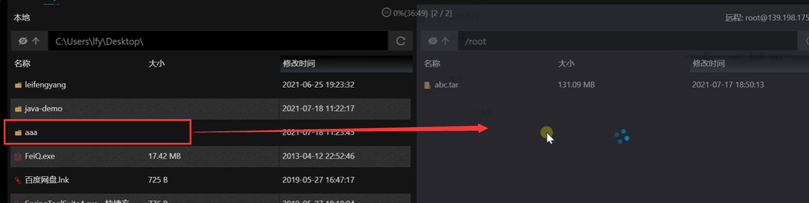

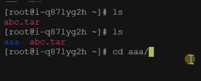

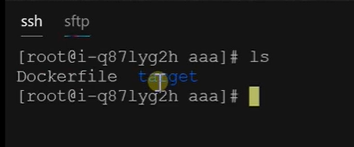

确认一下target下的jar包是否存在

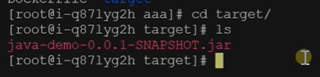

而这个jar包你在服务器上运行还需要装一堆环境，有了dockerfile之后我们就可以把他做成一个镜像

#### 制作docker镜像

​		只需要一个命令：docker build 就是构建docker镜像

​		然后是 -t 全称就是tag 镜像的标签名称 ：（冒号后面跟版本号）V1.0

​		然后是 -f 全称是Dockerfile 你是使用哪个Dockerfile构建的

​		还有最重要的是加个 . 这个点指的是在当前目录工作

如果文件名称就叫Dockerfile可以省略 -f的操作

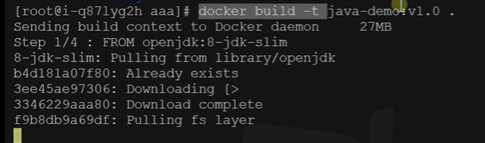

一共有4步命令操作，完成后构建成功

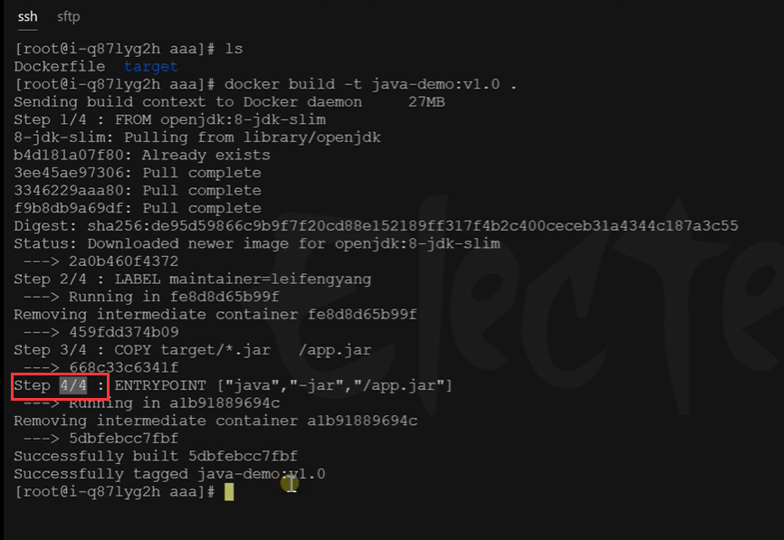

docker images查看一下，已经是构建好了，为什么是315M呢，因为是带了基础的jdk的原因

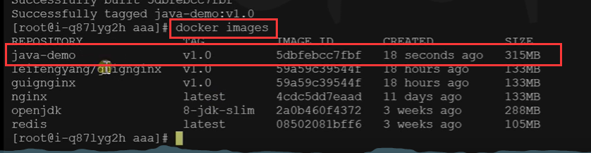

#### 启动我们制作好的java镜像

​	docker run -d后台运行 -p端口 8080内部端口：8080服务器端口 java-demo：v1.0 应用名称和版本号

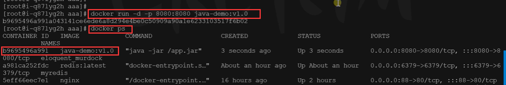

也可以多加个参数 --name 给起一个应用的名称

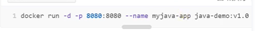

我们现在访问一下这个项目，这回就需要使用的是公网的IP地址来访问了

​	

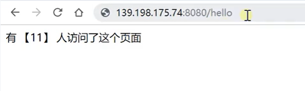

​	注意：安全组的端口也需要放开一下

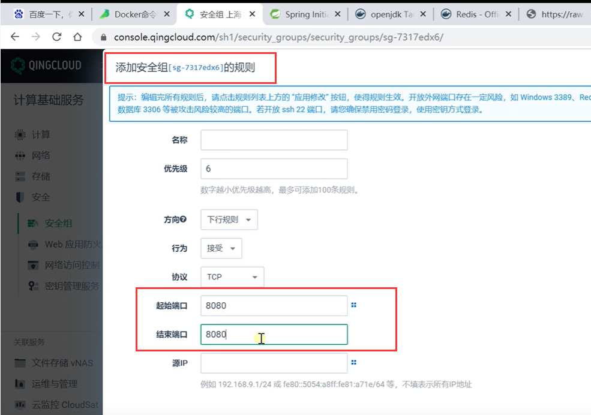

现在访问的时候人数也会每次发生变化

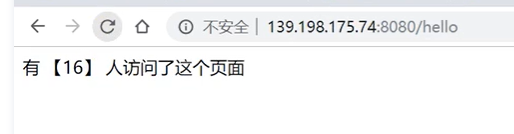

我们也可以查看这个java应用的日志

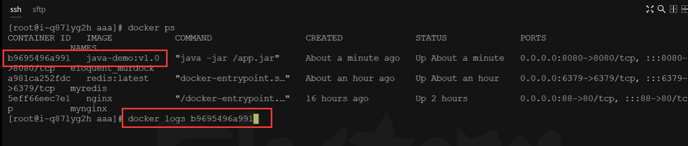

也可以使用docker logs -f 镜像id   这样可以跟踪实时的日志

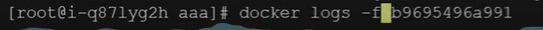

