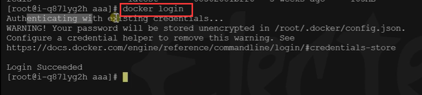
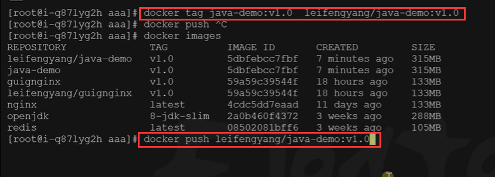
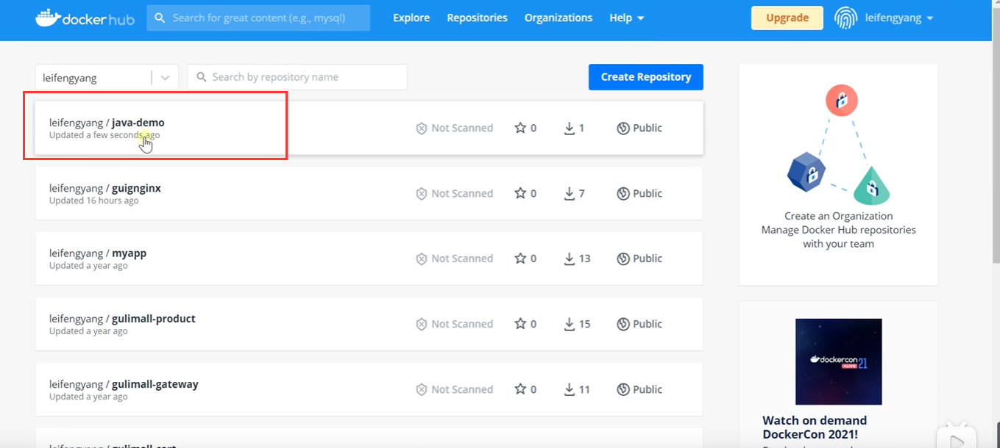
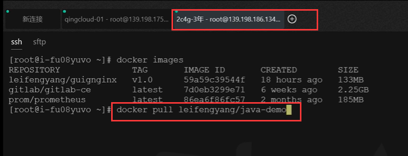
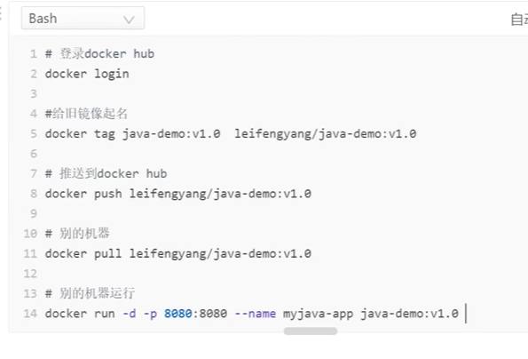
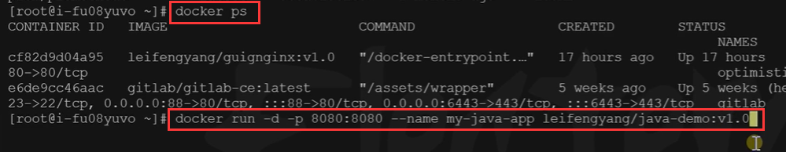
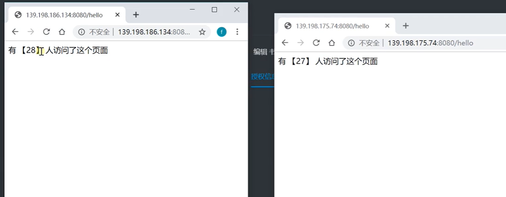

# 17.容器化-进阶-应用分享与启动

​	我们之前将应用自己打包到我们服务器上成为docker镜像文件了

​	如果现在有一台新的机器想跑这个应用该如何进行呢？

​	我们可以将这个镜像推送到镜像仓库

## 分享镜像

​	首先我们登录到仓库 docker login 登录到docker hub中

​	登录后先需要给镜像起一个带用户前缀名称的镜像名

 	我们可以在dockerhub 中的自己仓库中创建一个应用仓库，也可以起好名称直接推送 都是可以成功的

我们在仓库中查看一下，已经推送上来了

我们在新的机器上想运行，直接拉取镜像就可以了

​		docker pull 镜像名称:版本号

新的机器运行 我们制作的镜像

 应用部署在2个服务器上，并不影响访问人数的操作-无论访问那个服务都是没有问题的--这就是集群

https://www.bilibili.com/video/BV13Q4y1C7hS?p=25&spm_id_from=pageDriver

