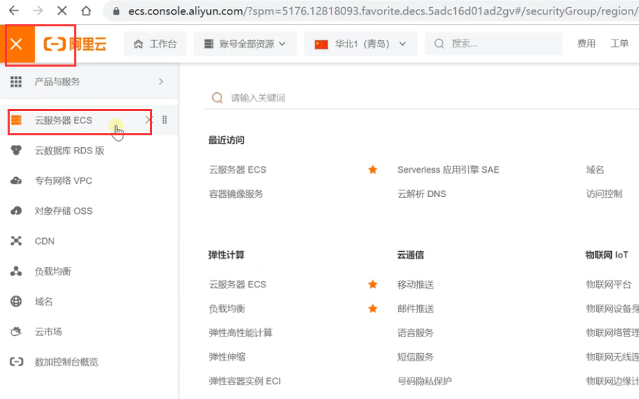
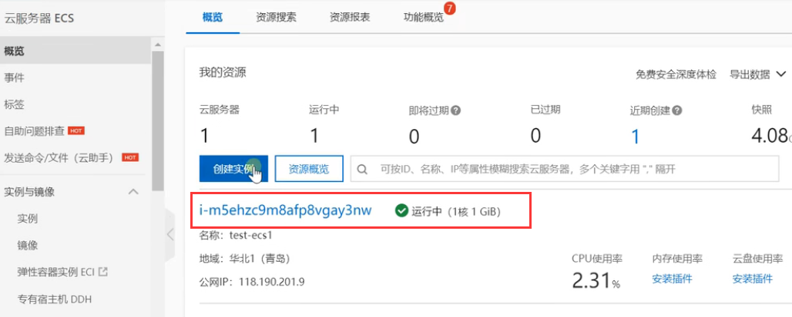
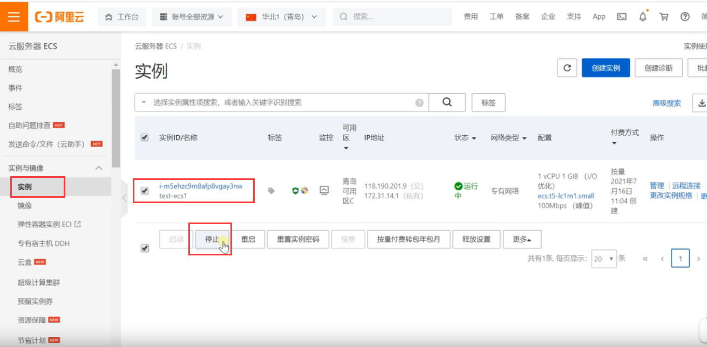
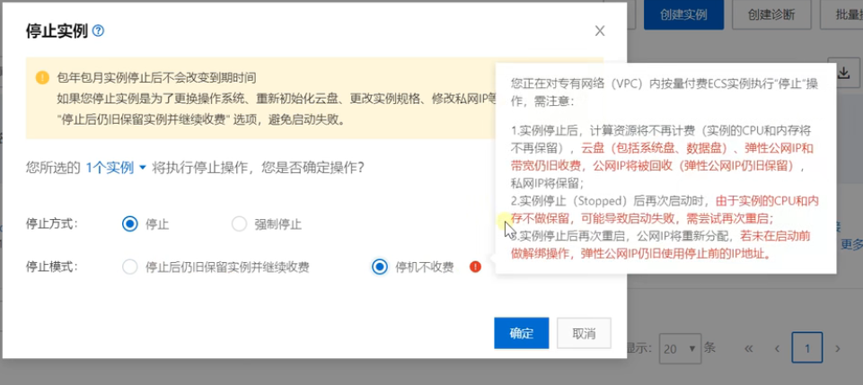
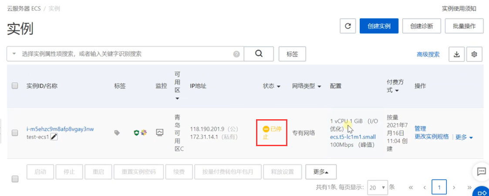
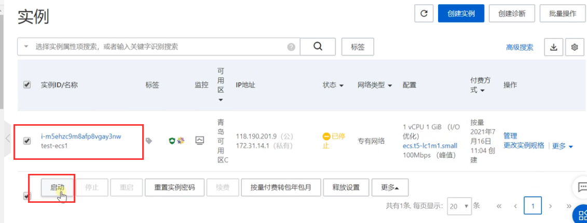

# 3.云平台-按量付费的优点

​	假设我们现在有段时间不使用这个服务器

​	从菜单进入我们ECS服务器控制台

可以看到我们创建好的运行实例--然后点击进入实例

勾选我们要停止的实例--点击停止

停机后-CPU和内存会取消收费--硬盘和公网IP还会继续收费，我们选择停机不收费

停机后--就只收少量的费用了

如果我们下次又需要使用这个服务器怎么办

​	勾选实例-启动实例就可以了

