# 4.云平台-私有网络VPC实战

​	首先每个服务器都有一个私有IP--内部网卡真正用的IP，一般这个私有ip是固定不变的，因为我们如果要建立集群，那么每个服务器的私有IP都得固定

​	如果我们使用公网IP如果我们选择是按量付费的，那么很有可能我们下次在启动实例的时候公网的IP地址就变了

​	我们的集群一般都是使用私有IP进行通信的，如果使用公有IP也是可以的，但是要考虑IP是否会变

还有就是使用私有IP是不会产生流量费用的，如果使用公网IP是会有流量的费用的。而且私有IP的速度是要比公网IP快的多的，因为公网IP会有带宽的限制，比如开通了1M的带宽，那么就很慢了

私有IP一般都会默认给我们一个的

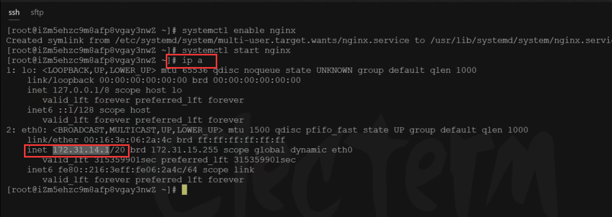

我们现在的网络类型也是选择的默认的**专有网络**

​		而我们真正在建集群的时候，我们有可能对自己的网络进行规划

那么如果我们想自己做集群 自己规划一些私有IP的话，而不是使用默认的阿里云的私有IP我们该如何做呢？

我们就可以使用VPC的方式，可以理解为私有网络或专有网络

比如我们自己创建一个VPC私有网络

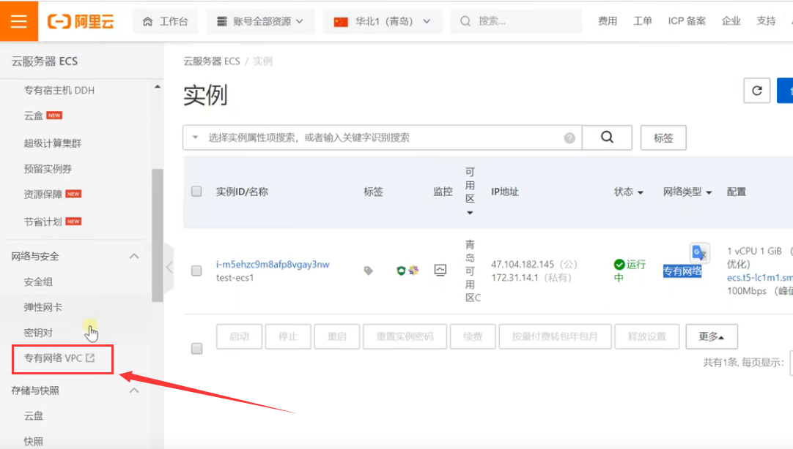

点击创建专有网络--目前有一个专有网络的实例--这个是阿里系统自动给创建的

输入专有网络的名称，网段配置

掩码的理解--比如我们使用的是16位掩码

​	我们将192.168.0.0转化为2进制就是以下数字，掩码划分网段，一共是32位，前16位是固定不变的

​	后16位就是我们可以使用的网段区间，那么8位的最大区间是256个地址，2个8位就是256*256

​	那么就相当于一个16位的掩码，可以托起网段区间一共可以分配65536个IP地址

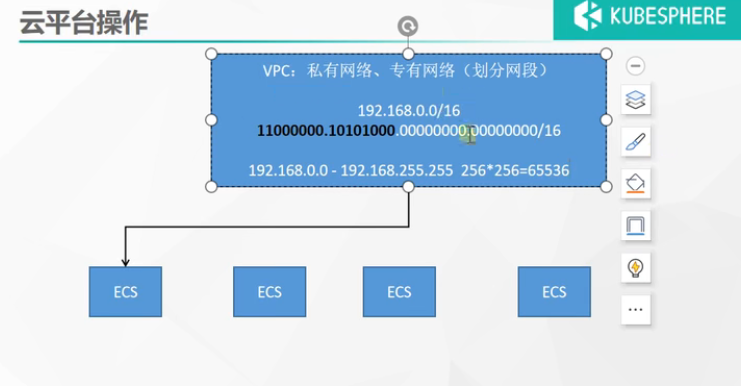

可以使用网络IP计算器来计算

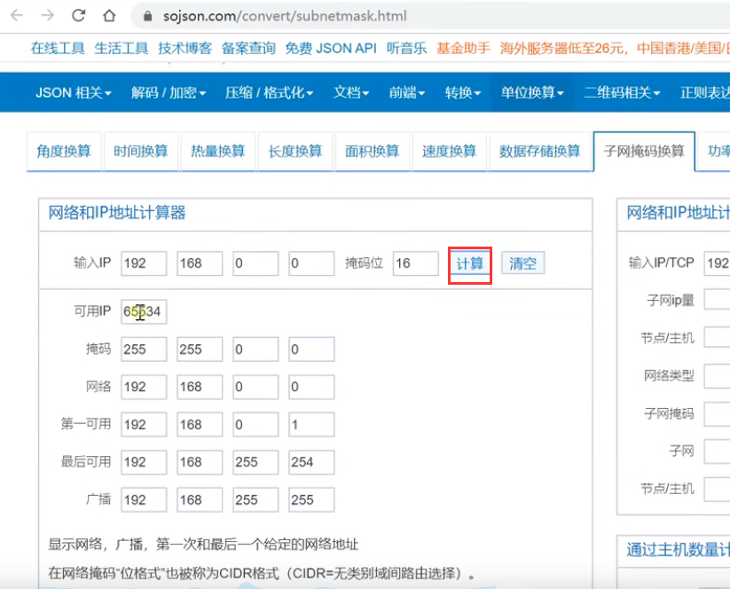

那么这个网络区间有可能太大了，我们还可以创建子网-创建交换机（创建交换机其实就是创建子网）

创建交换机：

​		那么我们在VPC下继续划分子网，子网掩码的24意思就是，32位的ip区间前24位是固定的，那么就剩余8位是可以分配的，那么就一共可以有256个ip地址 减去2头不使用的就是254个地址

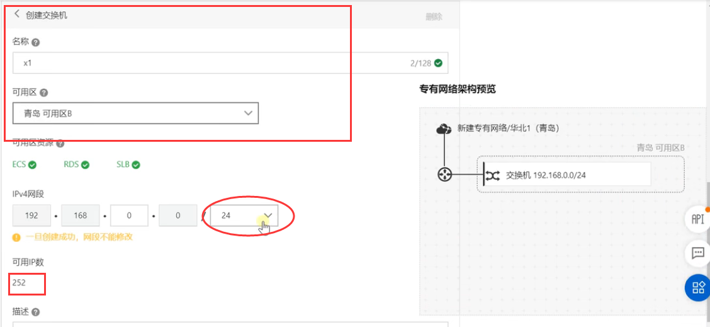

我们可以划分多个子网

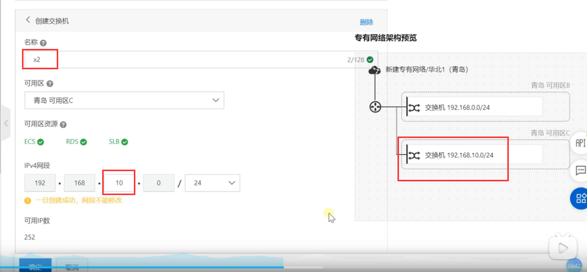

这就是我们目前规划出的VPC网络，暂时规划出2个子网254+254个地址

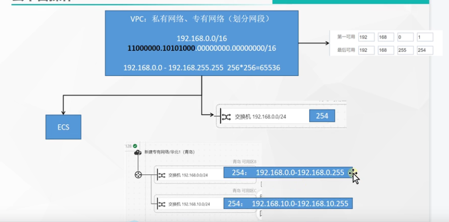

点击确认创建:

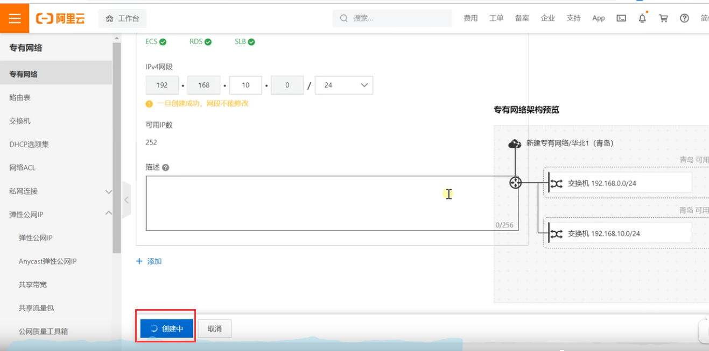

这个就是我们自己创建的VPC网络了

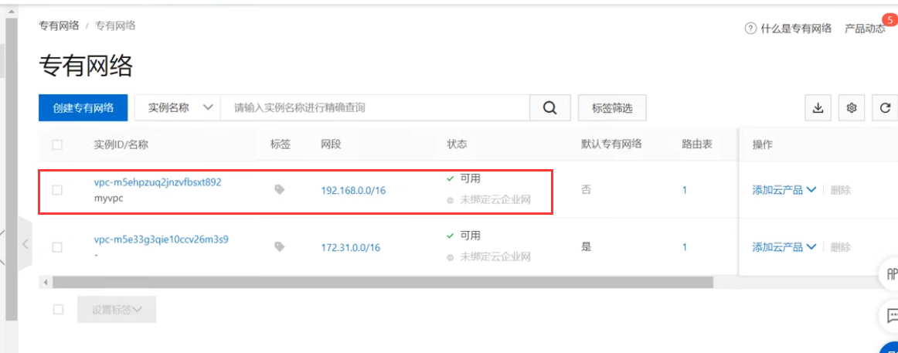

使用VPC的好处--多个VPC的同网段是互相隔离的--按同样的IP/掩码划分 的ip范围，不同的VPC是相互隔离的

​	比如 我们小区一个局域网，你们小区一个局域网，可能网段是一样的，但是是不互通的

​	只要是在同一VPC下网络都是互通的，不同的VPC就不行了

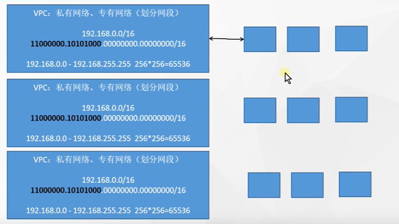

还有好处就是 开发使用一套VPC网络，生产使用一套VPC网络，这样互相隔离开来比较安全--增加了安全性

我们现在在新创建的服务器就可以选择需要加入的VPC网络，还可以选择此网络下的交换机

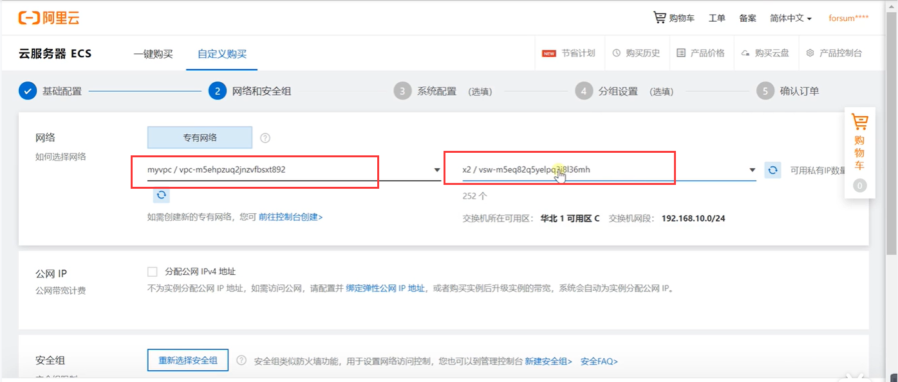

我们来测试一下这些私有IP是不是互通的

​	192.168.10网段的和172.31.14网段是不通的，因为他们属于不通的VPC网络

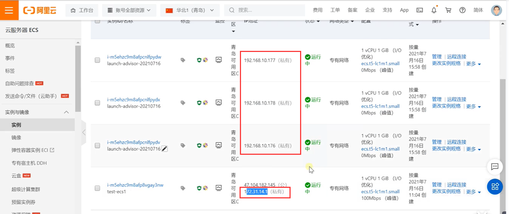

不通

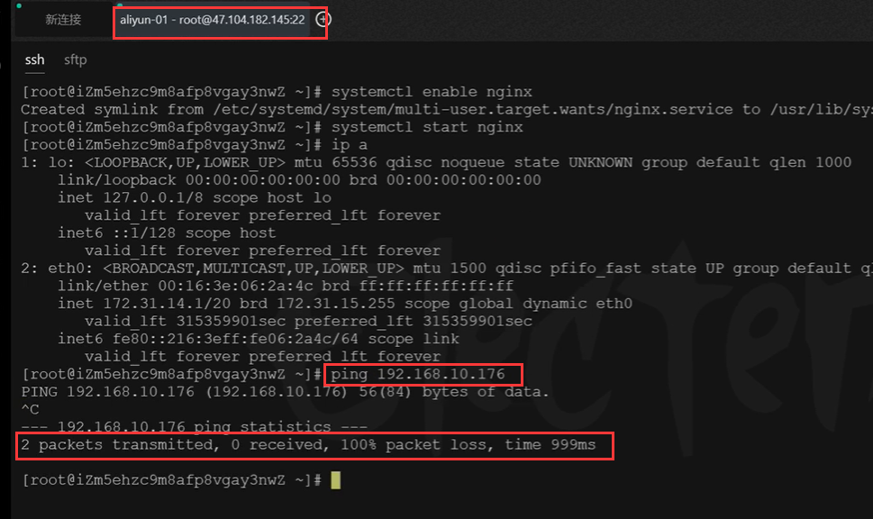

我们通过远程连接 可以进入阿里云 web连接服务器界面，测试同VPC下的服务器私有IP是可以进行通信的

最后--我们测试完成，停止所有的实例，然后释放全部的设置，就不需要付任何的费用了

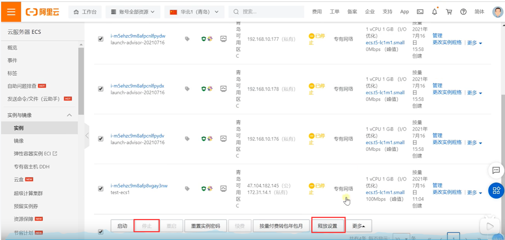

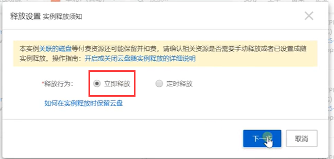

