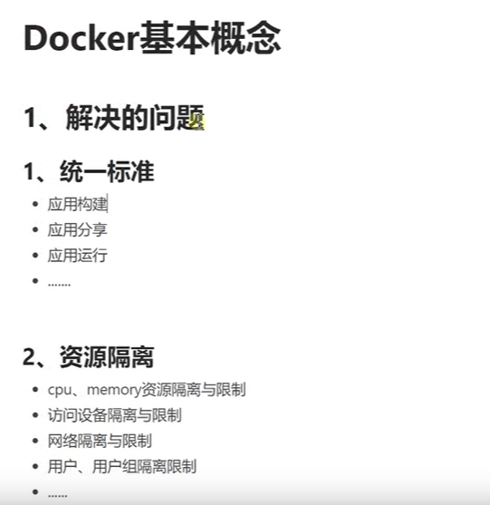
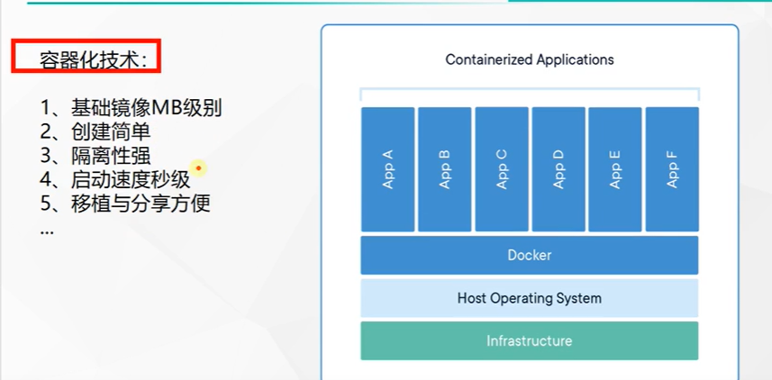
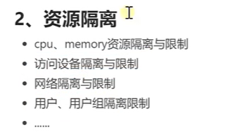
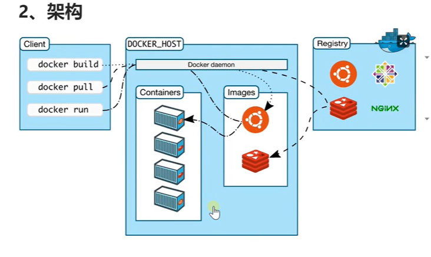
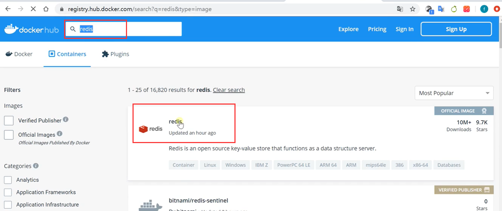
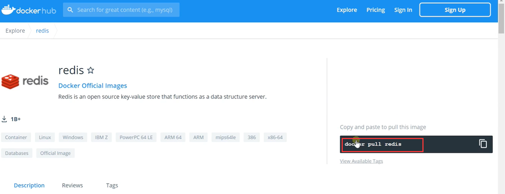
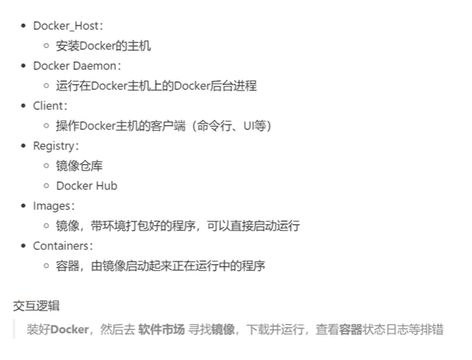

# 5.容器化-docker的概念

####		应用构建：

​		比如我们很多种语言开发的项目Java，C++，JavaScript等等，最终打了各种各样的包，每次对不同的包需要进行不同的部署方式比较繁琐。

​		而像我们windows无论你是什么软件最终都给打成一个exe的包来执行安装。

​		docker的思路也是这样把所有的程序都使用docker build编译成为 docker镜像--所有的应用统一为docker镜像

#### 应用分享：

​		应用统一构建成 统一的标准后，可以把所有软件的镜像放到一个指定的地方 docker hub（相当于放到了应用市场）

​		之后我们就可以访问这个docker hub 来下载我们需要的应用了---这样就解决了应用分享的问题

#### 应用的运行

​	因为有统一的标准**镜像**，就像Windows的exe一样

​	运行镜像就使用统一的命令 docker run 就可以了--（不像以前 需要单独启动java的，启动C++的，每次启动的模式也不一样，比较繁琐）

​	我们在理解**容器化**技术之前，先了解一下虚拟化技术，虚拟化技术解决了 强隔离的问题，但是每个虚拟机都需要独立的系统，这就导致创建稍微复杂，启动速度比较慢，还有就是虚拟系统占用空间比较多

**容器化技术：**

​	   我们可以理解为docker是一个个的隔离沙箱环境，每个容器都是独立的，而且容器镜像是非常小的大约5M，相比于虚拟系统好几个G就轻量级很多了，而且启动速度快

​	

#### 资源隔离--每个容器的隔离也是非常强可控的

我们理解一下docker的架构--

​	首先每一台机器都先安装docker，我们把安装了docker的机器叫做docker主机（DOCKER_HOST）

​	安装了docker，系统就会启动一个docker进程 docker deamon

​	一些docker的命令行操作 我们称为docker的客户端--然后给主机docker发送命令

​	Registry就是镜像的仓库，我们可以通过仓库来获取和推送镜像

​	Containers是容器，将下载好的镜像放入容器中来启动

​		

比如下载redis的镜像

然后docker pull redis就下载下来了 ---然后docker run 启动就搞定了

