# 6.容器化-开通青云服务器

地址 qingcloud.com

​		注意--在使用青云服务器的时候，可以查看自己的服务器配额，如果需要加大自己的一些服务器配额，可以申请工单，然后通过工单来进行对服务器的配额增加。

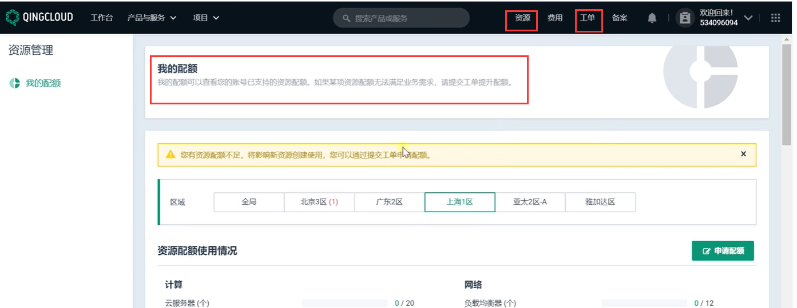

青云的所有入口基本都是从 **产品与服务** 这个菜单入口来进入的

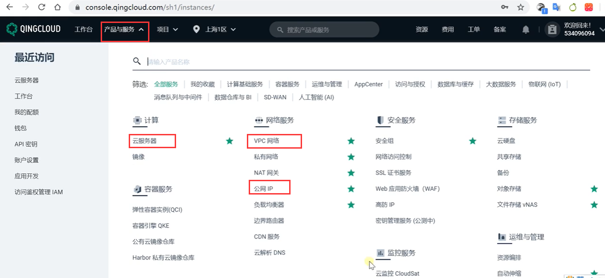

比如进入云服务器--然后来创建一个服务

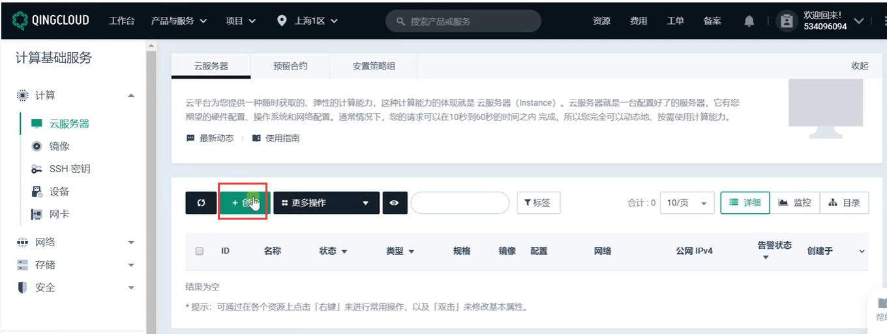

我们先选一个按需付费--测试完成后删除停止掉此节点

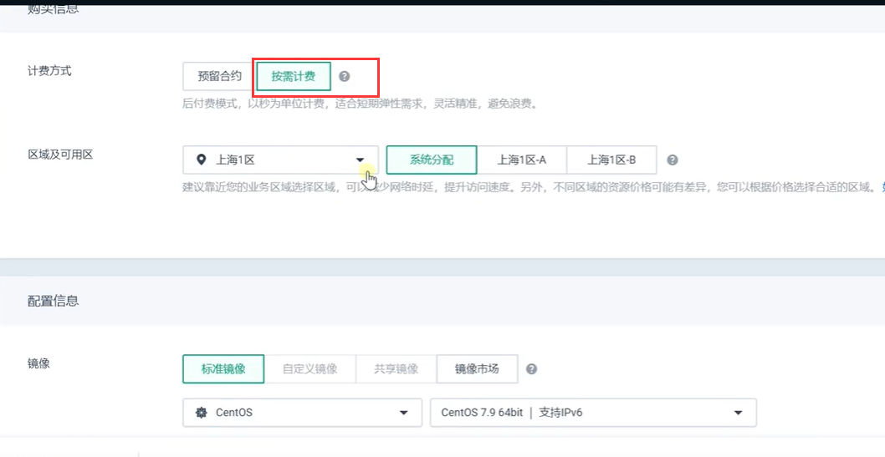

选个实例规格：	基础型的 1核2G的机器 每小时大约几毛钱，硬盘50G默认的

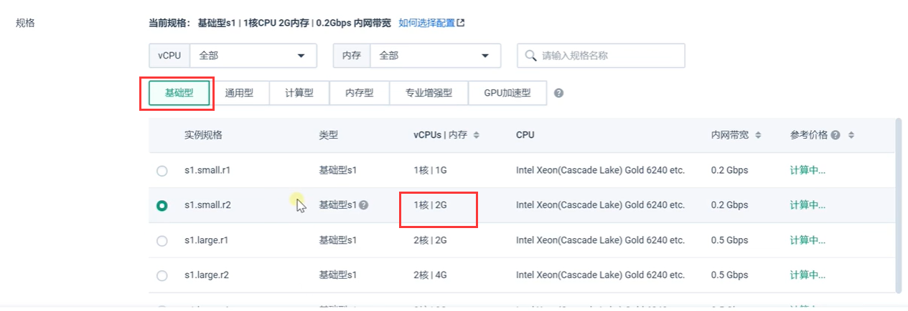

网络先使用默认的网络---后续我们使用自己组建的VPC网络

​	安全组先默认--安全组就是控制防火墙的

创建一个公网的IP，使用个固定带宽4M的，因为我们可能需要下载的东西比较多，使用固定带宽比较划算一点

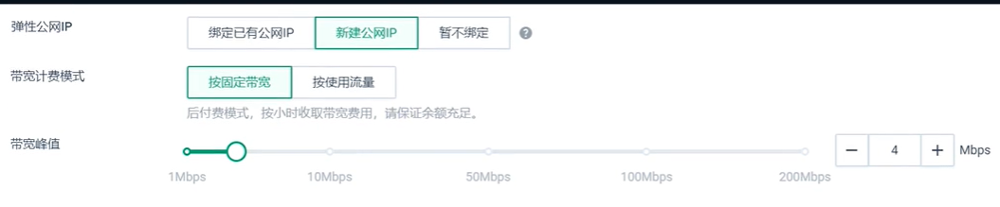

设置服务器名称和密码

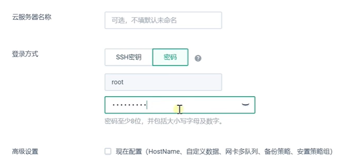

这个服务器就开通了--开通的前提是你这个费用里面要有余额

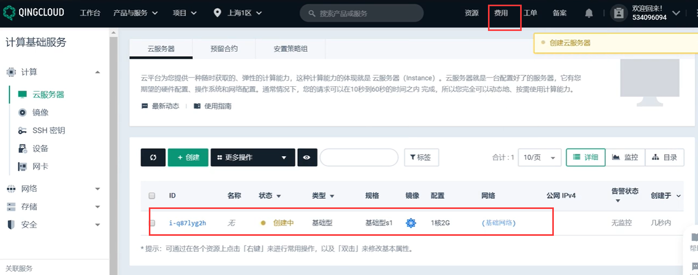

刷新一下页面--复制公网IP，然后连接

连接服务器

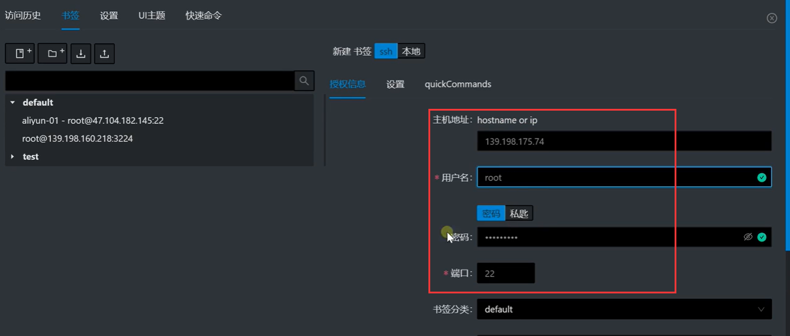

发现没有连接成功--一般连接不上的原因 首先检查安全组  可能是安全组的端口并没有开放

​		这个就是22的端口并没有启用

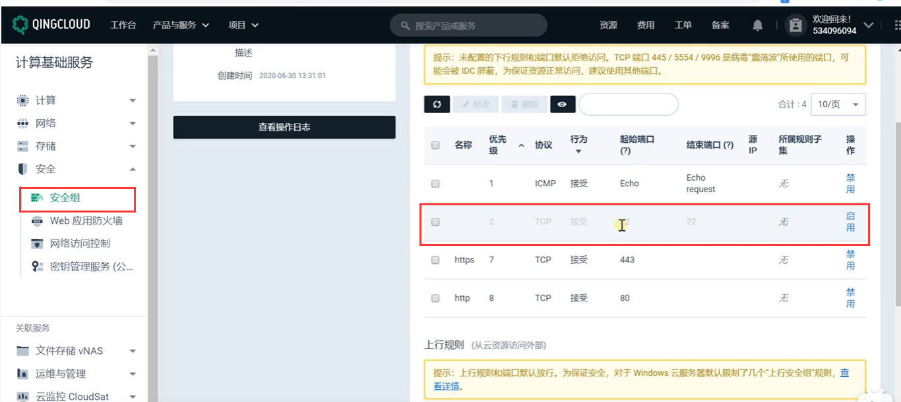

点击启用--规则修改后需要点击一下应用修改

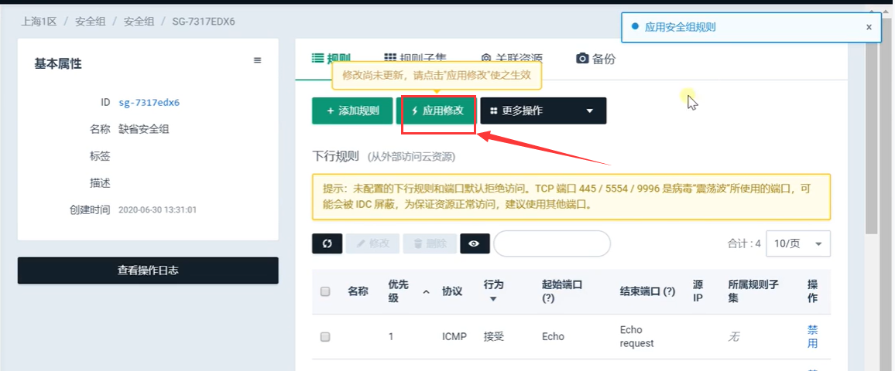

现在就连接成功了

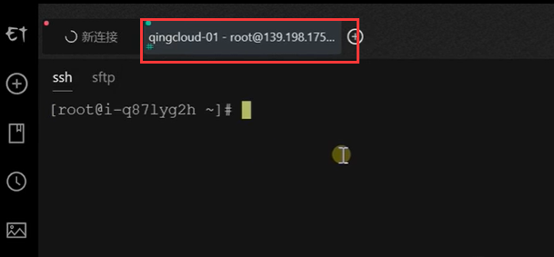

