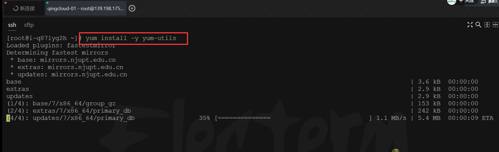
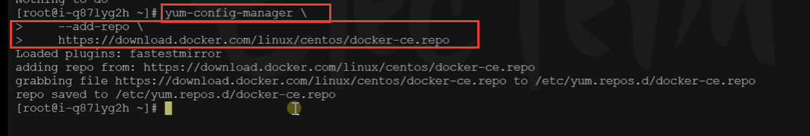
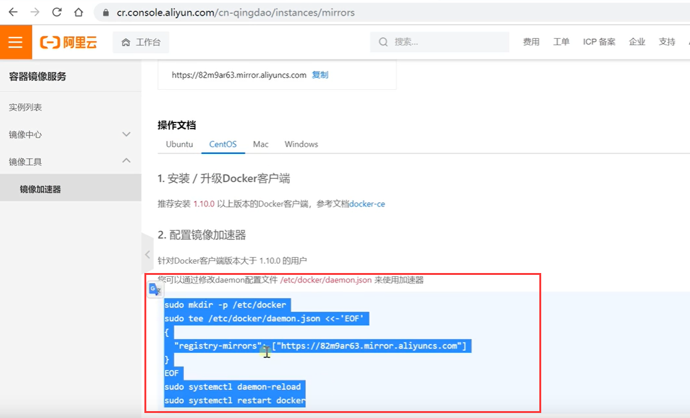

# 7.容器化-安装docker


# 3、安装

## 1、centos下安装docker

其他系统参照如下文档--这个是官方的文档

https://docs.docker.com/engine/install/centos/


### 1、移除以前docker相关包

​	第一步先卸载掉系统的以前的老版本的docker

```bash
sudo yum remove docker \
                  docker-client \
                  docker-client-latest \
                  docker-common \
                  docker-latest \
                  docker-latest-logrotate \
                  docker-logrotate \
                  docker-engine
```


### 2、配置yum源

​		我们安装docker之前先配置yum源，sudo 就是管理员权限的意思

```bash
# 安装yum的依赖
sudo yum install -y yum-utils

# 添加docker的安装源地址
sudo yum-config-manager \
--add-repo \
http://mirrors.aliyun.com/docker-ce/linux/centos/docker-ce.repo
```


先安装yum的依赖




添加docker的安装源地址，反斜杠是换行的意思




### 3、安装docker

```bash
# 这个是安装最新版的docker 如果是安装指定版本 就是docker-ce 19.03
# docker-ce 代表的是 ce社区版本 EE是企业版
# docker-ce-cli 是docker操作命令行的程序
# containerd.io 是docker容器化的运行环境

sudo yum install -y docker-ce docker-ce-cli containerd.io


#以下是在安装k8s的时候使用
yum install -y docker-ce-20.10.7 docker-ce-cli-20.10.7  containerd.io-1.4.6
```


### 4、启动

```bash
# 设置开机启动 --now是既要开机启动 也要现在立即启动
systemctl enable docker --now
```

​	然后我们检查一下，docker ps 里面有东西就行，docker info 查看docker的详细信息


因为我们平时从docker hub 仓库下载的内容都是国外的网站，所以我们需要进行docker的加速

### 5、配置加速

这里额外添加了docker的生产环境核心配置cgroup

```bash
sudo mkdir -p /etc/docker
sudo tee /etc/docker/daemon.json <<-'EOF'
{
  "registry-mirrors": ["https://82m9ar63.mirror.aliyuncs.com"],
  "exec-opts": ["native.cgroupdriver=systemd"],
  "log-driver": "json-file",
  "log-opts": {
    "max-size": "100m"
  },
  "storage-driver": "overlay2"
}
EOF
sudo systemctl daemon-reload
sudo systemctl restart docker
```


其实我们使用的就是阿里云的镜像加速地址




