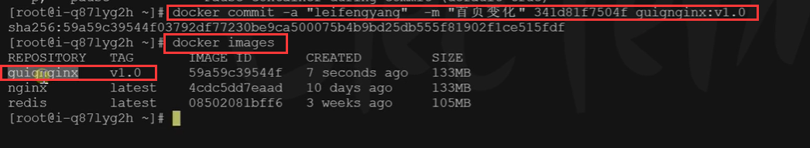
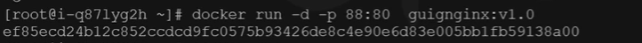
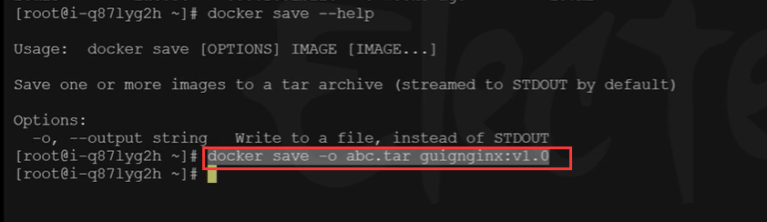
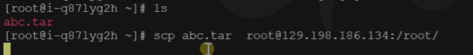
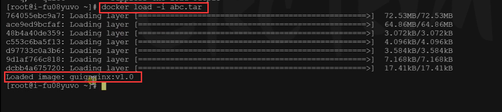
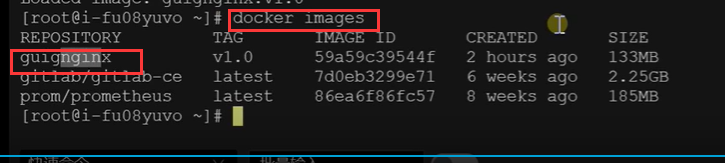
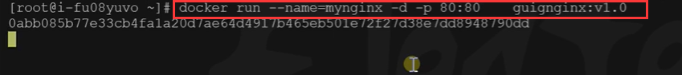
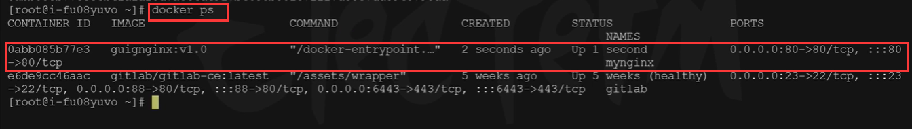
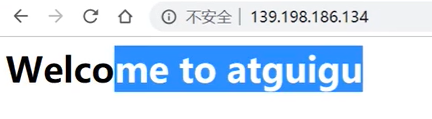

# 9.容器化-命令-提交改变

​	比如：我们现在使用的nginx修改了很多内容，但是在我们使用新电脑的时候，不希望重新的配置，希望还是使用这个修改好的镜像---那么就需要改变镜像，传输镜像


## 4、提交改变

将自己修改好的镜像提交


```bash
docker commit [OPTIONS] CONTAINER [REPOSITORY[:TAG]]

docker commit -a "leifengyang"  -m "首页变化" 341d81f7504f guignginx:v1.0

# -a 代表作者 ，-m 是变更信息 镜像id号 新的镜像名称：设置版本号
```


可以看到会产生一个新的镜像




我们现在就可以启动这个新的修改后的nginx容器了




如果我们现在有一台新的机器，那么我们怎么能把这个修改的镜像给到这个新的服务机器呢

使用的第一种办法就是物理传输，将镜像保存为压缩包，别的机器去下载这个压缩包

### 1、镜像传输

```bash
# 将镜像保存成压缩包
docker save -o abc.tar guignginx:v1.0

# 别的机器加载这个镜像--就是将tar的压缩包 -i 读 到本机成为镜像
docker load -i abc.tar


# 离线安装
```


实际操作：




然后我们通过物理传输 scp的方式发送给其他服务器




我们在新服务器上--需要将abc.tar加载到docker的镜像中

使用docker load -i 压缩包名称       -i 的意思就是image 镜像

​	读取到了镜像 guigunginx:v1.0




我们查看镜像，发现新的机器中就有这个镜像了




在新的服务器上运行测试：




正常运行




访问一下：没有问题，是我们修改后的镜像




