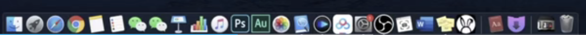
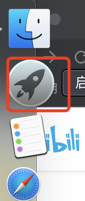
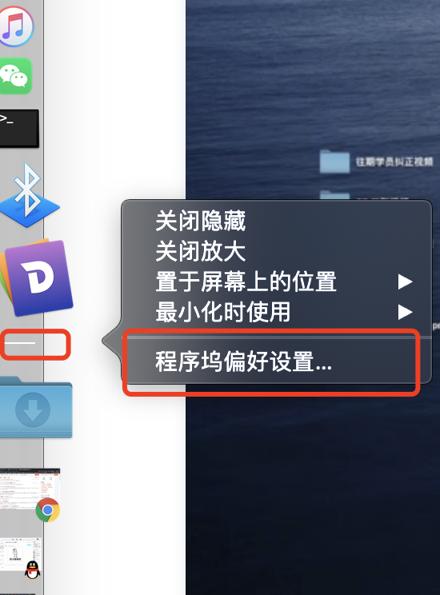

# 1.mac的基本理解

​		首先mac是没有我的电脑--我们可以理解为是一个大的Ipad

#### 1、顶部的这个--可以理解为是目前应用的一个菜单栏

访达：可以理解成为是我的电脑--访达就是最根本的文件目录--根

####  2、右上角

​			是系统的一些通知栏，系统的一些默认应用等等 

#### 3、下面

​		放的就是我们常用的应用，可以理解为windows的开始菜单中的内容

​	这个时候大家的疑问就来了--我的应用在哪里呢？

​	其实应用都是在启动台里面的--如果使用的是鼠标可以按住鼠标来滑动，如果是触控板使用俩指的滑动可以切换了

​		所有的应用都是在启动台中的，如果我们想把应用放入快捷栏里面，按住应用拖进就可以了

​		如果快捷栏里面的内容不想要了，拖出来就可以了

我们在快捷栏 横杠的地方右键，有个程序坞偏好设置--里面可以设置很多内容自己玩玩

#### 4、桌面

​		我们最新生成的文件一般是放在桌面的最右侧，上角的，依次往下排列，在windows是在左上角的，要习惯一下他们是反的

​		像我们还是会想到我的东西应该放到C盘或者是D盘--其实是因为以前那些老的电脑因为都是机械硬盘所以引用分盘的方式，像现在都是固态硬盘了-就不分这个盘符了

​	因为没有我的电脑了--整个电脑的文件需要你有一个非常好的文件管理的习惯

