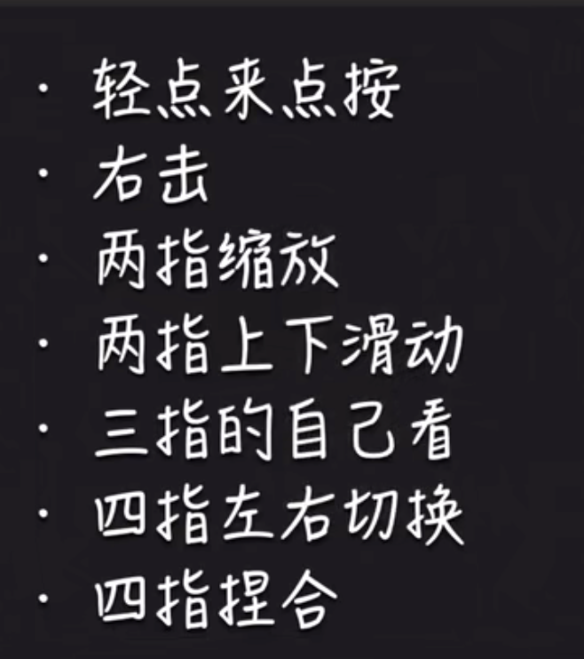
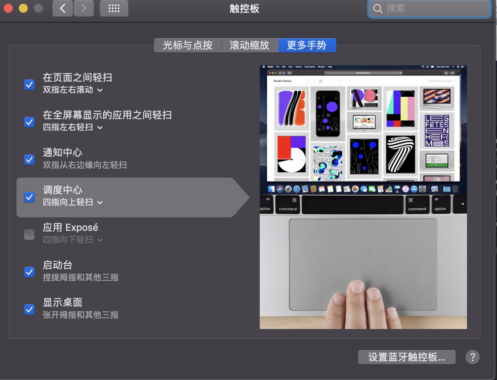
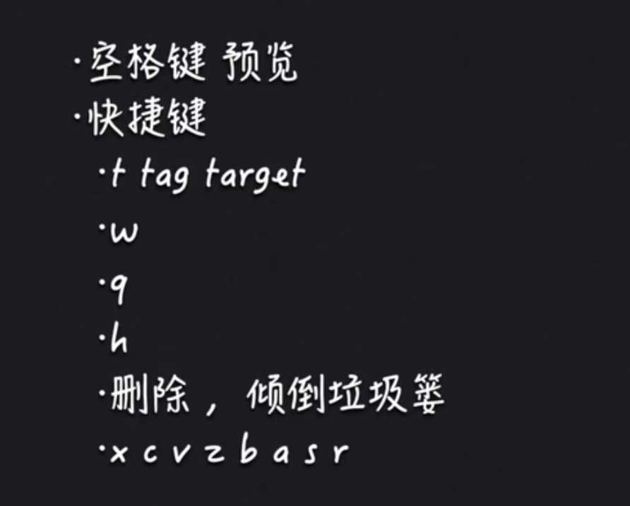
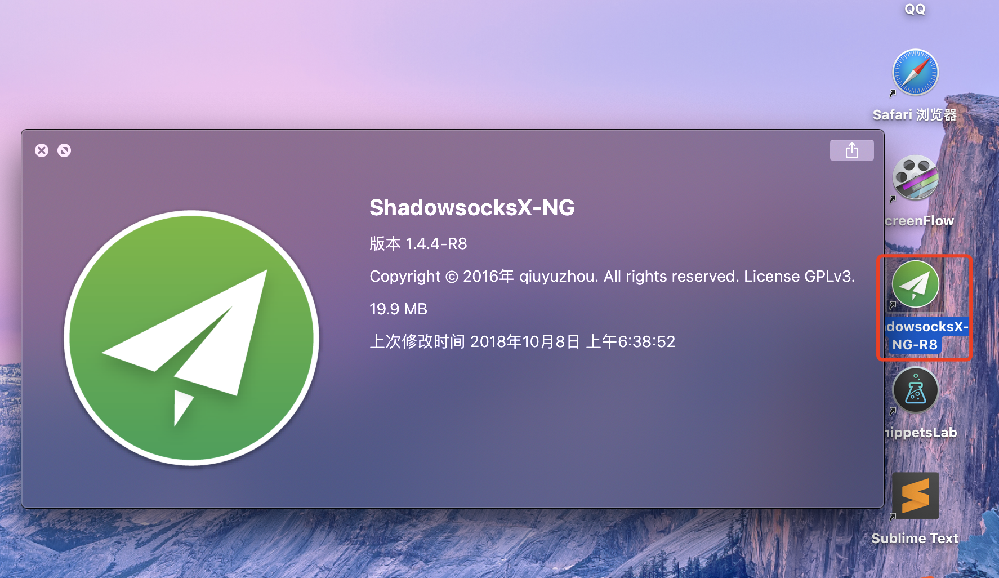

# 2.mac触控板

​		单击：单点触控板

​		右击：双指触控

​		缩放：俩指操作

​		三指：三指滑动是选中

​	使用四指：可以进行左右的滑动

​			四指上划：可以列出所有的本桌面的应用

​			四指捏合：进入启动台

​			四指开放： 进入桌面

更多的手势可以在触控板里面查看

#### 2、常用快捷键

​		 	首先肯定是不要背没有任何用--之后还是会忘记

我们需要一个记住一个--这样更容易记住

​	空格键---这个可以有预览的功能-非常好用

比如：我选中一个东西，然后空格就可以预览了

#### 3、按键T W

​	T也是比较重要的一个按键：Tag target

比如我们现在在浏览器查看东西，突然想打开一下百度需要新建一个标签页

​	我们只需要command + T 就可以新建一个标签页了，使用command +w可以快速的关闭这个标签页，这个w可以理解为window

#### 4、按键Q 

​	Q也是比较常用的 q可以理解为quite 推出的意思

#### 5、按键H

​	H--可以理解为hide 隐藏

#### 6 删除Delete键

​			command + delete 快速删除到废纸篓

​			如果是想倾倒废纸篓--command + shift +delete 

#### 7、还有一些比如x、cvzbasr

 	x剪切，c-拷贝，v-粘贴，z-撤销，b-加粗，a-全选，s-save保存，r-刷新

