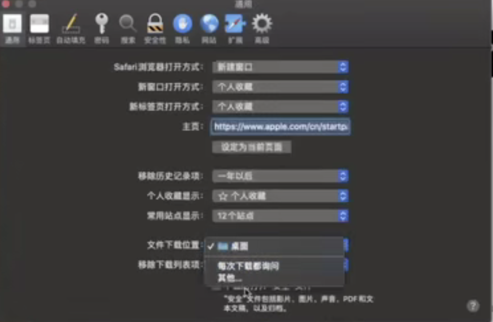
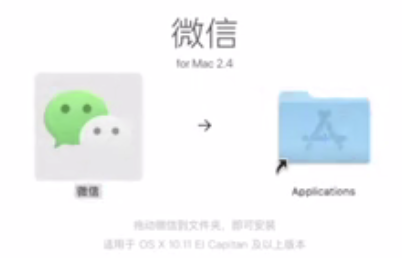
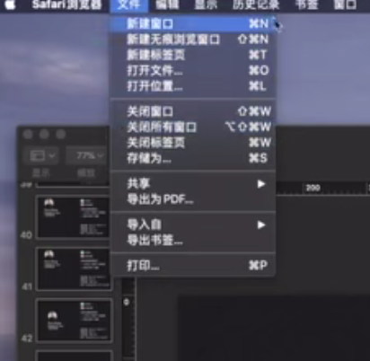

# 3.mac安装应用

#### 1、直接下载

​		比如我们直接浏览网页下载比如下载微信--新的mac可能不会下载到桌面

​			这个可以设置在系统偏好设置里面 偏好设置的快捷键是command+，逗号

​		可以选择下载到桌面

​		安装文件是dmg后缀的文件

安装拖到application中就可以了

安装完后会在访达中多出一个盘--推出就OK了

​	也可以到https://www.macdo.cn/里面去下载 --可以保存到收藏夹--command +d

其实所有的快捷键不需要记的，我们在菜单就可以找到

