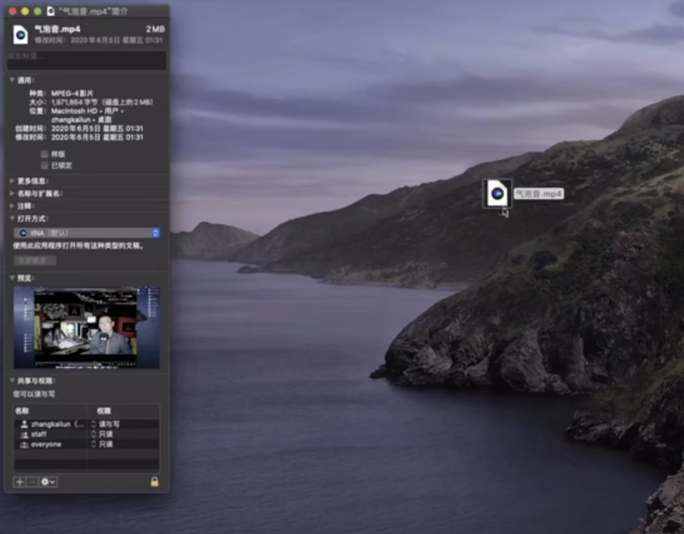
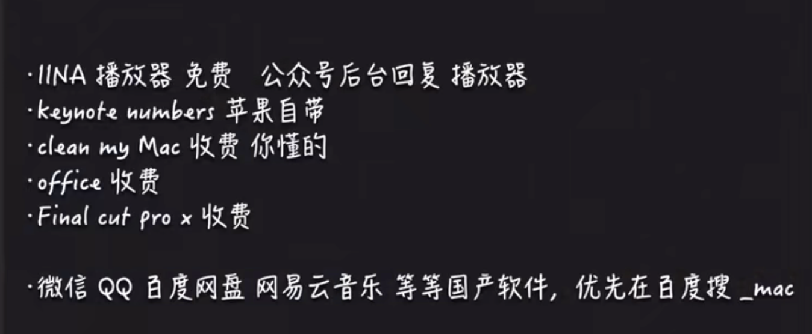

# 4.mac常用软件

​		

​		这个IINA播放器是目前mac上最好用的播放器--推荐使用

​	我们设置将默认的播放器设置为IINA这个播放器

​		 command + i 或者右击 显示简介，，然后在中间可以选择打开方式，默认是Quick 那个播放器，我们现在选择一些IINA就可以了

#### 2、keynot number

​			这个使用是不会丢失的-而且也不会奔溃

number这个不是简单的Excel 这个完全可以div的

 

