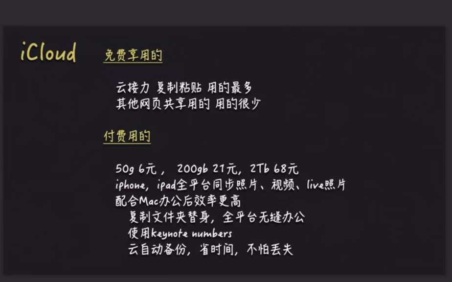
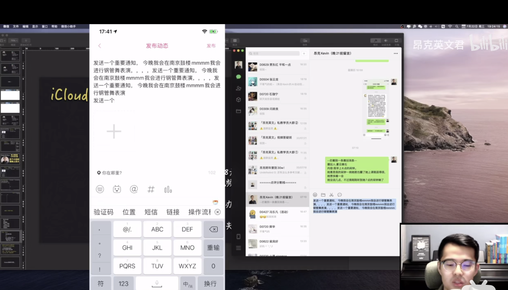
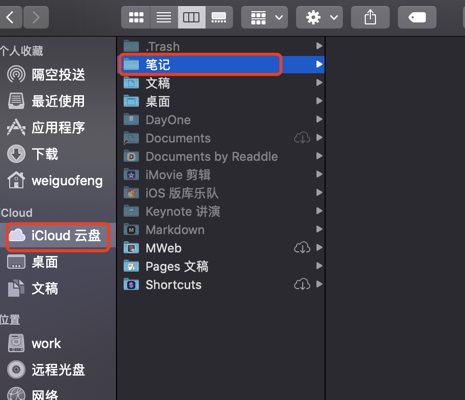
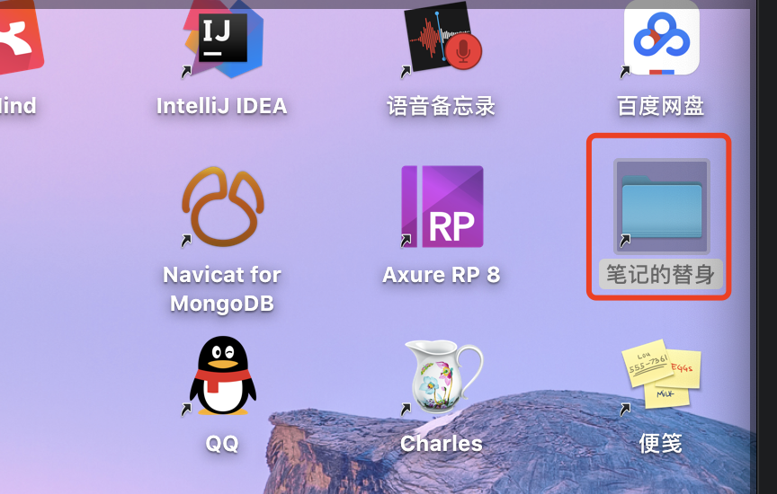

# 6.mac-icloud使用

​		icloud是构建整个苹果体系生态最重要的一环

比如好使的是：我们可以使用云接力的功能

​		我们在电脑端copy一个内容，在手机端可以进行粘贴使用，是不是很神奇

比如我们在icould 创建一个文件夹

​		然后右击制作替身--然后将文件夹拖出来--这个替身文件夹标识是有一个黑色的箭头

他不是一个真实的文件夹--比如我们后续想要备份的文件--都放入这个文件夹就可以自动同步到iCloud云端了

​	他一直是同步的--如果我们更换了设备也是不影响的，都会一直自动同步-办公更方便了

比如好使的是：我们可以使用云接力的功能

