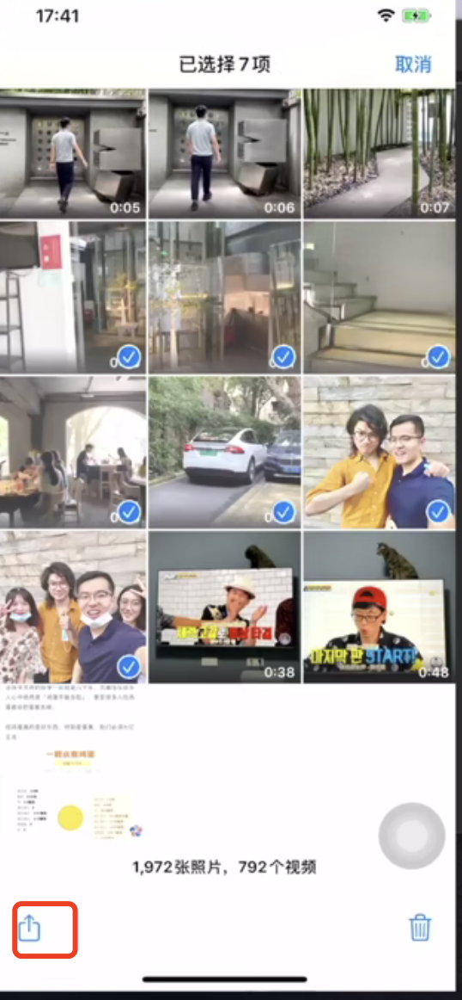
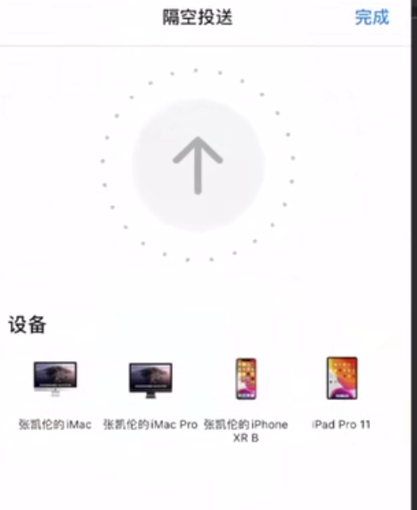
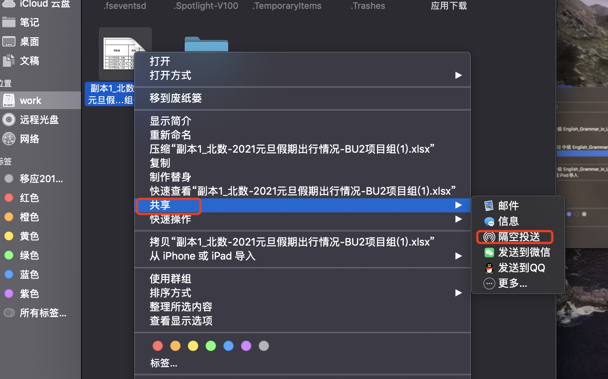

# 7.airDrop

​		翻译中文就是隔空投送--其实就是蓝牙传输文件

#### 1、手机传输电脑

比如-选中手机中的照片--进行传输

然后选择隔空投送---然后选择设备

然后投送的设备就会有滴滴滴的声音，然后在屏幕的右下角会弹出内容，也可以在下载中查看传入的内容

#### 2、电脑传输手机

​		右键--共享--选择隔空投送

​		

​		然后选择设备进行投送就OK了

