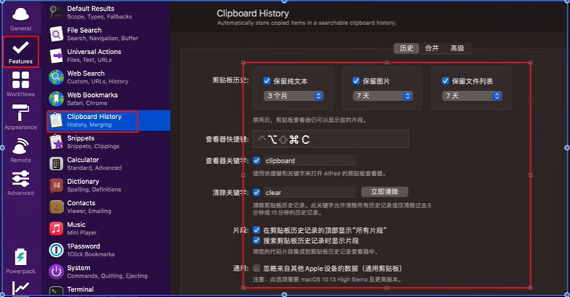

# 8、mac深度使用技巧

- 首次激活
- 软件推荐
- 使用技巧

## 首次激活

- `安装软件`

### brew

`brew 包管理工具`

https://brew.sh/

```markdown
# 1.安装 brew (科学上网)
```

```shell
/bin/bash -c "$(curl -fsSL https://raw.githubusercontent.com/Homebrew/install/HEAD/install.sh)"
```

```markdown
# 2.自动化脚本安装软件
```

```shell
ALL_PROXY=socks5://127.0.0.1:1080 /opt/homebrew/bin/brew install bat docker-compose fzf git maven nvm wget;

ALL_PROXY=socks5://127.0.0.1:1080 /opt/homebrew/bin/brew install --cask --no-quarantine adrive alfred another-redis-desktop-manager baidunetdisk bitwarden dingtalk docker drawio google-chrome hiddenbar iina iterm2 jetbrains-toolbox lepton maczip mailmaster mounty oracle-jdk postman qiyimedia qq qqlive qqmusic snipaste sogouinput stats sunloginclient tencent-meeting typora vmware-fusion wechat clashx 
```

## 软件推荐

- https://www.macwk.com/
- Redis Desktop manager redis 客户端工具
- Alfred 4 搜索
- Hidden Bar 菜单栏图标显示隐藏
- IINA 视频播放器
- Iterm 2 终端 
- Jetbarins ToolBox  开发工具管理
- Mac zip  解压缩工具 
- Mountry NTFS读写工具
- Snipaste 截图软件
- stats 用来展示系统状态
- Path Finder Finder 辅助工具
- Screen Flow 屏幕录制工具
- Transmit  SFTP 文件服务器
- Dowine 4  网站视频下载工具
- Motrix      多线程下载工具
- Rectangle 分屏工具
- yoink    临时仓库
- electerm 终端工具
- one switch 小工具(隐藏桌面,屏幕常量)
- 柠檬清理 


接下来我们说一下mac中软件的配置技巧，首先这么多软件我们不会一一的进行讲解，我们只说一些软件对于我们来说是非常重要的一些配置


​	首先我们说一下item2终端，还有Alfred4 这俩款软件是我们使用mac必装的软件，这俩个软件的配置也比较复杂和繁琐，所以我们重点了解这俩个软件


#### 1、Item2技巧

​		首先呢，item2默认是没有那些高亮还有其他的一些支持，和本机的终端差不多--原因是item2默认是使用mac的bin bash的终端，所以我们需要修改item的终端

​		我们的思路是将item的配置指定一个目录中配置，这样的话无论我们切换电脑或者是系统，我们的配置都是可以进行快速的还原配置的

​	**配置云端存储**

```
	1、将默认配置保存到指定的iCloud云盘上
		实现一次配置永久保存
		实现多机器之间配置共享
```

​	我们看一下这个配置文件的路径--是在云盘上的


当我们修改配置后直接就写到这个云盘里的这个文件中了，那么无论我们有多少的机器，我们都指定让他读取这个配置文件，这样就实现无缝衔接了


 **安装oh-my-zsh**

​	oh-my-zsh 是github上开源的终端工具，它比默认的bash要好很多

我们可以先看一下我们当前使用的bash，如果我们没有修改过bash的话默认是bin bash

​	如果已经安装好了zsh，那么就会显示zsh


​	我们安装zsh也是非常的简单的-我们只需要执行wget命令进行安装，安装完成后就会自动的使用/bin/zsh终端了

```shell
$ wget https://github.com/robbyrussell/oh-my-zsh/raw/master/tools/install.sh -O - | sh
```


​	安装成功之后，就会出现这个界面


​	安装后每次打开终端就使用这个zsh了，zsh提供很多终端，同时也有自己的配置文件

​	oh-my-zsh的配置文件和主题配置

```shell
# 1.默认配置文件的位置
- vim ~/.zshrc

# 2.修改主题配置
- ZSH_THEME="robbyrussell"

# 3.重载配置生效 ---修改后执行
- exec zsh
```


​	设置背景图--如果需要的话Enabled


​	插件Autosuggestion 命令自动补全

​		比如我们打一个命令，那么过一会我们又想使用这个命令了，忘记之前那一长串了，我们敲几个字母会提醒你，根据之前使用过的命令，前提是你之前必须使用过一次的命令

​	安装--先下载

```shell
# 1.下载插件
$ git clone git://github.com/zsh-users/zsh-autosuggestions ~/.oh-my-zsh/plugins/zsh-autosuggestions

# 2.配置 vim ~/.zshrc
plugins=(git zsh-autosuggestions)

# 3.加载配置
exec zsh


```

​	


#### 2、Alfred 技巧

​		他是一个效率软件--他是用来替换我们mac的聚焦的，如何做替换的呢

​	我们一般使用的commont + 空格 呼出的聚焦，我们在键盘中取消这个快捷键，因为他不是太好用


​	我们在Alfred 中右键--选择


​	我们上来还是先不要修改配置，还是把他的配置共享到云盘

​	我们先找到这个同步文件夹，设置为云盘文件夹


​	**设置快捷键：**


​	为什么说Alfred是一个效率工具呢，因为他支持搜索应用


我们如果想搜索我们浏览器的书签怎么办呢？我们在特性里面勾选浏览器的书签就可以了


**开启剪切板功能**

​	我们经常各种复制和粘贴，但是复制完之后我们想看之前复制的内容，如果我们开启就可以轻松找到了




**快速搜索功能-**-


我们以一个百度网站的配置为例


**搜索文件**


**工作流**

​	这个工作流是可以导入导出的


​	我们看一下CodeVar工作流

​			比如我们开发中对变量的命名比较头疼，比如我们叫统计，不知道英文名称该怎么写，所以我们就可能会打开翻译去搜索，有了这个就不需要了比如小驼峰命名方式


​	他可以帮助我们搜索到非常多的命名名称


​	这个就可以帮助我们解决命名的高效率处理


​	**Finder工作流**

​		这个也是非常的强大，可以快速的copy，因为我们的mac不像是windows能够直接copy绝对路径

​	但如果我们使用finder工作流，打开文件夹，然后使用Finder工作流是可以直接copy路径的


​	**IP工作流**

​			查看自己的本地IP地址


**Maven工作流**


中文档以及配置下载地址: https://chenyn.lanzoul.com/b01d0rwxc 密码:29ho


https://www.bilibili.com/video/BV1SY411H7QB?p=3&spm_id_from=pageDriver&vd_source=243ad3a9b323313aa1441e5dd414a4ef


