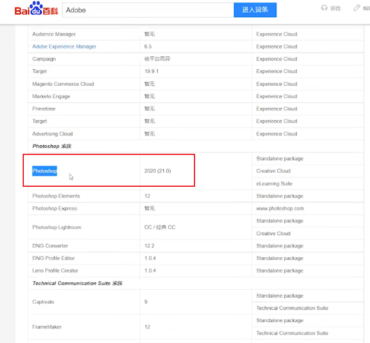
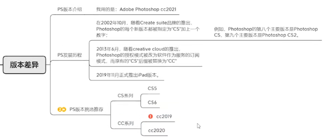
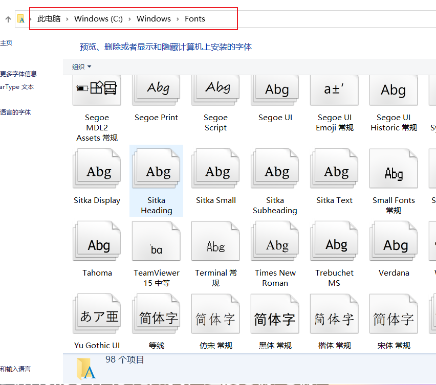

# 1.基础介绍

## 1、Photoshop历史

Adobe photoshop cc2021：分别代表的是 公司名称 软件名称 版本号

软件历史：adobe的公司名称来源（一个河流是一个河流的名称叫奥多比--或者是A都比

我们所学的photoshop只是adobe家族中非常常见的一个软件

photoshop的作者是：约翰诺尔，和托马斯诺尔--他们是在1987年的博士论文提出的使用mac电脑做的photoshop这个软件

## 2、版本差异

 

## 3、我们安装的字体

​	在这里可以看到有98种字体

​		如果我们安装的字体--直接拖到Fonts文件夹下就可以了，就相当于安装好字体了

