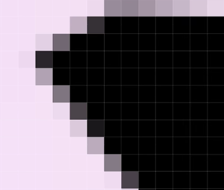
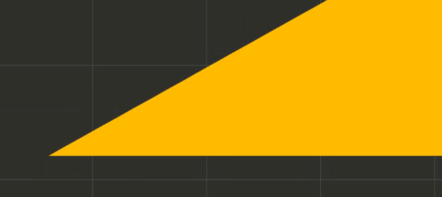
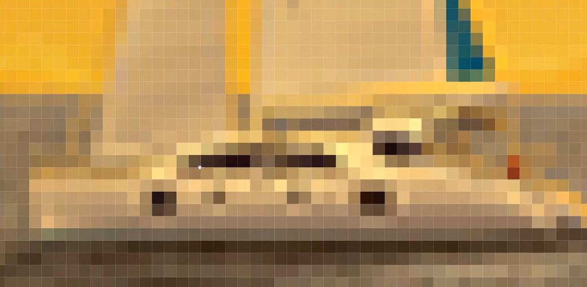
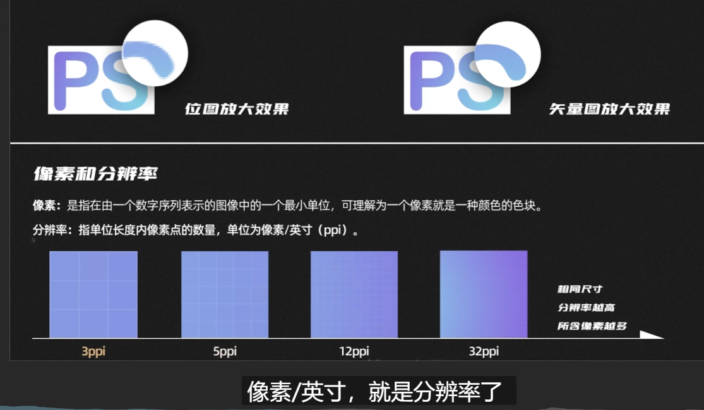
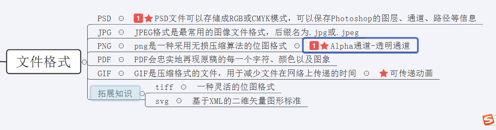

# 2.概念-像素分辨率&矢量图位图


https://www.bilibili.com/video/BV1N44y1e734?p=3


## 1、位图与矢量图


先说一个快捷键--就是F键--就是可以进行视图的切换


在我们将图放大后--发现是由一个个的锯齿状的形状构成的--那么这就是位图

**位图：** 就是由格子组成的，我们**ps就是编辑位图**的就是这样的逻辑

```
	也可以称为栅格图--我们叫格子图比较好记一些
```




那么什么图不是由格子构成的呢？

比如我们PS的姊妹软件Ai 全名叫 adube illustrator ，他就是放大怎么放大都不会出现小格子--这种就是矢量图

以下这个图就是放大很多倍后的效果-依然是没有格子很光滑




区别就是：一个是用格子存储信息，一个是像是数学函数来存储信息的，矢量图不会出现失真的情况

​				失真：其实就是不会变的模糊，如何放大都不会


比如这个船放大后就失真了




可以这样理解一下像素




## 2、文件格式：

psd：可以理解为图像中的每个小的组成部分，这样在ps中才是独立可调整的，属于ps的文件




