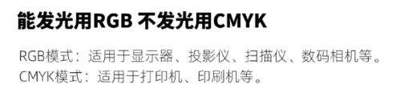
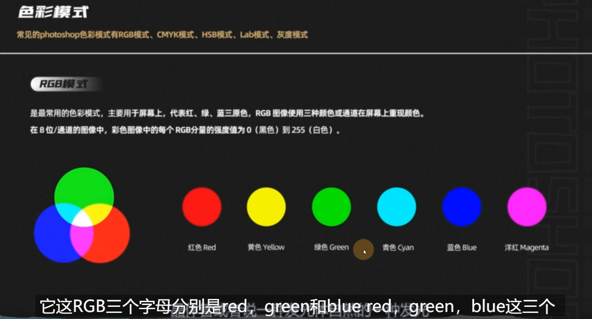
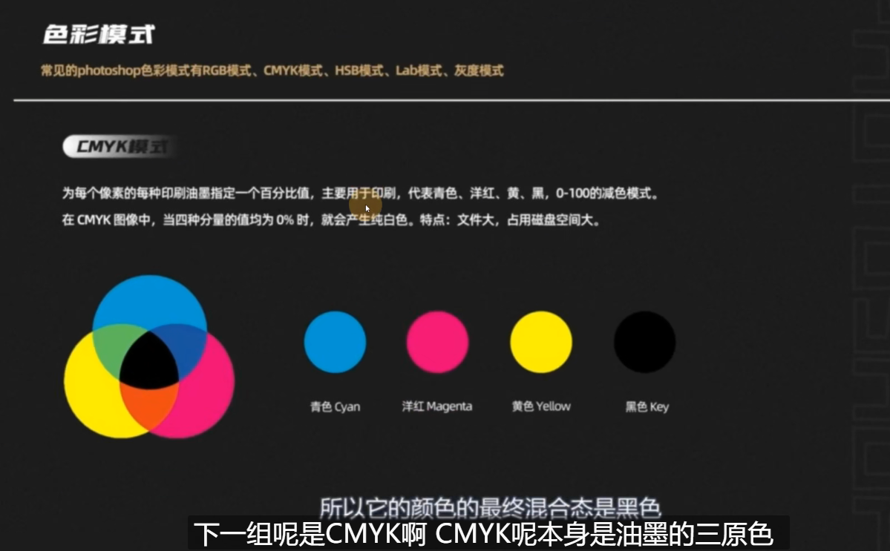
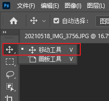
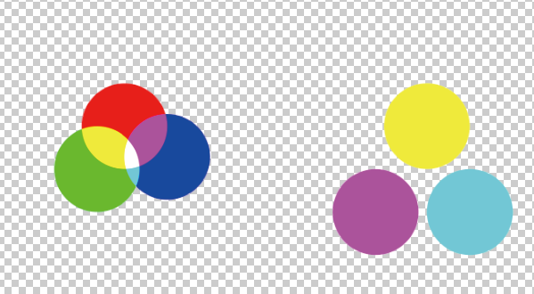
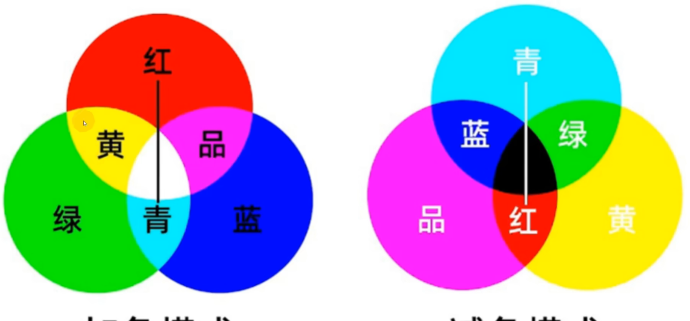
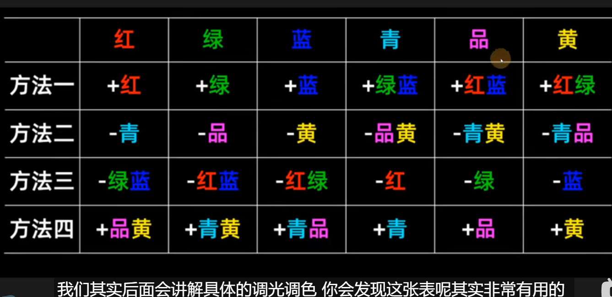
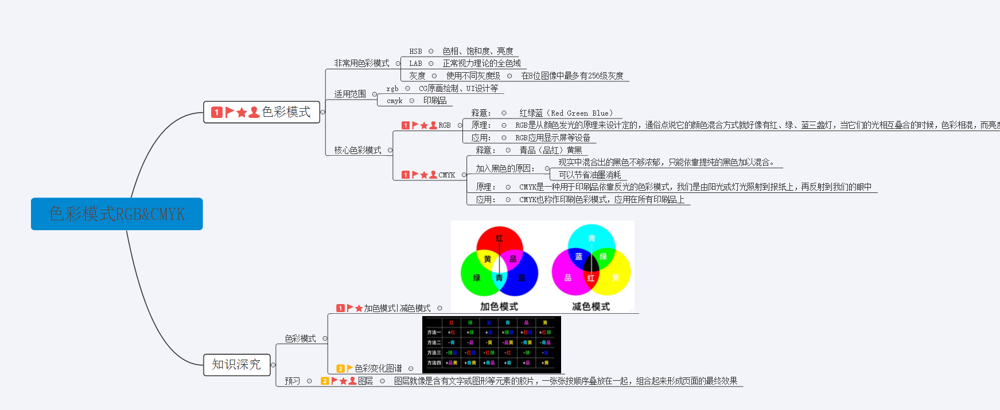

# 3.概念-色彩模式：RGB&CMYK&Lab&HSB

## 1、色彩模式是个啥？

​	色彩模式是数字世界里中表示颜色的一种算法，在数字世界中，为了表示各种颜色，人们通常将颜色划分为若干分量。由于成色的原理的不同，决定了显示器，投影仪，扫描仪这类靠色光直接合成颜色的颜色设备和打印机，印刷机这类靠使用颜料的设备在生成颜色方式上的区别。

​	

​	我们眼睛看到的颜色是一种衡量的方式，但是我们很难把眼睛看到的颜色能够完整的在计算机里面找到它

如果我们能在电脑上调出来这个颜色，可能在打印的时候就不一定能够完整的打印出这个颜色，所以每个颜色的色域呢 可能不一样，听起来有些抽象。

​	核心口诀就是：

介绍一下ps的移动工具--快捷键是V

可以移动图层

然后我们移动后使他们混合，可以看到批出不一样的颜色

比如我们想增加蓝色的比重，想要更蓝

​	1、可以增加青色和品色

​	2、可以减少黄色（那么黄又是红绿拼合的颜色，那么就可以减少红和绿也相当于减少了黄）

