# 4.界面-初次打开PS的所有注意事项&认识PS界面

## 1、初识界面

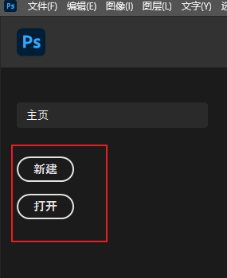

我们新建一个画布：我们先设置一下预设，预设就是设置我们画布的模板

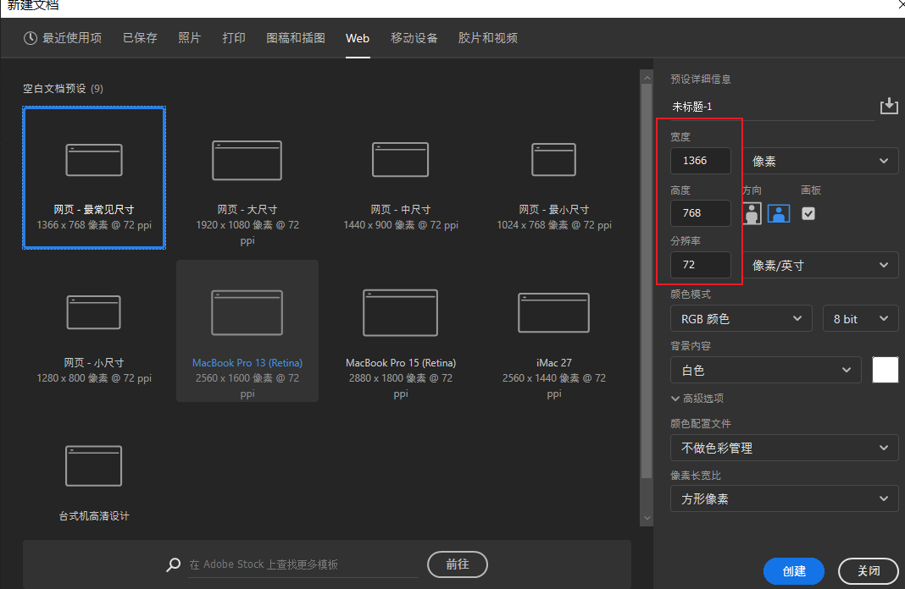

创建：

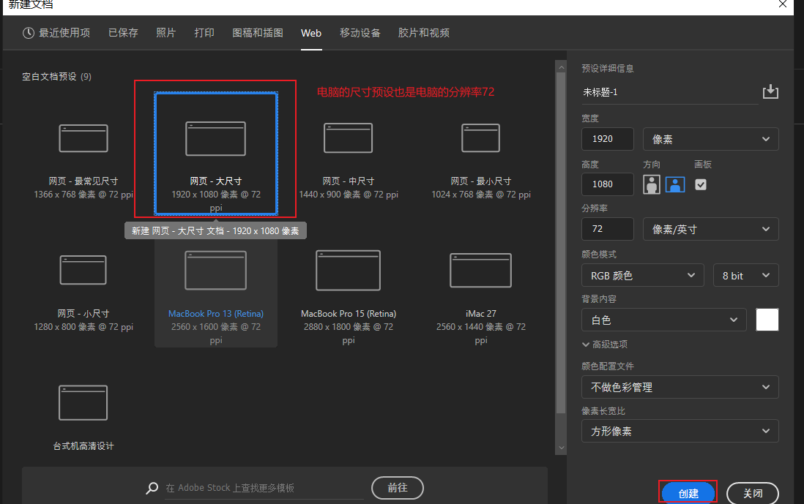

 菜单的左侧是工具-右侧是图层

## 2、界面操作

#### 顶部菜单栏

​	顶部菜单栏一共有12个菜单

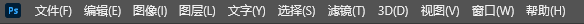

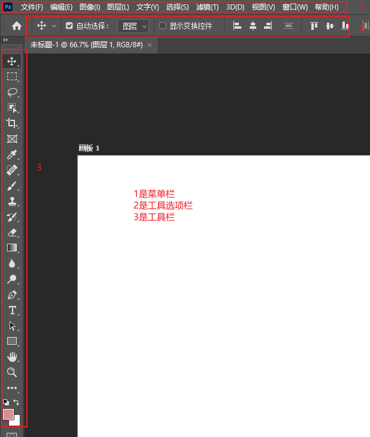

新手 最重要的是要熟悉工具栏和工具选项栏的配合使用

顶部菜单 我们主要学习使用的是**窗口** 

​	可以通过窗口来进行对基本面板的调整--也可以恢复默认

​	也可以新建工作区-方便自己对某些事物的快速处理

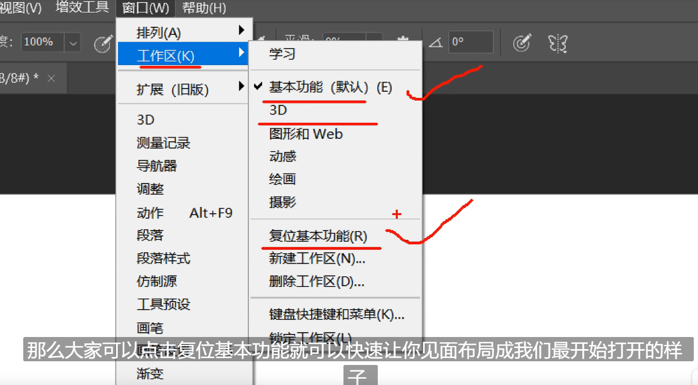

#### 面板

​	PS面板用于设置颜色，工具参数，执行各种命令

比如这个图层：像一个板子可以随意拖来拖去

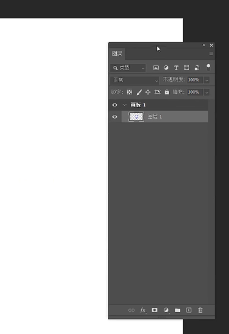

**历史记录**：历史记录面板也是比较常用的

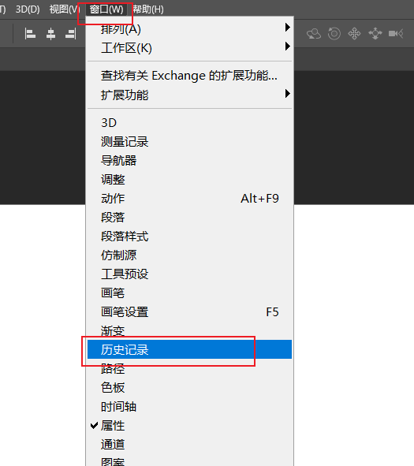

还有就是字符面板也是比较常用的--从窗口调整出来

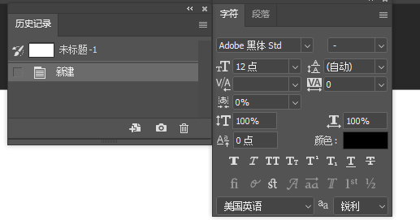

主界面的左下角显示的是文档的大小和显示的比例

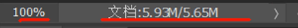

小妙招：

​	按住 空格键  可以拖拽画布

​	ALT+鼠标滑轮  可以调整画布比例--放大缩小视图

标尺：比如我们想把文字排列的更整齐一些可以使用标尺 Ctrl +R 可以调出标尺

## 首选项

​	首选项也是比较重要的，调整软件的一些配置 Ctrl+K 呼出常规

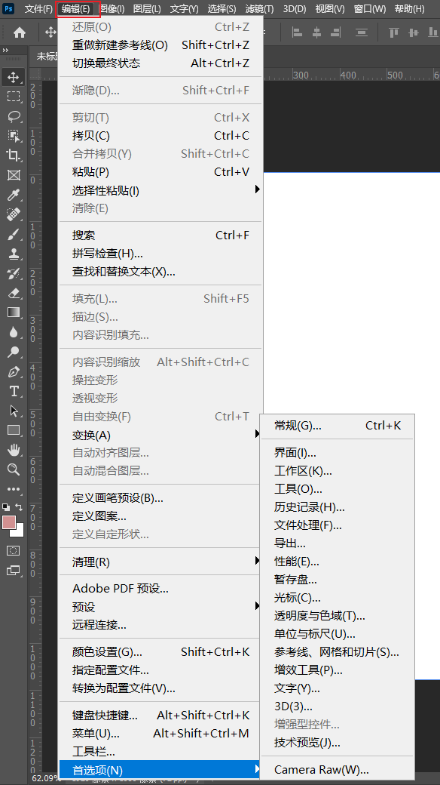

比如调整一下主题

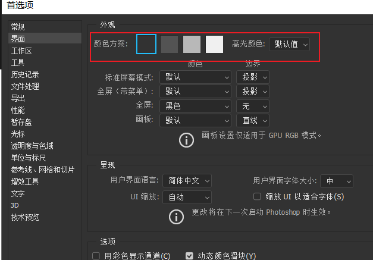

查看快捷键--也可以编辑快捷键

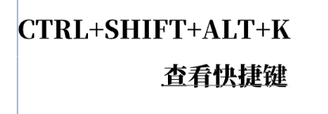

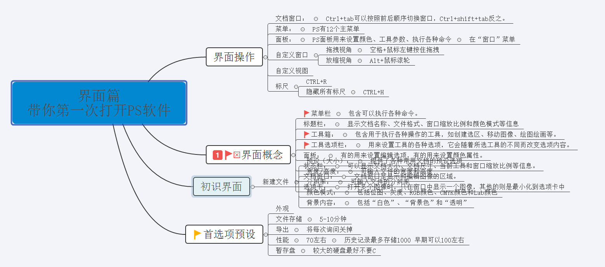

