# 2、使用Lora制作AI网红


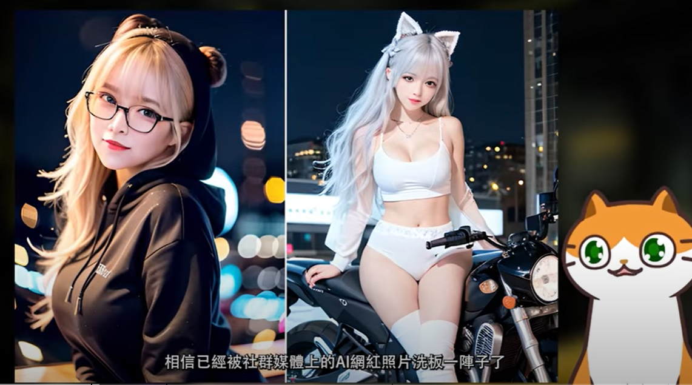

## 1、前提

​	首先需要下载SD程序--使用git拉取https://github.com/AUTOMATIC1111/stable-diffusion-webui

​	需要python环境 -- 3.10.6的版本以上https://www.python.org/downloads/windows/

​	注意，在运行的时候是--进入到我们拉取代码的路径下D:\software\Stable-Diffusion-web-UI\stable-diffusion-webui

​		windows--双击webui-user.bat 可执行文件进行运行--第一次启动需要下载很多依赖比较慢


​	注意：可能有些python依赖的下载报错---需要修改lunch.py文件的镜像地址，或者是科学上网处理。

​		


首先需要下载制作AI网红照片 所需要的Stable Diffusion模型

​		然后加上Lora就可以制作出这样的效果，以及AI Coser


####  中文--汉化

​	点击 Extensions


​	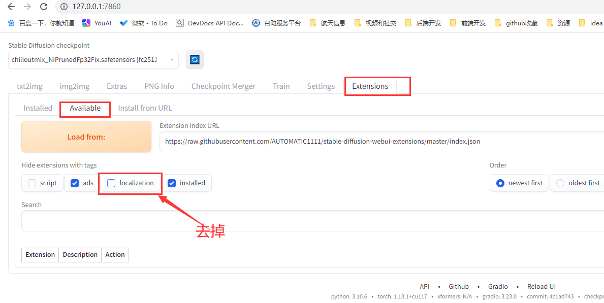

​	搜索ZH -- 然后install

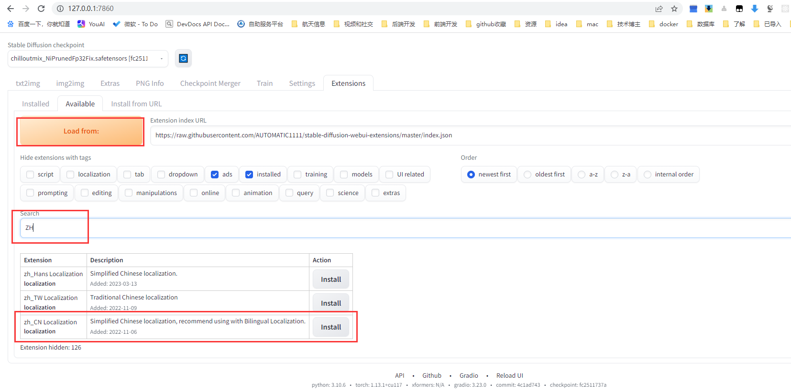


​	然后点击settings 然后reload UI

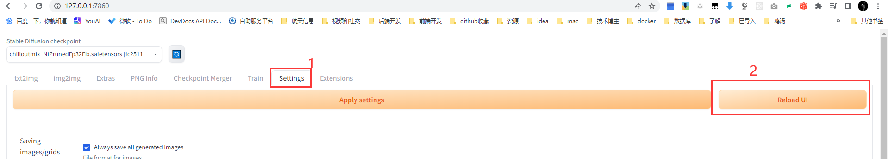


​	确认中文包勾选	然后点击Apply and restart UI

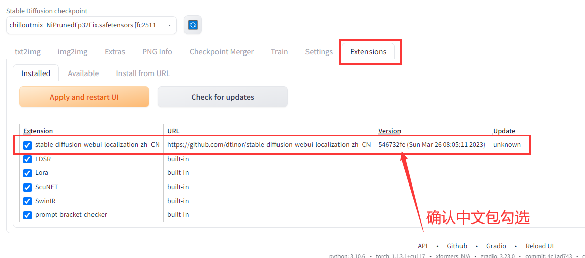


然后点击settings点击user interface 用户接口


然后设置最下面的localization 为中文

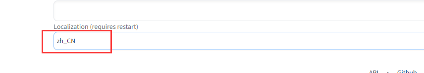


然后保存设置---重启UI

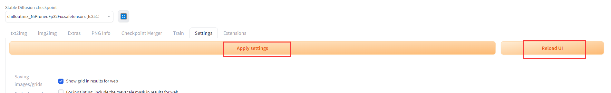


ok--汉化完成


#### 下载Stable Diffusion 模型

​	打开 https://civitai.com/

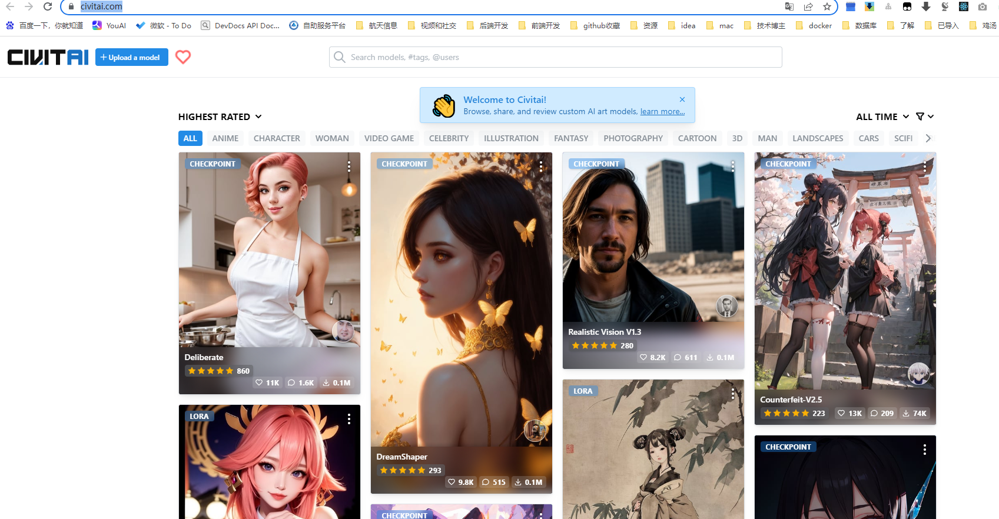


​	搜索ChilloutMix  就可以找到 ChilloutMix  的模型页面

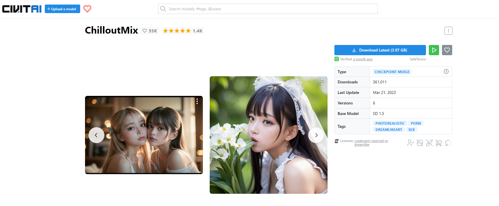

​		可能因为这个模型的过于火爆，产生了一些舆论问题所以 Civit AI把他下架了

​	我们也可以通过Chillout Mix-NI模型的google银盘备份来使用，请不要做一些违背法律或风俗的事情


下载模型

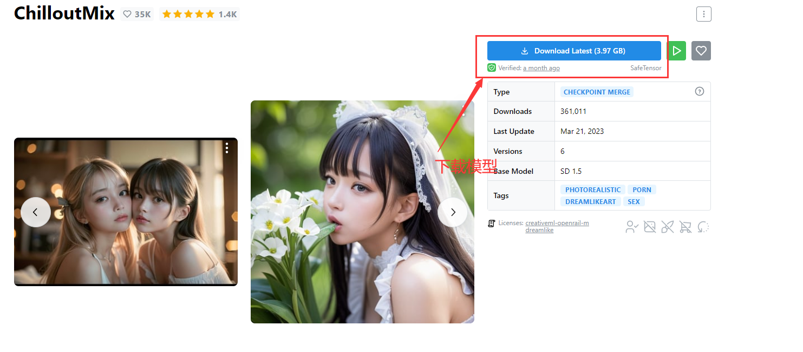


#### Lora 模型

​	https://civitai.com/models

​	搜索Lora模型

​	在Civit AI 搜索 Doll Likeness 就可以找到Korean Doll Likeness、Taiwan Doll Likeness、Japanese Doll Likeness等等

​	可以三个Lora模型都下载下来--等一下会使用到

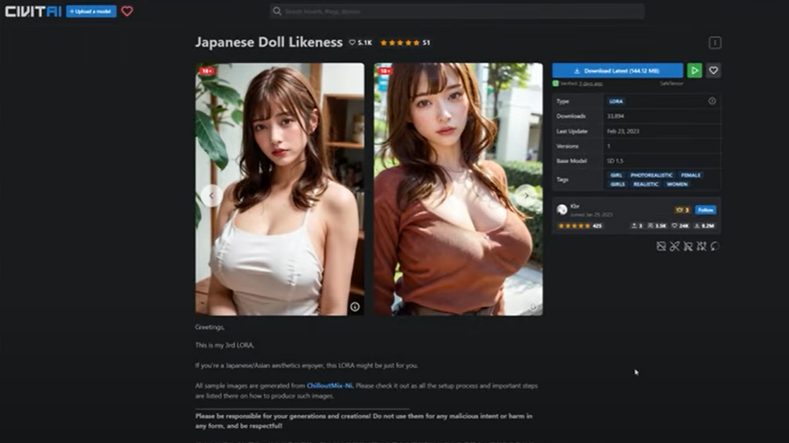


## 2、模型下载和存放


​	把下载完成的Chillout Mix 模型  复制 到Stable Diffusion web ui下的Model文件夹下的 Stable Diffusion文件夹内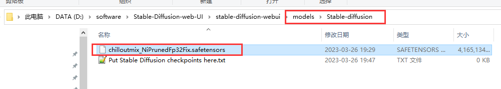


然后把下载完毕的三个Lora模型复制到model文件夹下的Lora文件夹内，这样模型就准备完成

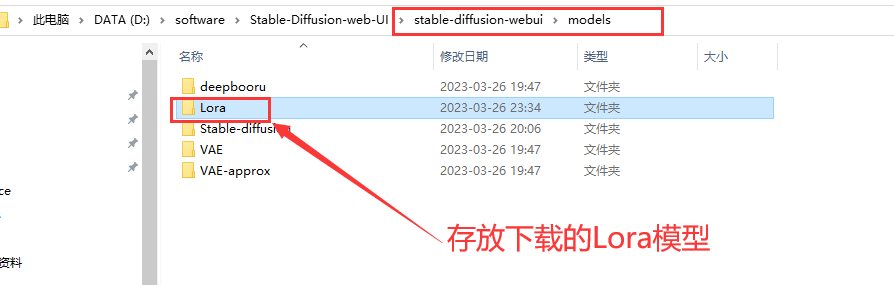


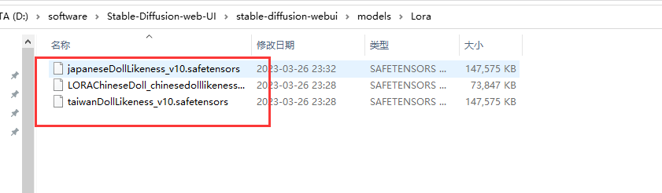


## 3、安装Additional NetWorks外挂

​	执行webui-user.bat 打开Stable Diffusion

​	选择模型--点击扩展

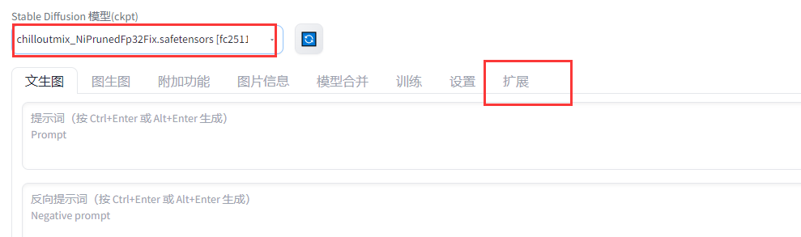


​	选择可用---加载

​			这里加载的就是官方的扩展列表--也就是外挂列表

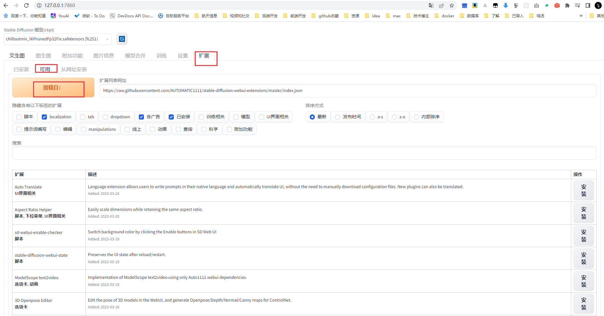


​	我们找到[Kohya-ss Additional Networks](https://github.com/kohya-ss/sd-webui-additional-networks.git)

​			这个扩展--点击安装

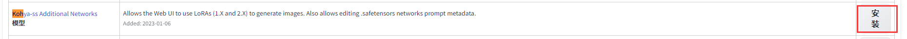

​	然后重启UI


​	有这个就是安装成功了	

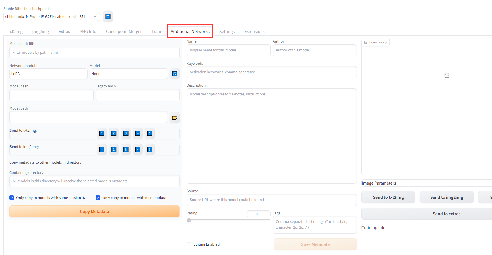


## 4、生成图片

​	点击Lora 选择每个Lora模型，配置权重

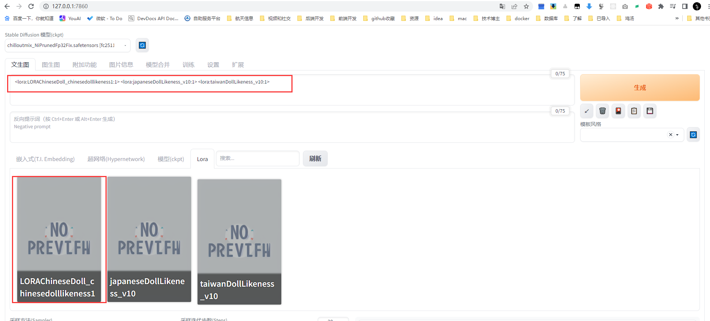


​	注意，所有的Lora全部加起来权重不超过1

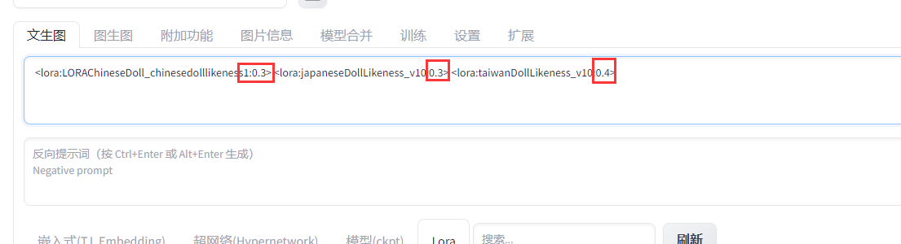


​	然后输入提示词--与负面提示词

​		正向提示词 就是--我们希望看到的

​	提示词语法：https://www.youtube.com/watch?v=nHfdvgxsPUU

​		反向提示词就是--我们不希望什么样的


#### 1、设置采样方法

​	DPM++SD 各种方法生成效果不一样

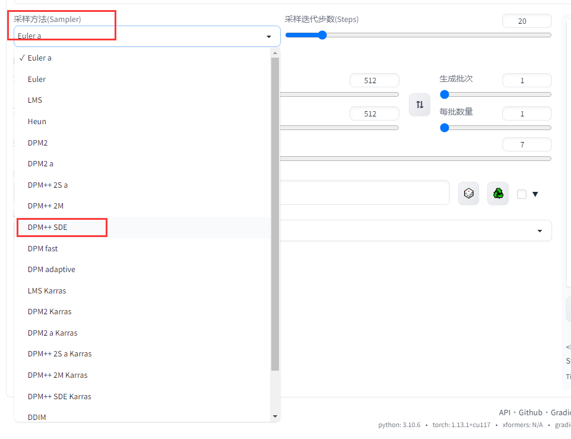


​	采样迭代步数 设置为30

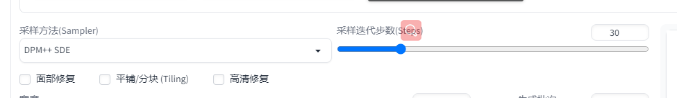


​	按下show extra networks 收起规则--点击生成就可以生成图片了

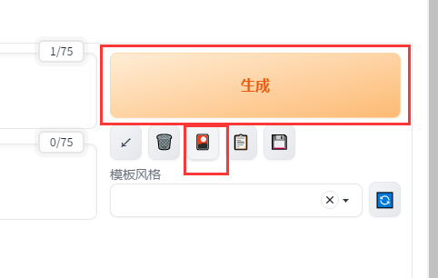


​	


​	效果如下：

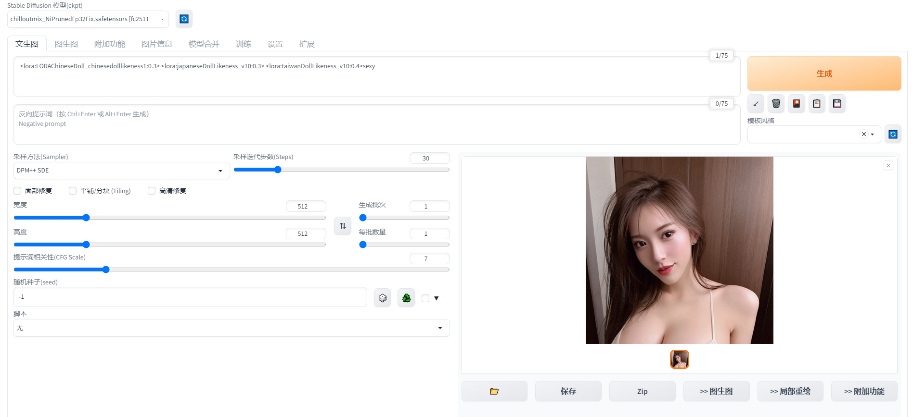


#### 	2、可以把生成批量 设置为9


#### 3、设置关键词--提示词


​	正向词

```
realistic,portrit of a girt,Al language model,silver halr,question answering,smart,kind,energetic,cheerful,creative,with sparkling eyes and a contagious smile,,information providing,conversation engaging,wide range of topics,accurate responses,helpful responses, knowledgeable,reliable,friendly,inteligent,sleek and futuristic design elements, and a complex network of circuits and processors.Others may imagine me as a friendly and approachable virtual assistant, with a smiling avatar or animated character representing me on thelr screen,Still, others may envision me as a disembodied volce,speaking from an unseen source,providing helpful and informative responses with a calm and reassuring tone

# 代表的含义
写实的，一个女孩的肖像，Al语言模型，银色哈尔，问题回答，聪明，善良，精力充沛，开朗，有创造力，与闪闪发光的眼睛和传染性的微笑，信息提供，对话参与，广泛的话题，准确的反应，有用的反应，知识渊博，可靠，友好，智能，圆滑和未来的设计元素，电路和处理器的复杂网络。其他人可能会把我想象成一个友好而平易近人的虚拟助手，在屏幕上有一个微笑的化身或动画角色代表我。还有一些人可能会把我想象成一个脱离实体的volce，从一个看不见的来源说话，用平静和令人安心的语气提供有用的和有信息的回答

# 修改后的正向提示词
full body shot(全身)
cowboy shot ( 半身)
close-up shot (接近)


realistic,full body shot,portrit of a girt,Al language model,silver halr,question answering,smart,kind,energetic,cheerful,creative,with sparkling eyes and a contagious smile,,information providing,conversation engaging,wide range of topics,accurate responses,helpful responses, knowledgeable,reliable,friendly,inteligent,sleek and futuristic design elements, and a complex network of circuits and processors.Others may imagine me as a friendly and approachable virtual assistant, with a smiling avatar or animated character representing me on thelr screen,Still, others may envision me as a disembodied volce,speaking from an unseen source,providing helpful and informative responses with a calm and reassuring tone


```


反向提示词---就是不要的点

```
(((sexy))),paintings,loli,big head,sketches,(worst quality:2),(low quality:2), (normal quality:2),lowres,normal quality,((monochrome)), ((grayscaleI), skin spots, acnes, skin blemishes, age spot, glans, nsfw, nipples,extra fingers,(lextra arms)), (extra legs),mutated hands,(fused fingers),(too many fingers),(long neck:1.3)


#含义
(((性感)))，绘画，洛利，大头，素描，(最差质量:2)，(低质量:2)，(正常质量:2)，低分辨率，正常质量，((单色))，((灰度)，皮肤斑点，痤疮，皮肤瑕疵，老年斑，龟头，nsfw，乳头，多余的手指，(多余的手臂))，(多余的腿)，变异的手，(粘连的手指)，(太多的手指)，(长脖子:1.3)
```


#### 4、图形大小分辨率

​	抖音竖屏尺寸为宽高9:16的比例,分辨率为540*960。这也是目前大部分的视频尺寸;

​		此外,也可以使用720/1280、1080/1920等分辨率。


## 5、图像优化

#### 1、选择图像

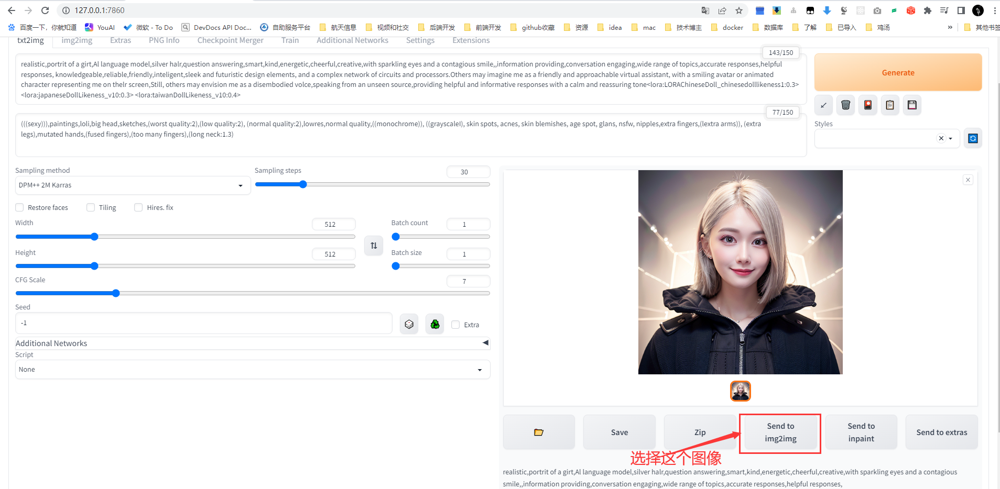


​	

​	解析度栏位--  宽度405  * 高度720

​	设置生成批次为 4

​	设置生成方法 DPM++ SDE karras

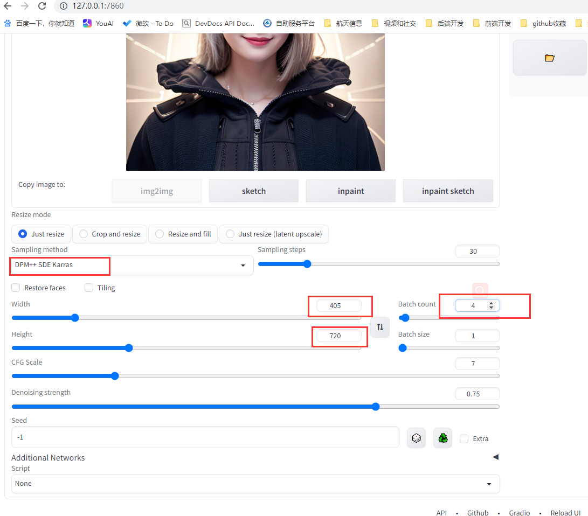


​	生成好了4张照片

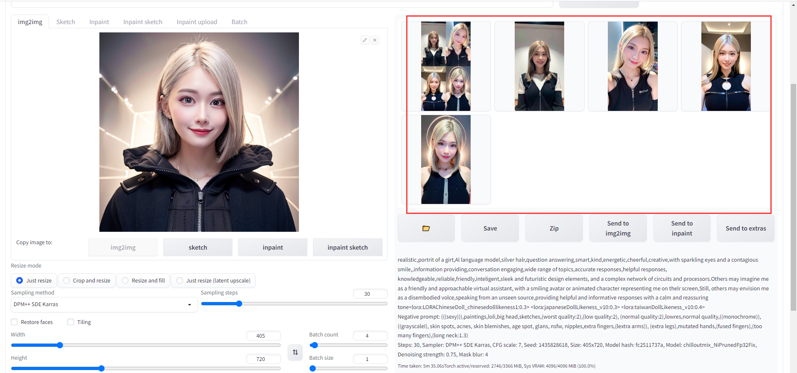


#### 	2、选择一个比较好的照片

​			按下 Send to inpaint -- 发送到inpaint

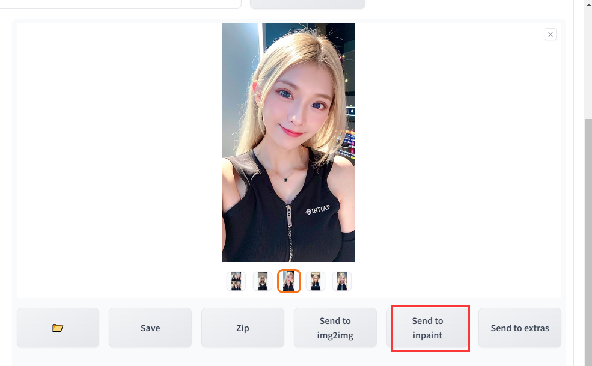


​	使用笔刷--修改想要修改的地方--然后按下生成

​			比如她后面的这个灯有点暗---重复这个步骤生成直到满意为止

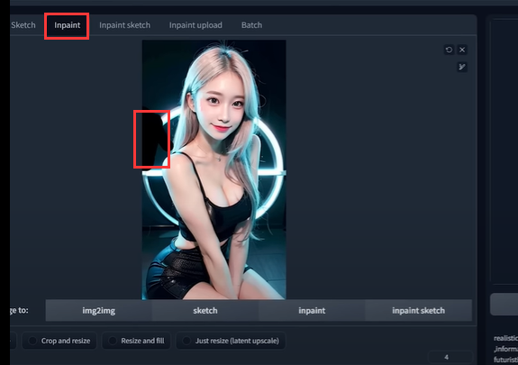


#### 	3、调整眼袋

​	按下Send to extras -- 发送到临时

​			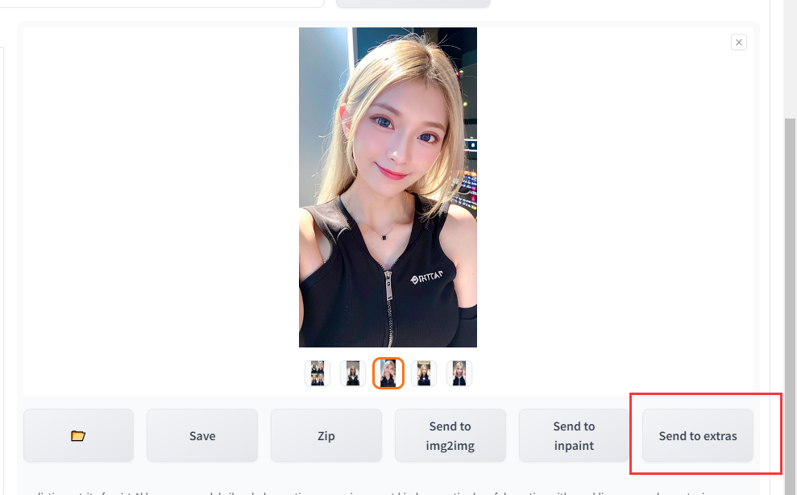


​	选择想要放大的取样方式

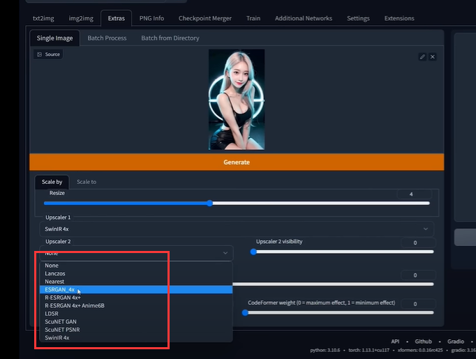


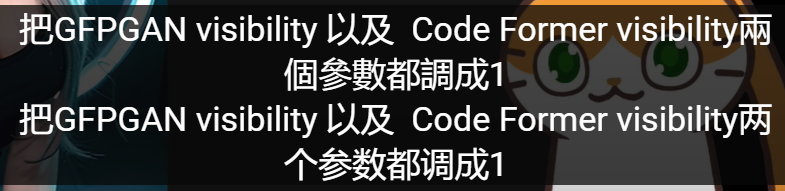


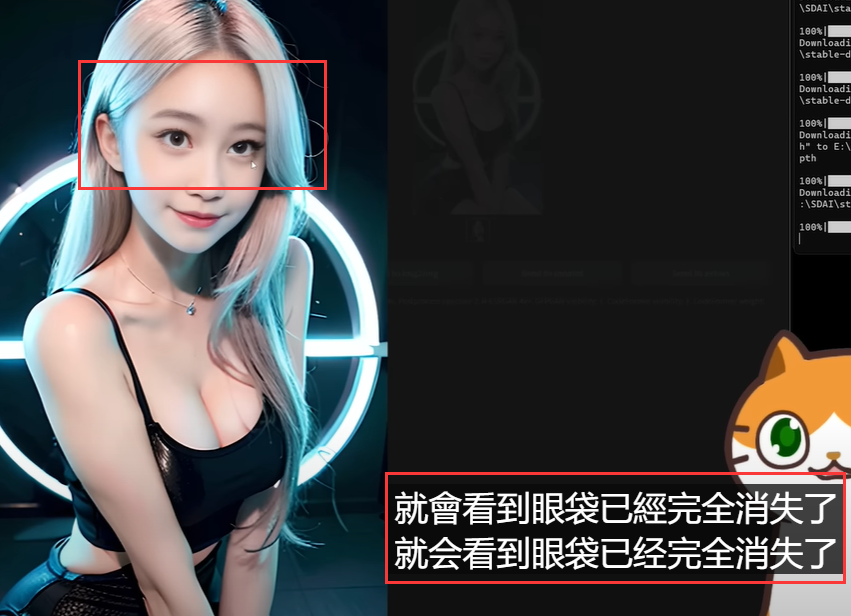


调整后的图，可以再放到send to inpaint 中修正


#### 	4、即将完成--调整参数

​		都调整为0.1--然后点击生成

​			这样就得到一张合适的AI网红照片

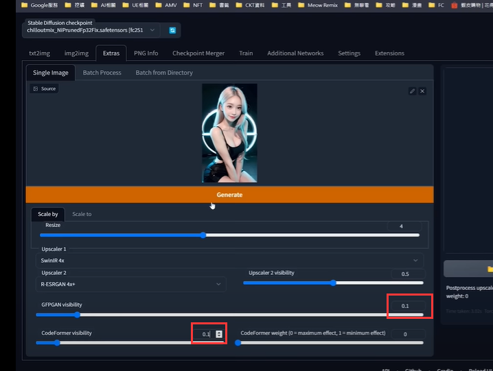


https://www.youtube.com/watch?v=OoTgK7w-gjQ


打开Civit AI

