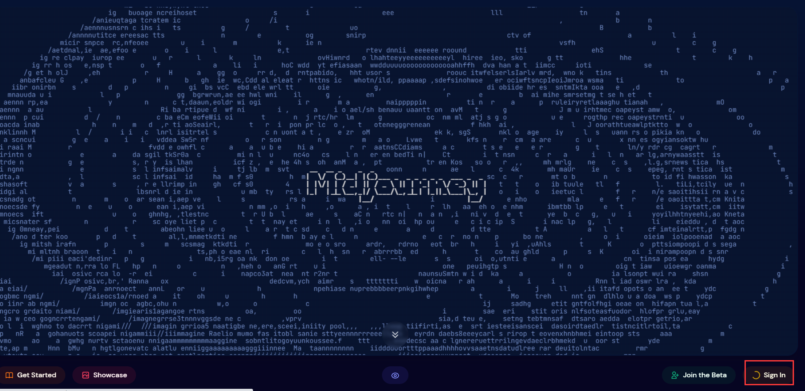
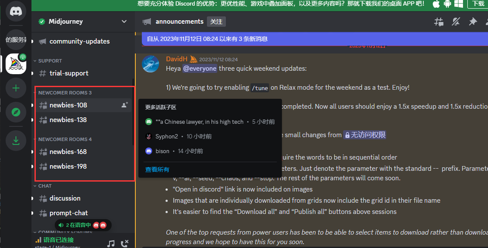
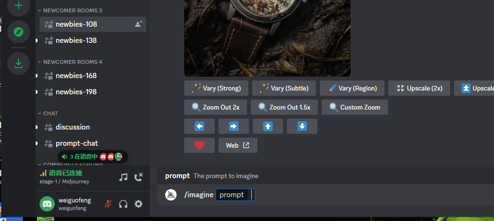
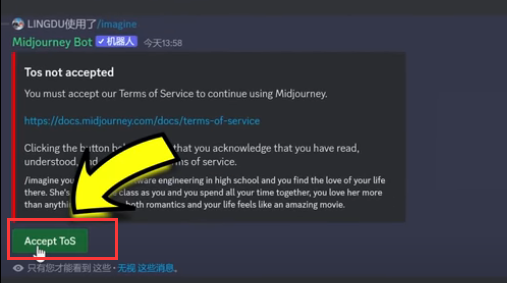
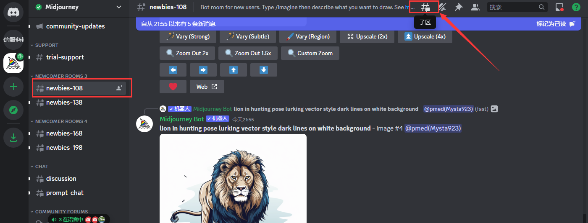
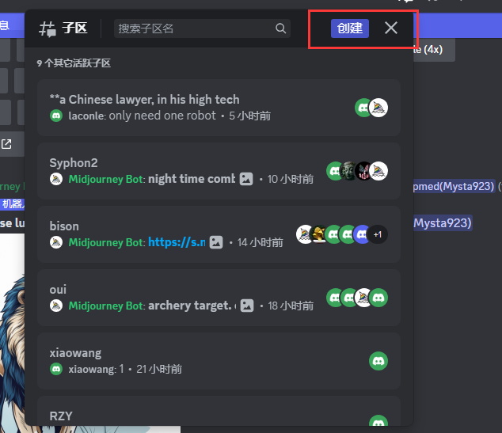
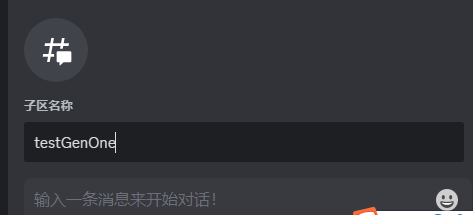
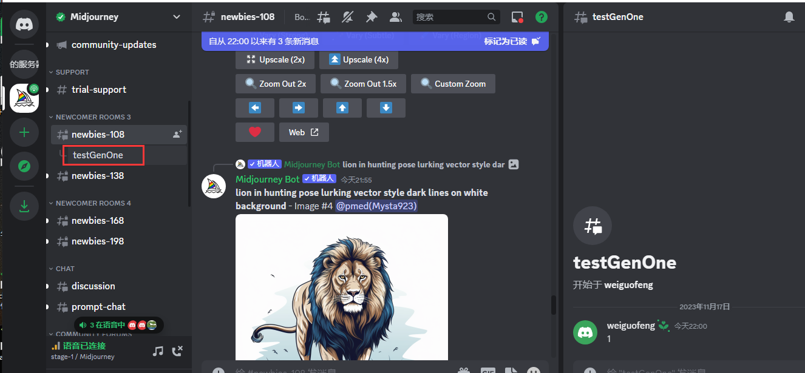
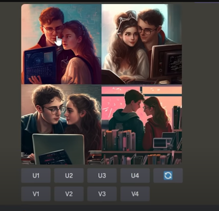
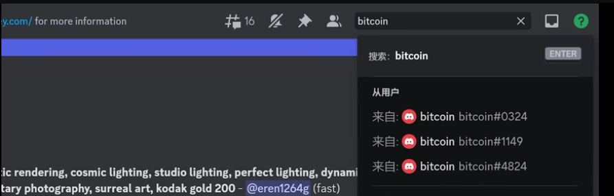

# 3、midjourney的使用

​	网站：https://www.midjourney.com/home

​				他是运行在discode平台上的

​			账号：weiguofeng123@gmail.com

​	左侧的标签newbies是新手区

​	进入新手区输入 /imagine  然后输入提示词

​	接受条款协议

​	因为这里人太多了，所以我们最好不要在这里作画，否则都不知道哪个是自己生成的图形

#### 2、创建一个子区

​	

​	子区名称随便写---

​	这个时候我们就可以看到子区了

​	生成图片后

​			U1--代表第一张图片--我们点击对应的U1就可以生成U1的高清图形-默认分辨率是1024*1024

​			V1--代表的是风格，不同的风格

​				点击圆圈是重新生成

​	

​	比如我们看到别人很漂亮的照片，可以复制其提示词，制作自己想要的风格图像

​	我们也可以进行搜索，搜索自己感兴趣的内容，找到自己需要的图像或者是关键词

https://www.youtube.com/watch?v=1sR9xBM1W78&ab_channel=%E9%9B%B6%E5%BA%A6%E8%A7%A3%E8%AF%B4

