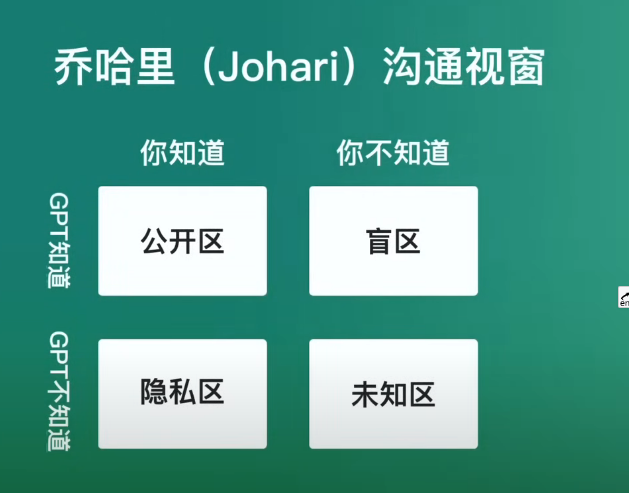

# 4、熟练掌握chatGPT解决复杂问题

​				适用于所有的大语言模型，差别就在于其他的大语言模型没有chatGPT这么好用。

​	如果有这么一个人--对世界的认知 几乎无所不知，我们还可以实时的和他对话，他可以无条件的帮我们 搜索信息，多语言编程，多语言翻译，多语言写作，还可以推理，甚至还可以调用其他的工具帮我们完成任务，而这样的人我们可以做我们的导师，翻译官等等。总结一句话--他是可以实时对话，几乎全知全能的大神。

​	我们一般的问题都分为俩类问题

- 简单： what，who，when，where 

  ​	一般简单的问题我们都可以通过Siri，百度，谷歌都可以解答

- 复杂问题： why，how的问题

   1、 GPT可以直接给出答案

  2、gpt能反向提问（你问我答，我问你答）构成真正的对话

  3、gpt能完成工作任务--比如帮我们写文章，写代码

#### 1、Why

然后我们说gpt帮我们解决why的问题：

​		要回答这类问题，你需要有强大的事实依据

​	他还有能力进行逻辑的推导

​	gpt回答why这类的问题要比人类回答的更好，事实依据 + 推导过程，人类在回答why这类的问题首先是知识面没有那么广泛，知道的事实依据是有限的。

​		而gpt是没有自己的信仰和偏见--更理性的做出推导

#### 2、How

​		目标---路径---工具

​	关键在于目标路径，很多时候我们是有目标的但是缺乏路径，思路就是你的路径

​	

#### 3、如何提问才能得到更高质量的答案

​		

​	

##### 	盲区问法：

​	元问题--盲区问法

​	了解人物，盲区问法

##### 	公开区问法：

​	公开区--可以作为检验认知的测试

​	扩充认知：

​	

​	

