# 5、思维模型

​		23-11-26

#### 1、WOOP模型

​		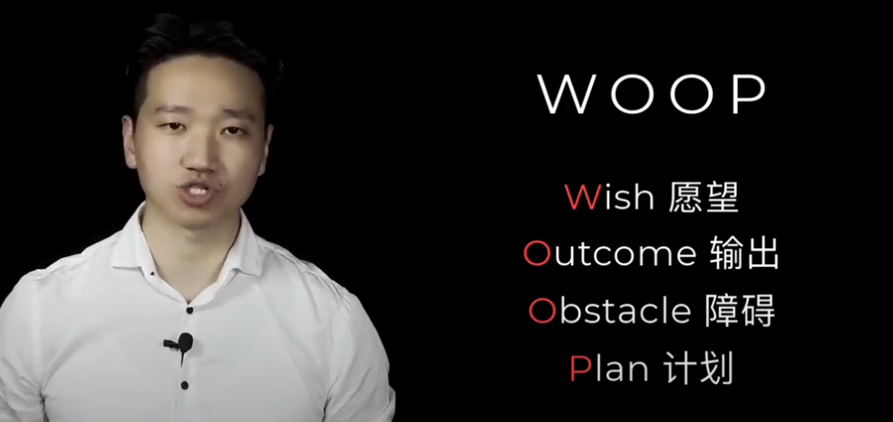

​	示例：

​	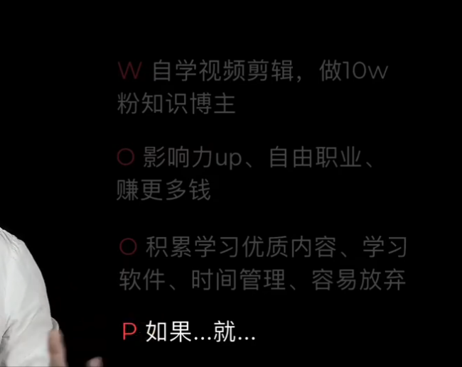

https://www.youtube.com/watch?v=yciVoX84mjA&list=PLb4JIoIhgLkw7mKNX9b4GuyruPJQYv0lu&ab_channel=%E6%AA%80%E4%B8%9C%E4%B8%9C%C2%B7Tango

#### 2、PREP

​		让你把话说明白

​		结论先行 -- 

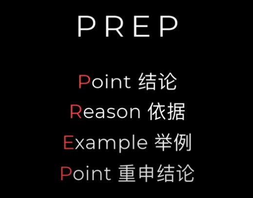

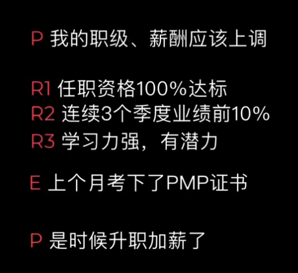

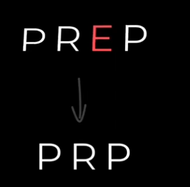

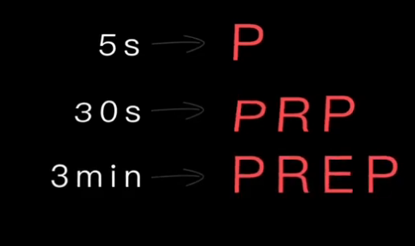

#### 3、SCP

​			

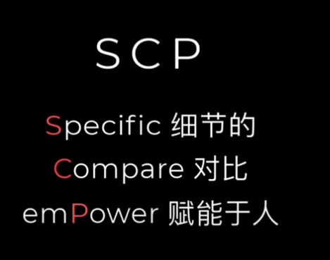

​	夸奖别人--从细节入手，然后进行对比，最后赋能夸奖

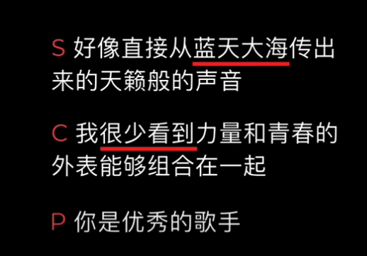

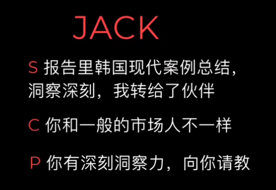

#### 4、STAR模型

​			挑战+解决方案

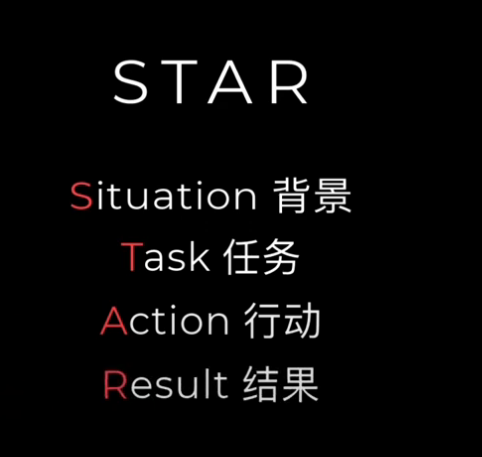

​	例如出师表

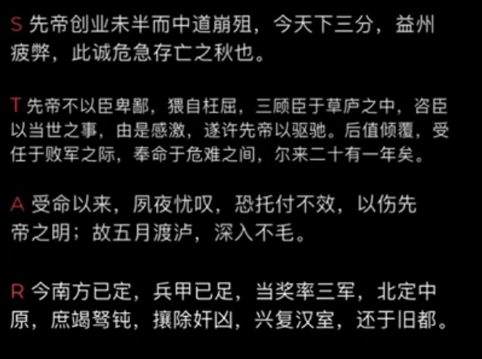

#### 5、SCQA	演讲模型

​		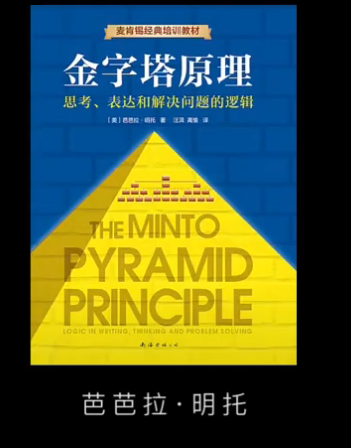

​	结构化表达

​			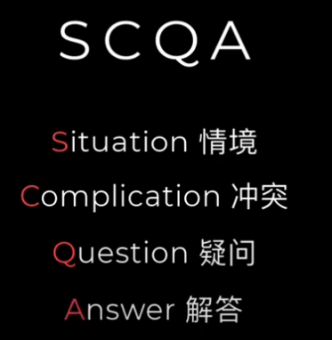

https://www.youtube.com/watch?v=RpNeVAkEag0&list=PLb4JIoIhgLkw7mKNX9b4GuyruPJQYv0lu&index=5&ab_channel=%E6%AA%80%E4%B8%9C%E4%B8%9C%C2%B7Tango

