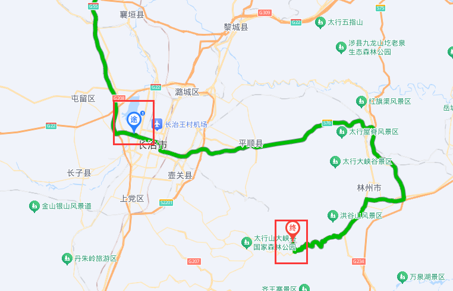
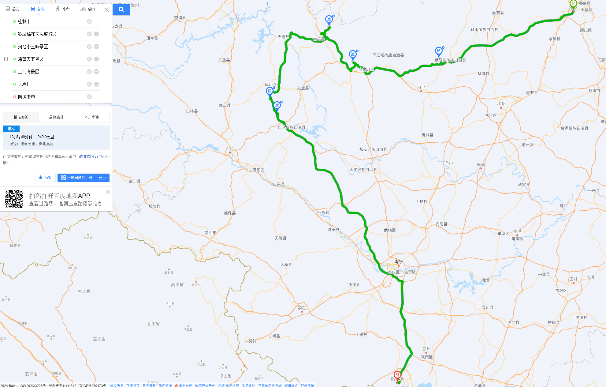

# 防城港行程

呼和浩特 （走苏北线272km）- --五寨县（中午吃饭，继续苏北线175km）---古交市（入住）

第二天：古交--太原古县城（50km）饭后出发-- （晋中南东村）漳泽湖国家城市湿地公园（途径）平顺县--八泉峡（入住）

第三天：八泉峡中午出来--- 350km平顶山市叶县（7小时）--入住

第四天：叶县--常德

第五天：常德市（乌海线）---大圩xu镇--入住

第六天：大圩镇---漓江景区（中午）----（4小时到）  河池市罗城--这边入住

 第七天：（抖音买票）早晨--河池棉花天坑--长生洞--小三峡--南丹县-入住

第八天	 南丹风情园--三门海--长寿村

第九天：长寿村--防城港，4个小时

