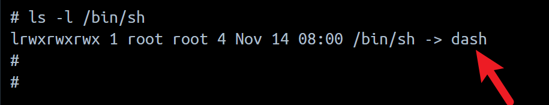
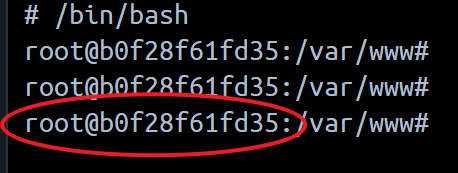

```
title: 11、docker进入容器命令tab无法补全
date: 2024-06-17
```


# 11、docker进入容器命令tab无法补全


​			进入容器后

​	界面是不支持`tab键命令自动补全`和`上下箭头键切换历史命令`的，因为它使用的不是bash shell。

如何知道当前容器使用的是不是bash shell？




如上图所示，执行 `ls -l /bin/sh`命令，可以看到我这个容器默认使用的是[dash](https://so.csdn.net/so/search?q=dash&spm=1001.2101.3001.7020) shell，而不是bash shell。

如果需要命令[自动补全](https://so.csdn.net/so/search?q=自动补全&spm=1001.2101.3001.7020)功能，需要切换到bash shell环境，方法很简单，输入以下命令就可以：

```
/bin/bash
```





执行命令后，前面的内容会变成显示`root@xxxx`，说明切换成功了


