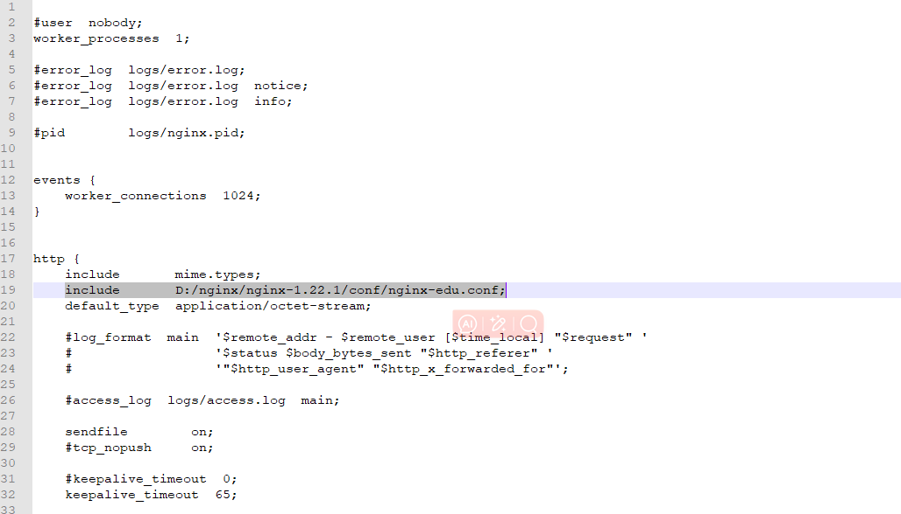
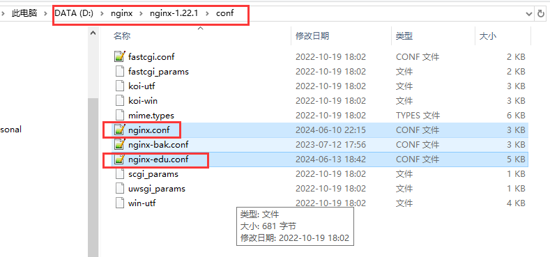
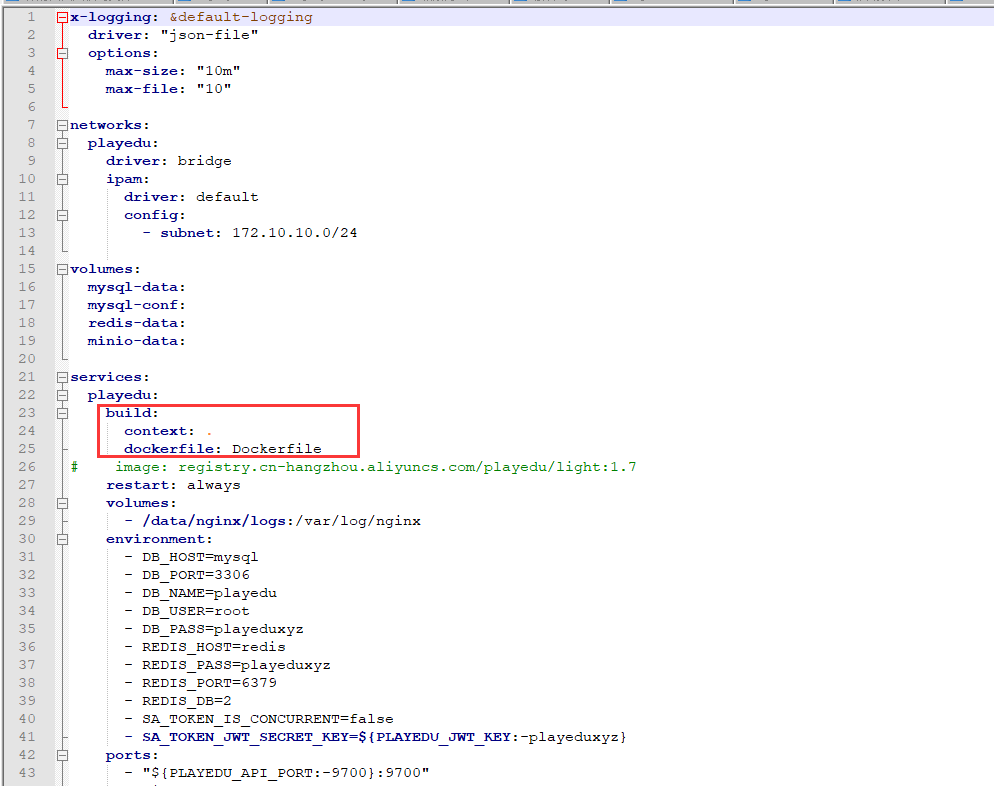

# 12、windows环境下开发edu配置


## 	1、后端配置

​		配置application.yml 中的数据库信息配置以及环境dev


## 	2、前端配置

​		需要配置.env在项目启动的时候添加 /api这个路由，否则nginx代理会有问题

#### 		2.1、注意：这个env在打包时需要删除---否则打包会加载env，而打包也会创建api文件夹--导致前端访问后端多一个/api


## 	3、nginx配置

​			在windows下nginx原配置添加 一行包含文件就可以，其他原配置保持不变

​			linux同理

​		在http下

```
include       D:/nginx/nginx-1.22.1/conf/nginx-edu.conf;

```




​	这样就可以将nginx的其余配置merge合并处理了




​	


## 	4、docker配置

​		如果是本地使用虚拟机

​		在compose.yml文件中 使用build构建自己的后端代码

​		在生产环境下直接使用image拉取镜像就可以，无需再次构建镜像




本地docker-compose文件

```yml
x-logging: &default-logging
  driver: "json-file"
  options:
    max-size: "10m"
    max-file: "10"

networks:
  playedu:
    driver: bridge
    ipam:
      driver: default
      config:
        - subnet: 172.10.10.0/24

volumes:
  mysql-data:
  mysql-conf:
  redis-data:
  minio-data:

services:
  playedu:
    build:
      context: .
      dockerfile: Dockerfile
#    image: registry.cn-hangzhou.aliyuncs.com/playedu/light:1.7
    restart: always
    volumes:
      - /data/nginx/logs:/var/log/nginx
    environment:
      - DB_HOST=mysql
      - DB_PORT=3306
      - DB_NAME=playedu
      - DB_USER=root
      - DB_PASS=playeduxyz
      - REDIS_HOST=redis
      - REDIS_PASS=playeduxyz
      - REDIS_PORT=6379
      - REDIS_DB=2
      - SA_TOKEN_IS_CONCURRENT=false
      - SA_TOKEN_JWT_SECRET_KEY=${PLAYEDU_JWT_KEY:-playeduxyz}
    ports:
      - "${PLAYEDU_API_PORT:-9700}:9700"
      - "${PLAYEDU_PC_PORT:-9800}:9800"
      - "${PLAYEDU_H5_PORT:-9801}:9801"
      - "${PLAYEDU_ADMIN_PORT:-9900}:9900"
    networks:
      - playedu
    depends_on:
      - mysql
      - redis
      - minio
    logging: *default-logging

  redis:
    image: registry.cn-huhehaote.aliyuncs.com/wgf-images/redis:7.0.12
    # build: ./docker/redis
    restart: always
    volumes:
      - redis-data:/data
    ports:
      - "${REDIS_PORT:-6379}:6379"
    networks:
      - playedu
    logging: *default-logging

  mysql:
    image: registry.cn-huhehaote.aliyuncs.com/wgf-images/mysql:8.1
#    build: ./docker/mysql
    restart: always
    environment:
      - MYSQL_DATABASE=playedu
      - MYSQL_ROOT_PASSWORD=playeduxyz
      - TZ=UTC
    volumes:
      - mysql-data:/var/lib/mysql
      - mysql-conf:/etc/mysql/conf.d
    ports:
      - "${MYSQL_PORT:-3306}:3306"
    networks:
      - playedu
    logging: *default-logging

  minio:
    image: registry.cn-huhehaote.aliyuncs.com/wgf-images/minio:latest
    restart: always
    environment:
      - MINIO_ROOT_USER=${MINIO_ROOT_USERNAME:-username}
      - MINIO_ROOT_PASSWORD=${MINIO_ROOT_PASSWORD:-password}
      - MINIO_DEFAULT_BUCKETS=playedu:public
    volumes:
      - minio-data:/bitnami/minio/data
    ports:
      - "${MINIO_PORT:-9002}:9000"
      - "${MINIO_CONSOLE_PORT:-50002}:9001"
    networks:
      - playedu
    logging: *default-logging

```


#### 	4.1、生产环境注意 无需build，否则会使用代码重新构建


​		