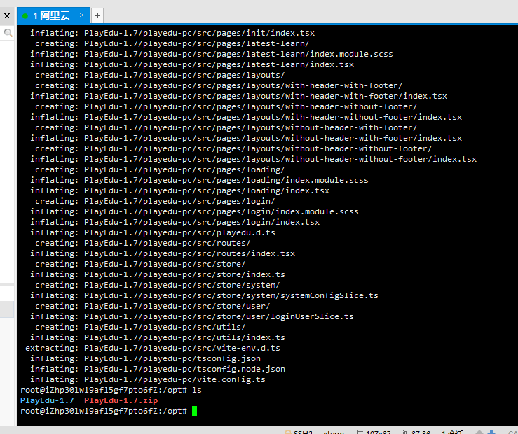
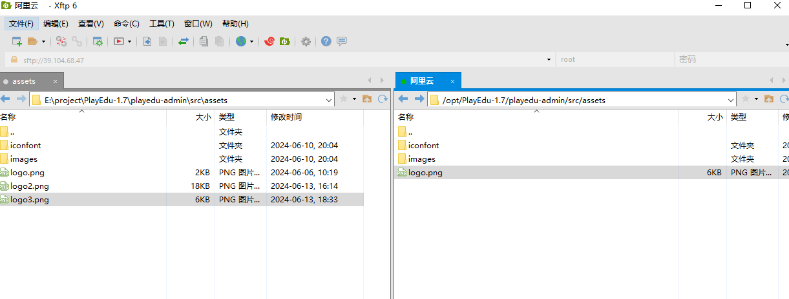
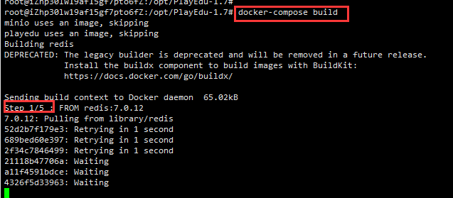
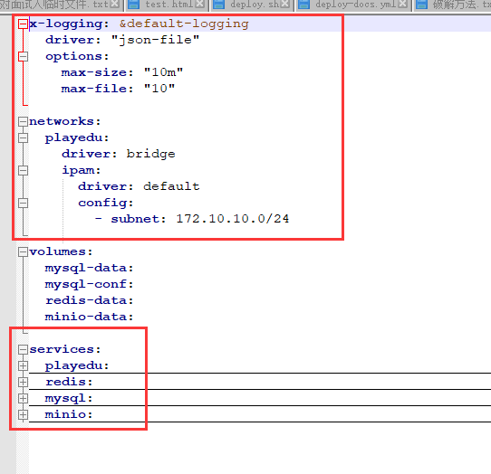
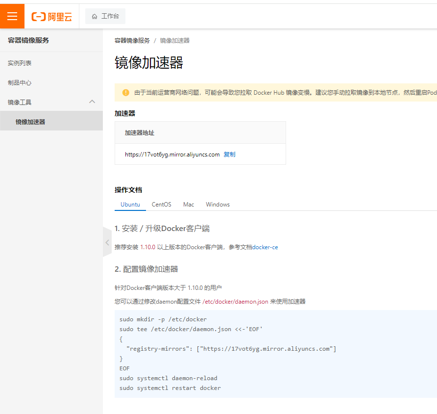
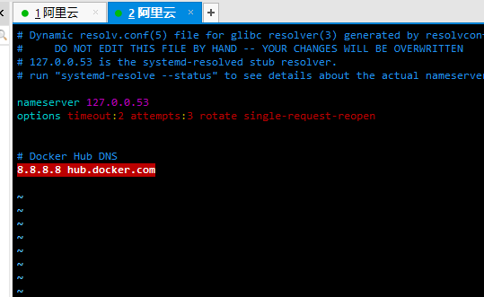
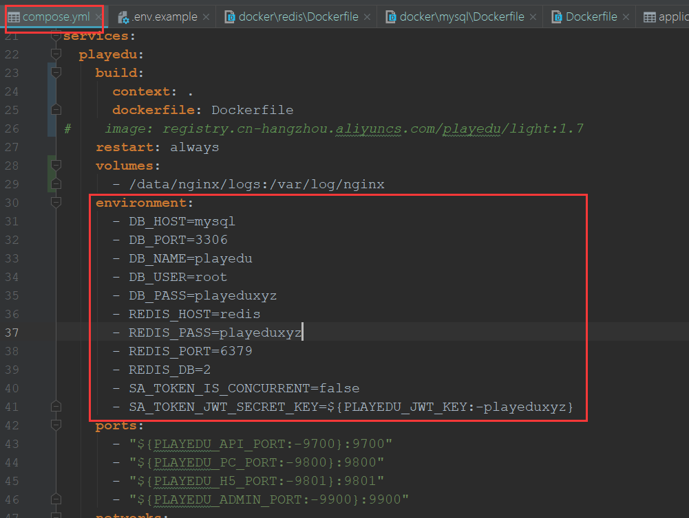
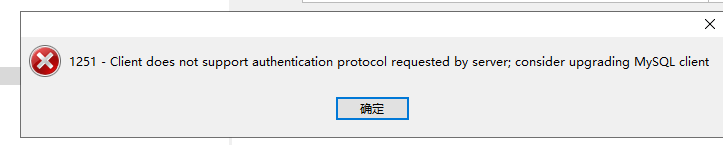
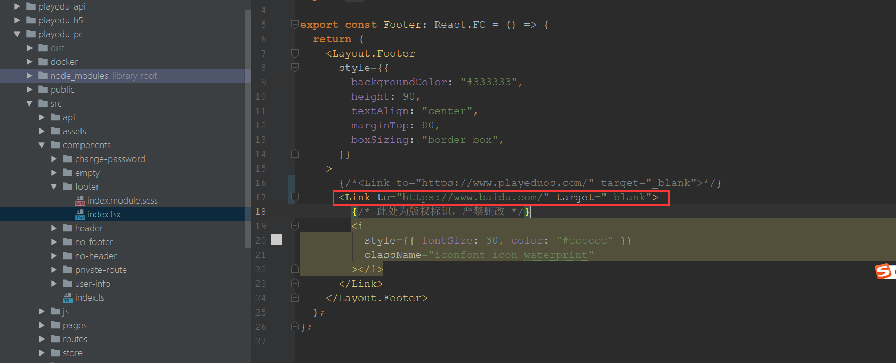

```
title: 2、阿里云部署
date: 2024-06-13
```


# 2、阿里云部署


#### 		1、copy与解压项目

​	

​				

​				unzip PlayEdu-1.7.zip

​				如果没有unzip安装unzip

```sh
apt install unzip
```

​	解压完成：




#### 	2、logo替换




#### 	3、项目启动

​		docker-compose安装

https://faq.playeduos.com/opensource-maintenance-handbook/article/GGIiSyzeaB

​	没有docker会报以下错误

```
Command 'docker-compose' not found, but can be installed with:
snap install docker          # version 24.0.5, or
apt  install docker-compose  # version 1.29.2-1
See 'snap info docker' for additional versions.

```


​	安装docker

```
snap install docker

# 安装docker-compose
apt  install docker-compose
```


使用docker-compose安装

```
docker-compose build
```




​	安装的过程中一共需要5个步骤



​	设置挂载文件夹权限

```
# #### 这里是注释的话，无需执行 ####
# 命令解释：给 data 授权可读、可写、可执行权限
# data 目录将会挂载到容器以用来数据化持久存储(更多知识请自行了解 docker 数据卷)
chmod a+rwx data
```


​		运行服务 mysql redis minio

```
sudo docker-compose up -d mysql redis minio
```


​	启动项目

```
docker-compose up -d playedu
```


#### 	4、安装过程中遇到的问题

```
error pulling image configuration: download failed after attempts=6: dial tcp 31.13.87.34:443: i/o timeout
ERROR: Service 'redis' failed to build : Build failed

```

​	有可能是docker镜像源的问题，可以修改docker的镜像源

​	可以在 `/etc/docker/daemon.json` 文件中配置镜像加速器，例如：

```
{
  "registry-mirrors": ["https://registry.docker-cn.com"]
}
```

然后重新启动Docker：

```
sudo systemctl restart docker
```


​	原因可能是阿里服务器需要镜像加速

["https://17vot6yg.mirror.aliyuncs.com"]



​	

```
sudo systemctl daemon-reload
sudo systemctl restart docker
```


​		检查docker状态

```
systemctl status docker
```


​	修改DNS尝试

```
vim /etc/resolv.conf 
```





#### 	5、数据库相关

​				数据库相关的用户名和密码在环境变量中设置




​		连接报1251

​	升级数据库客户端版本即可




#### 	6、修改页脚




