# 3、阿里云容器镜像服务

​			https://cr.console.aliyun.com/cn-huhehaote/instance/new

#### 	1、创建个人版

​	注册

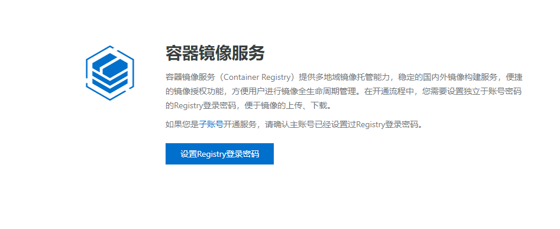

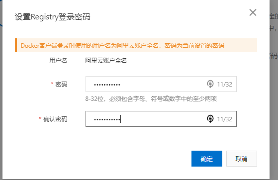

​		创建命名空间

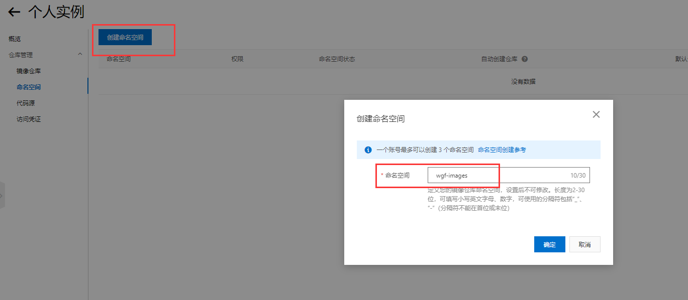

​		现在我们需要4个变量

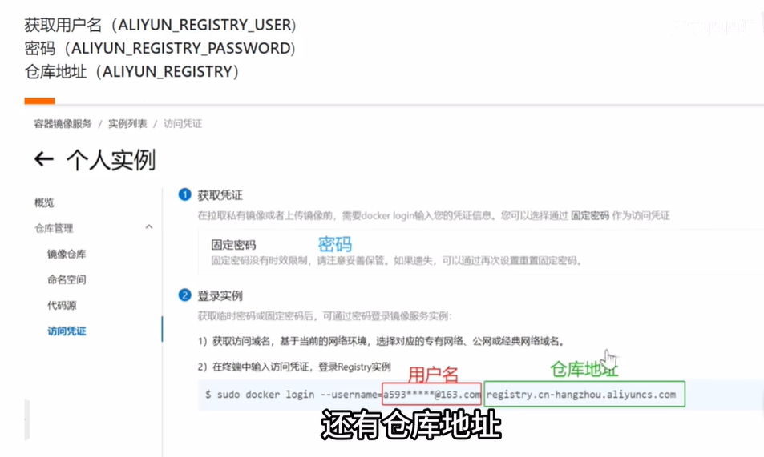

#### 2、github配置

​		先把项目fork到自己的空间

[https://](https:)github.com/tech-shrimp/docker_image_pusher

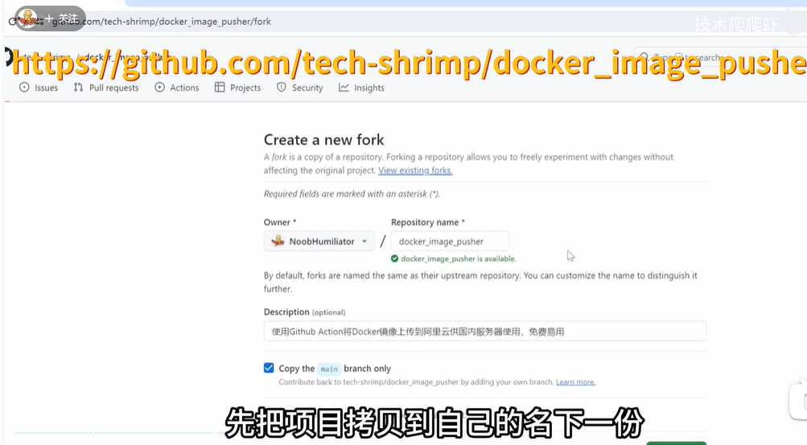

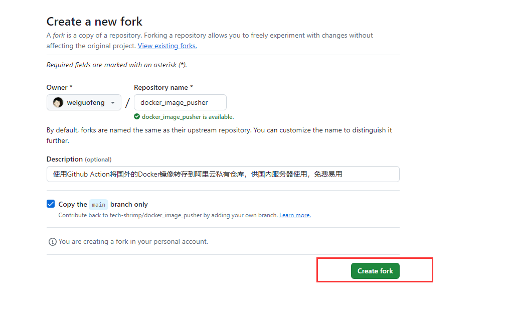

​			然后进入项目setting -- action

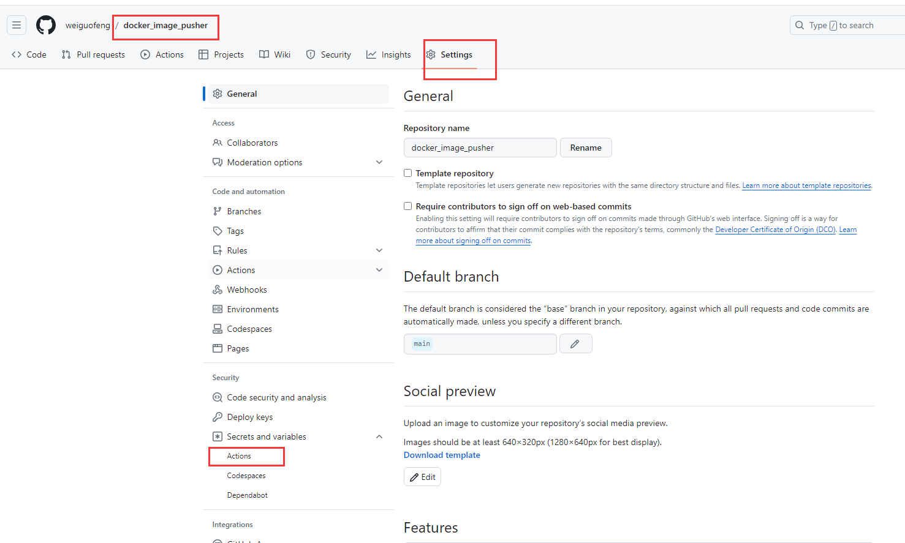

​			创建变量

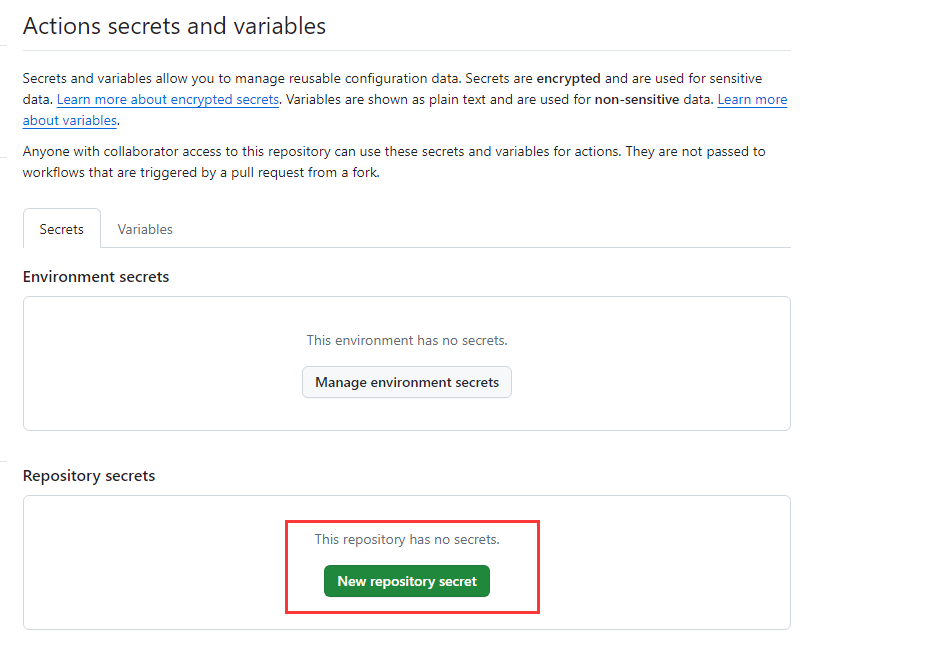

​			这个阿里云命名空间 

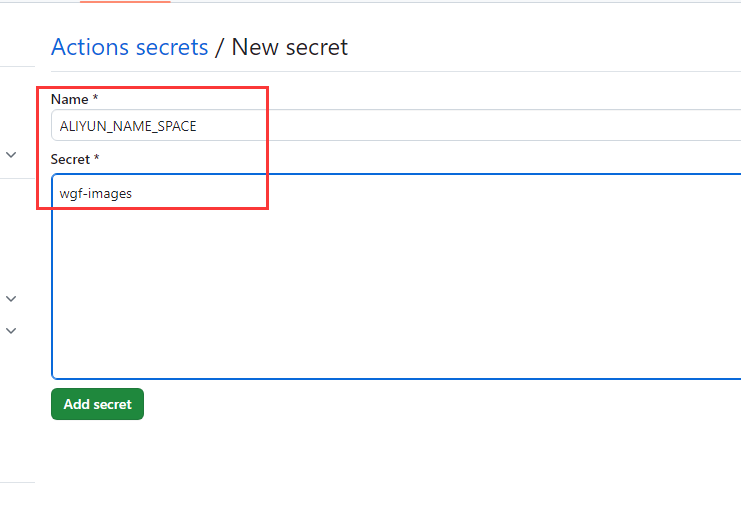

​			用户名

​		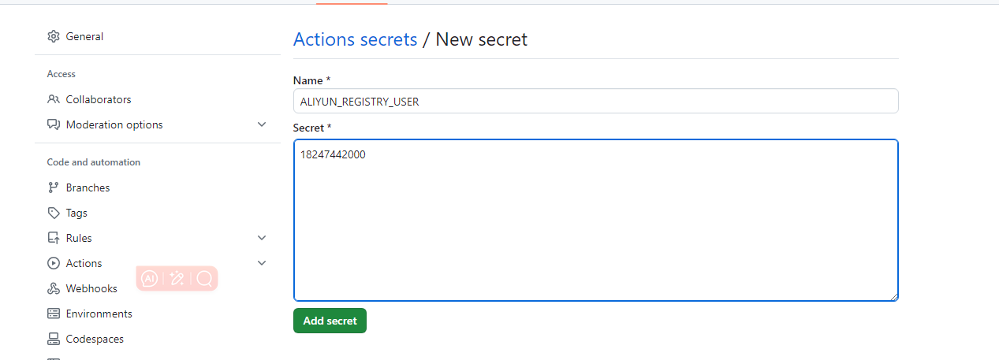

​	密码

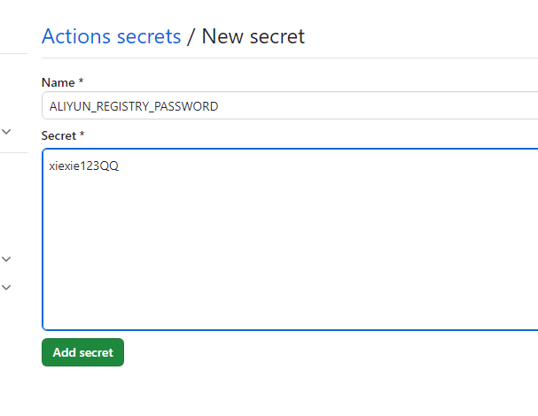

​		仓库地址

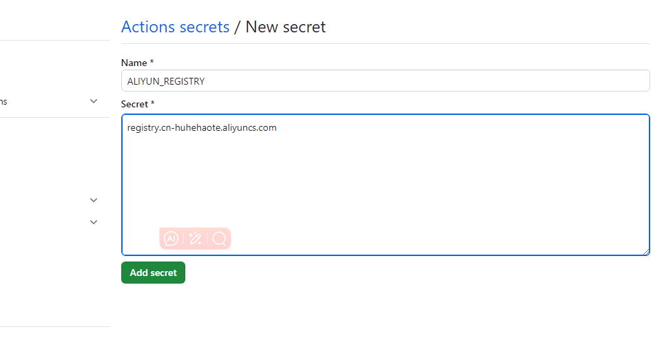

#### 3、点击action

​		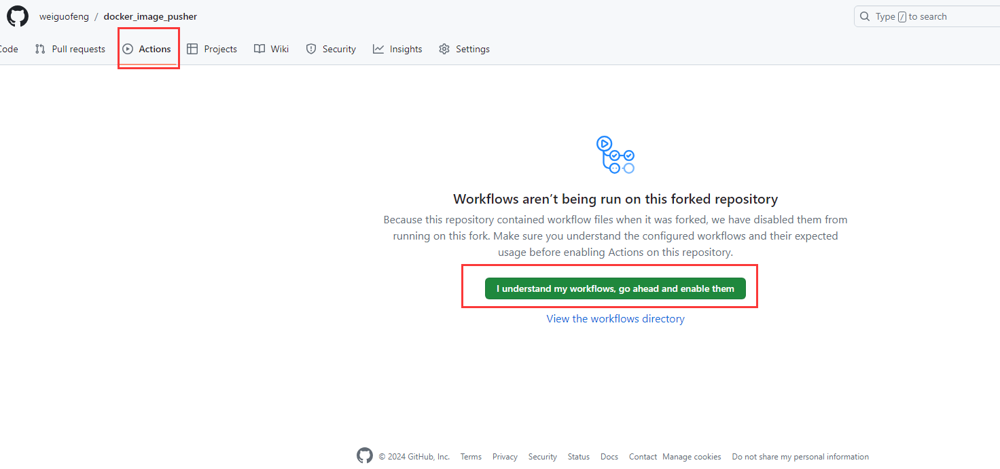

​			然后我们返回code，编辑一下自己需要的镜像名称

​	例如想要python copy到文件末尾就可以了

https://hub.docker.com/_/redis/tags

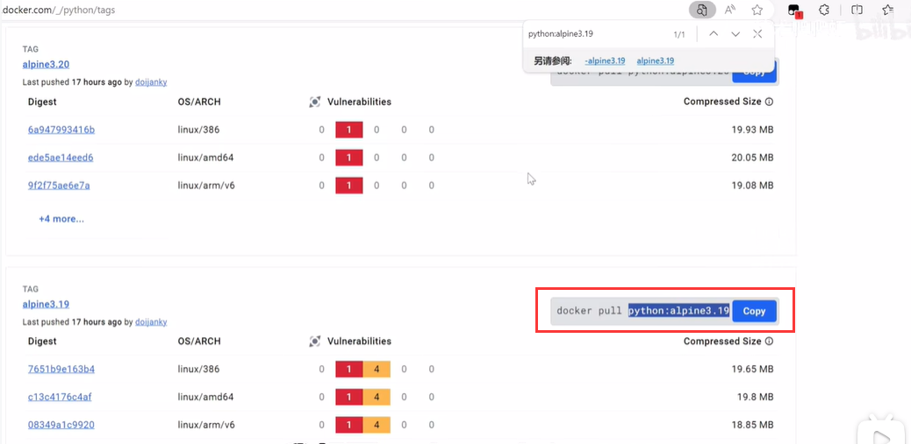

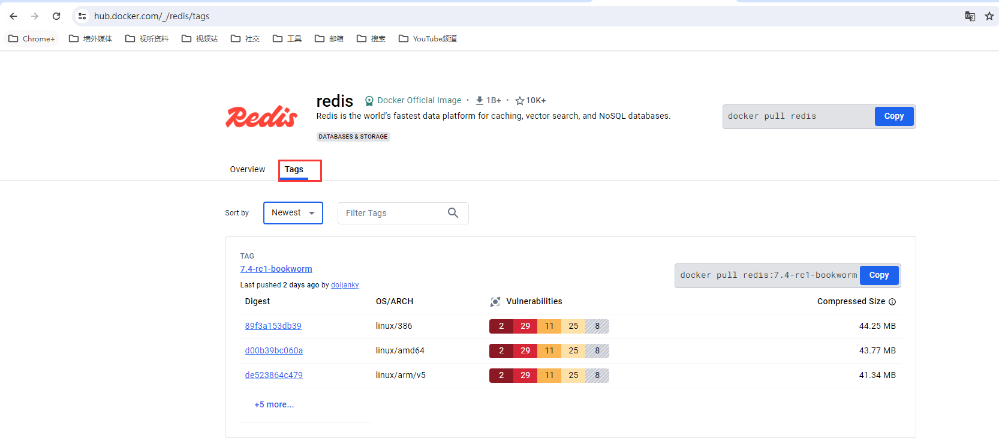

​		然后右上角点击 commit change 提交修改

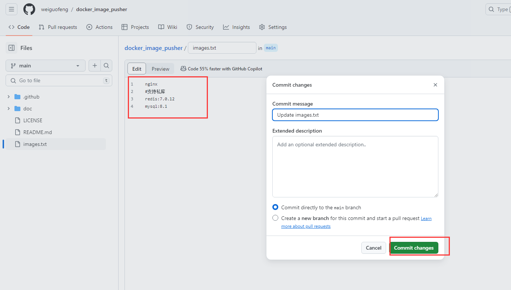

我们点击Action可以看到已经开始构建了

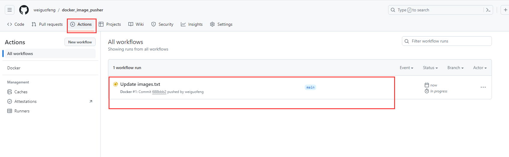

执行完成

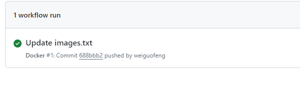

#### 4、回到阿里云仓库

​	可以看到我们的镜像都拉取下来了

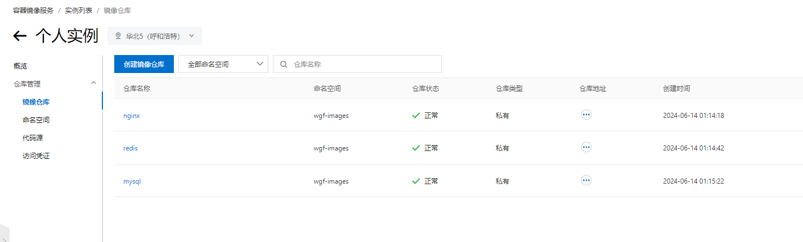

​	然后我们点击仓库里的镜像--就可以看到拉取的命令了

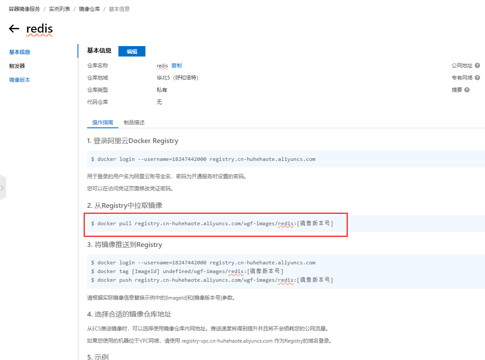

​	将仓库设置成公开否则可能无法拉取

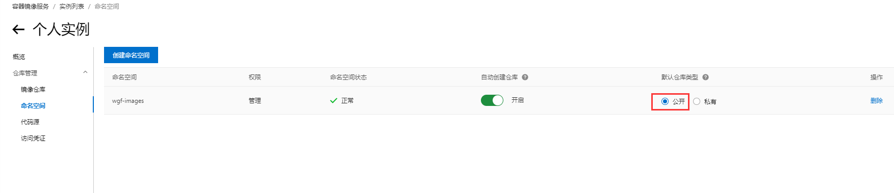

​	

​	拉取成功

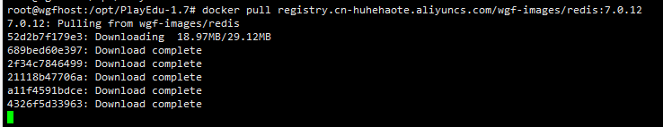

mysql也拉取成功

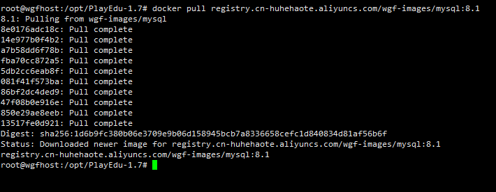

​		开放安全组

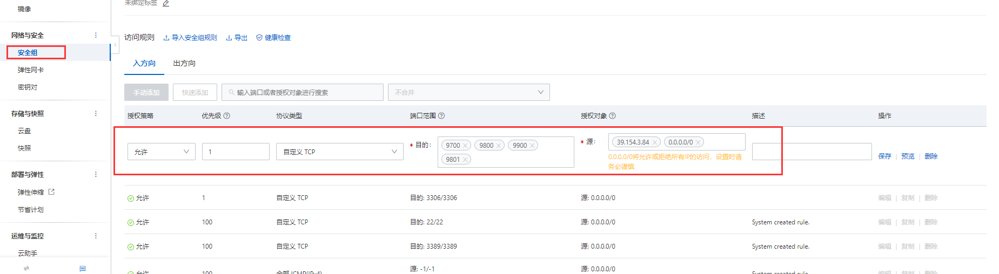

​	视频地址：https://www.bilibili.com/video/BV1Zn4y19743/?spm_id_from=333.337.search-card.all.click&vd_source=243ad3a9b323313aa1441e5dd414a4ef

