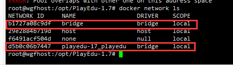

```
title: docker-compose重新构建
date: 2024-06-14
```


# 4、docker-compose重新构建

​	停止并移除服务

docker-compose down


​	删除自定义网络

```

docker-compose down --rmi all --volumes --remove-orphans

```


​	重新构建

```
docker-compose build
```


​	启动

docker-compose up -d mysql redis


#### 	2、问题处理

​	配置了两个不同的`docker-compose.yml`，使用了相同的网段，导致了在运行第二个yml文件时命令行报错`目标网段已存在`，报错如下:

```
ERROR: Pool overlaps with other one on this address space

```

因为目标网段已经存在的原因，通常这发生在将要创建的networks手动指定了subnet网段地址的时候(比如用docker-compose.yml编排容器，自定义了网段，并手动指定了各个容器的ip地址)。


​	查看docker网卡

​		docker network ls




​		删除docker网卡

docker network rm 【NETWORK ID】 网络名称

```
docker network rm b1727a08c9df bridge

```


