```
title: 6、virtualbox安装unbantu系统
date: 2024-06-14
```


# 6、virtualbox安装unbantu系统


#### 	1、安装镜像

​			清华镜像源

​				https://mirrors.tuna.tsinghua.edu.cn/

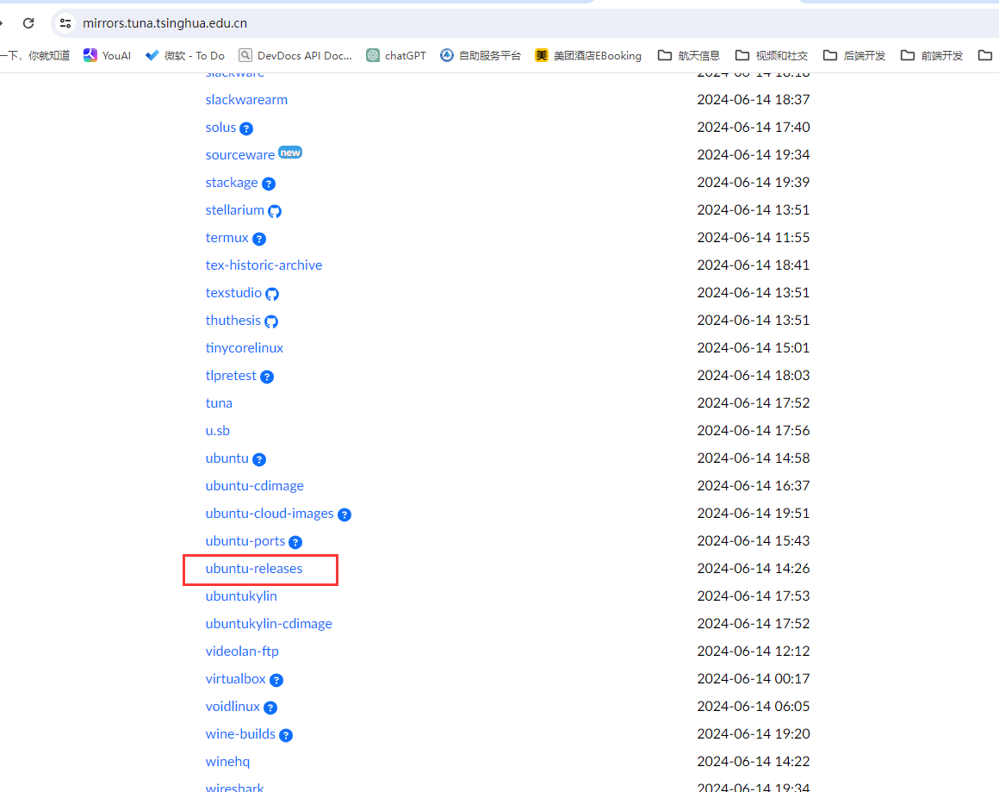


​			找到release版本

​	选择对应的桌面版本或者是服务器版本

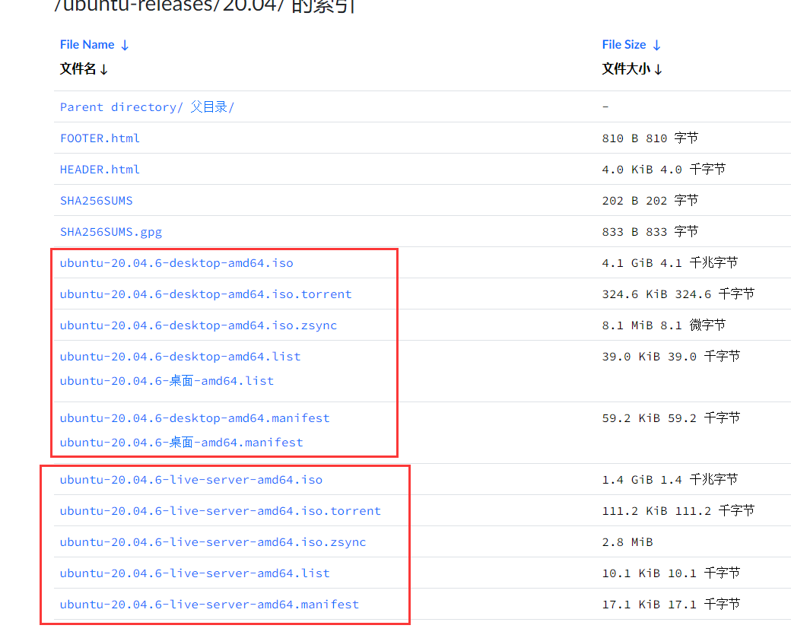


​	然后使用光驱加载我们下载的系统

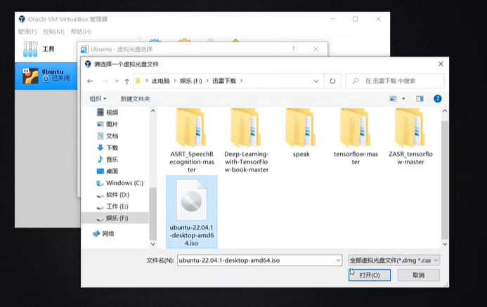


​			新建服务器 -- 选择磁盘放的位置

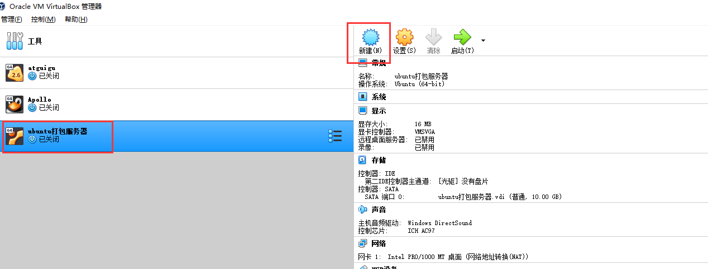


#### 		2、光驱加载镜像

​		设置中--存储--虚拟光盘选择 --注册 

​			然后选择我们的ios系统


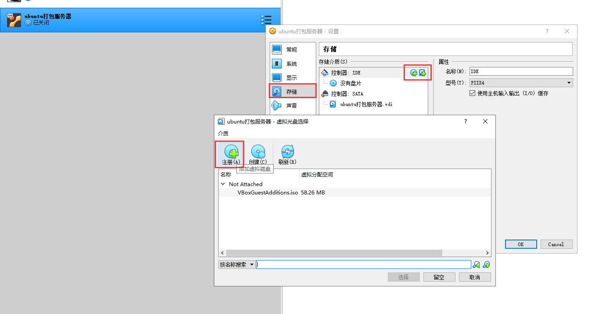


​	然后启动就可以了

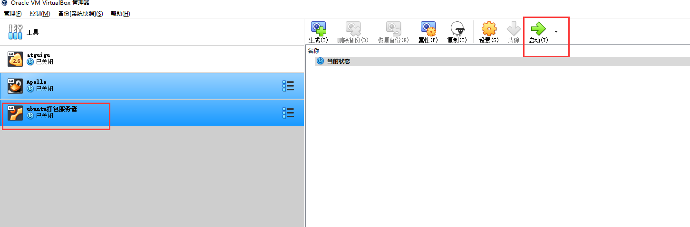


#### 	3、错误处理

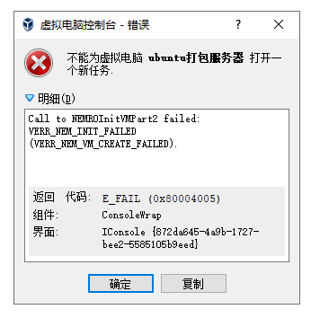

​		需要以管理员身份打开CMD然后执行

```
bcdedit /set hypervisorlaunchtype off
```

​	这样就关闭hypervisor服务，然后重启电脑就可以了


#### 	4、调整一下分辨率


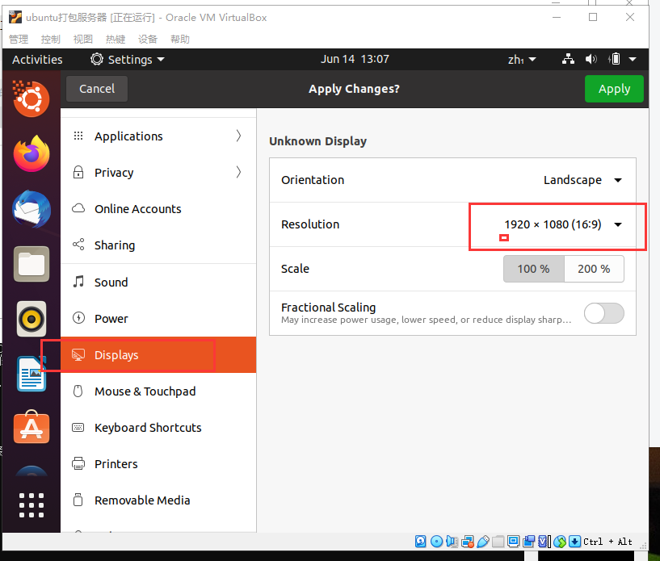


#### 	5、分区

​	新建分区

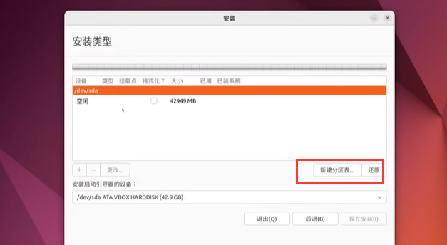


​	新建2048的boot用于启动

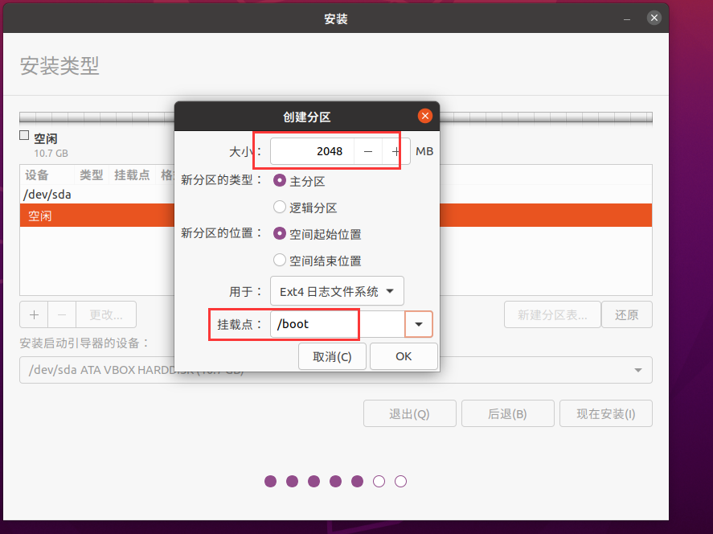


​	交换空间--和实际内存一致

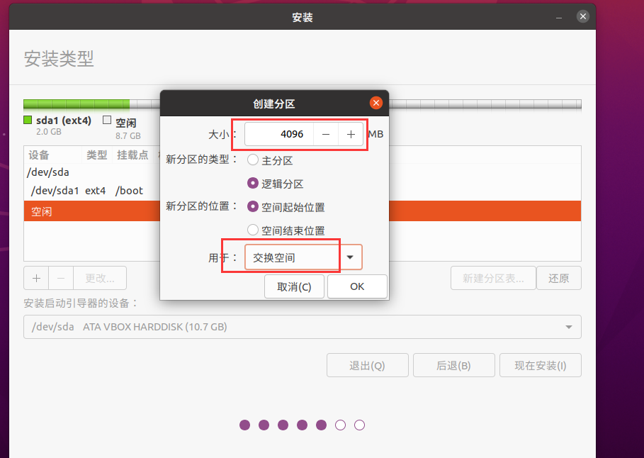


​	然后分配跟目录和home目录的大小

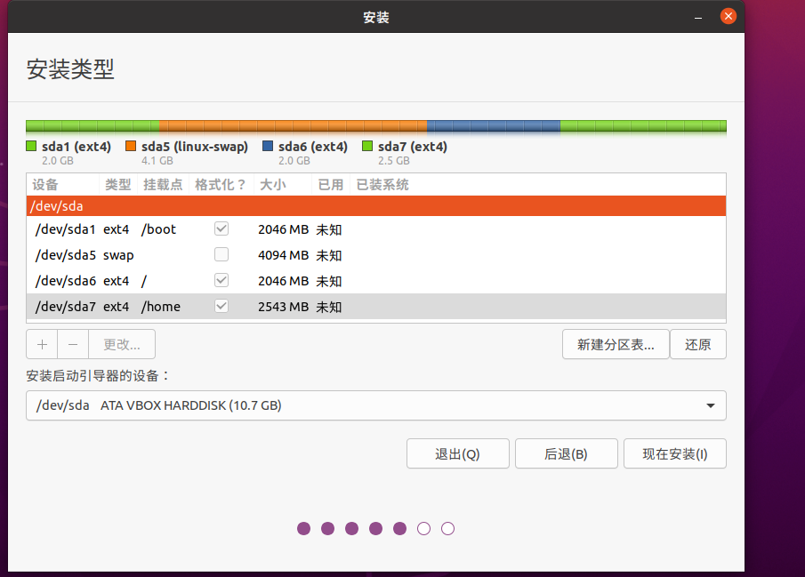


​	

​	然后一直继续安装就可以了--设置用户名和密码

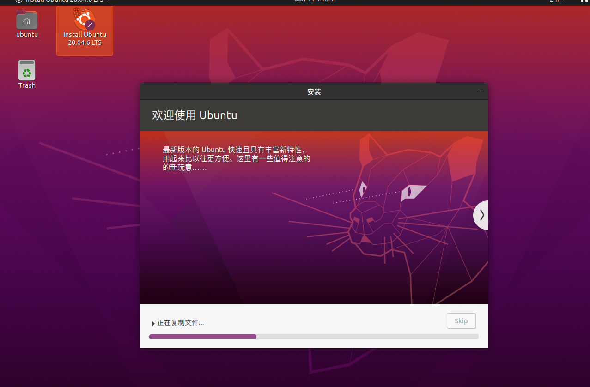


https://www.bilibili.com/video/BV1qZ4y187f8/?spm_id_from=333.337.search-card.all.click&vd_source=243ad3a9b323313aa1441e5dd414a4ef


#### 	5、root用户密码的问题

​		修改配置文件，然后重启ssh

​		https://blog.csdn.net/a6661314/article/details/123341431


