# 7、使用docker-compose打包服务镜像


## 1、docker相关

#### 	1、安装docker

​		初始化操作

```
# 停止防火墙 -- 如果没有防火墙 安装命令apt install firewalld

systemctl stop firewalld
setenforce 0
```


​		安装docker

```
yum install docker
或者 apt install docker

#可能还需要一步
apt install docker.io

# 查看版本
	docker version
```

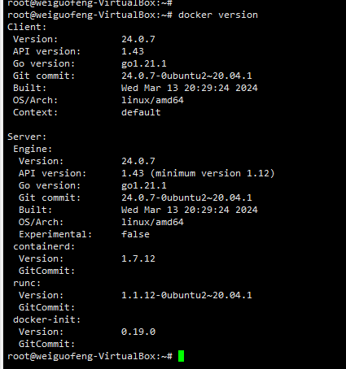


#### 	2、设置开机启动docker


```
systemctl enable docker


```


#### 	3、安装docker-compose


```
curl -L "https://github.com/docker/compose/releases/download/v2.11.1/docker-compose-$(uname -s)-$(uname -m)" -o /usr/local/bin/docker-compose


```


​	设置权限

```text
chmod a+x /usr/local/bin/docker-compose
```

​	

​	查看版本

​	docker-compose --version


## 	2、安装打包环境

#### 	1、安装node18

1. 首先，打开终端。
2. 使用curl下载Node

```
wget https://nodejs.org/dist/v18.17.1/node-v18.17.1-linux-x64.tar.xz

# 解压node
xz -d node-v18.17.1-linux-x64.tar.xz
tar -xvf node-v18.17.1-linux-x64.tar

# 移动目录
mv node-v18.17.1-linux-x64 /usr/local/soft/

# 删除以前的连接 新安装不需要删除
# rm /usr/local/bin/node
# rm /usr/local/bin/npm

# 创建符号链接供命令行使用--这里注意路径的，如果安装的路径有变化，写实际路径
ln -s /usr/local/soft/bin/node /usr/local/bin/node
ln -s /usr/local/soft/bin/npm /usr/local/bin/npm

# 查看版本
	node -v
	npm -v
	

```

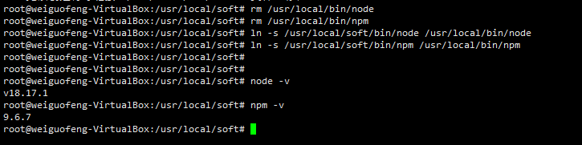

​		其实最终使用的是镜像打包，无需安装node在本地


#### 		2、离线安装docker

​			参考https://blog.csdn.net/weixin_42571882/article/details/134015815


#### 3、安装docker注意事项

​					Ubuntu系统安装docker 可以使用apt的方式，也可以使用snap的方式（有坑-与传统使用方式有区别-不建议此安装）

​					清除docker缓存的时候 docker system prune -a   如果镜像、容器--未使用会被清除掉


#### 	4、容器进入

​			如果需要进入容器 docker exec -it b92f5020828c /bin/sh


## 3、打包镜像

#### 	1、修改docker-compose

```
	docker-compose build
```

​	

​		执行过程中遇到错误

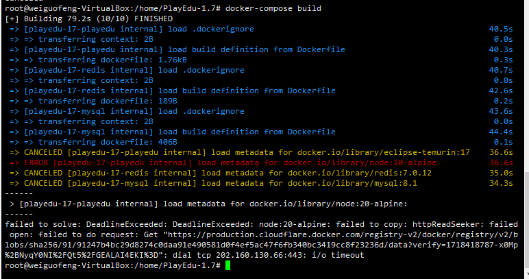

​		原因是缺少node20这个镜像

​	在docker-hub中找到这个

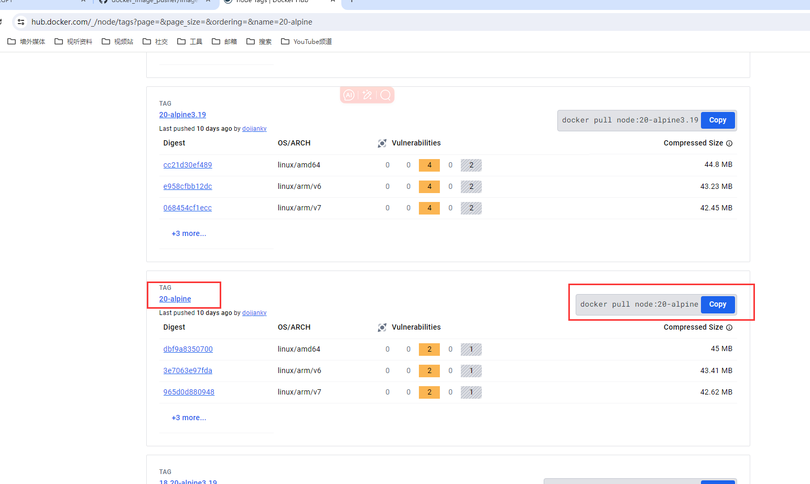


​	然后使用github的工作流放入到我们自己的镜像仓库

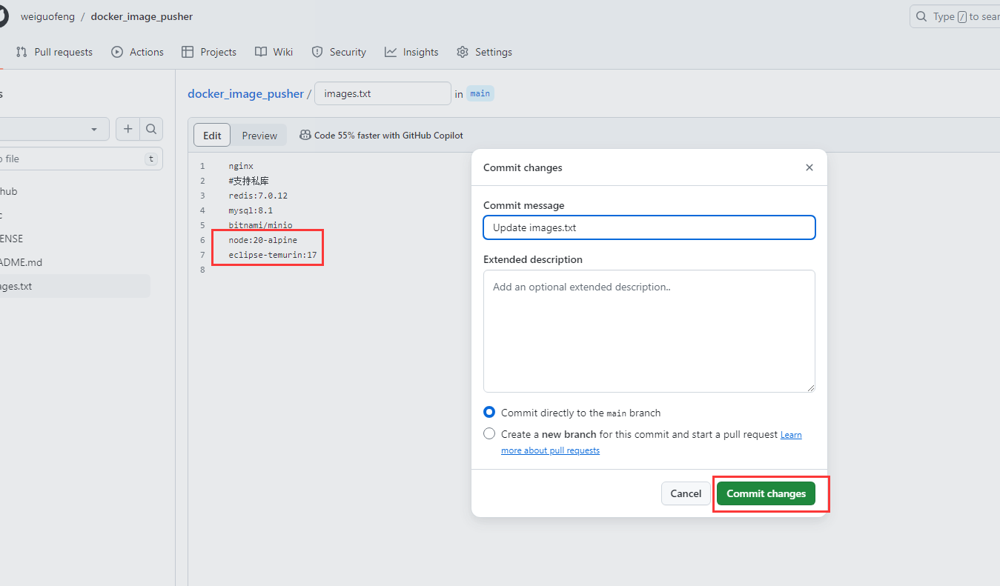

#### 	2、拉取缺失的镜像

```
# 获取node
docker pull registry.cn-huhehaote.aliyuncs.com/wgf-images/node:20-alpine

# 获取Java17
docker pull registry.cn-huhehaote.aliyuncs.com/wgf-images/eclipse-temurin:17

docker pull registry.cn-huhehaote.aliyuncs.com/wgf-images/redis:7.0.12

docker pull registry.cn-huhehaote.aliyuncs.com/wgf-images/mysql:8.1

docker pull registry.cn-huhehaote.aliyuncs.com/wgf-images/minio


```

​	拉取完成

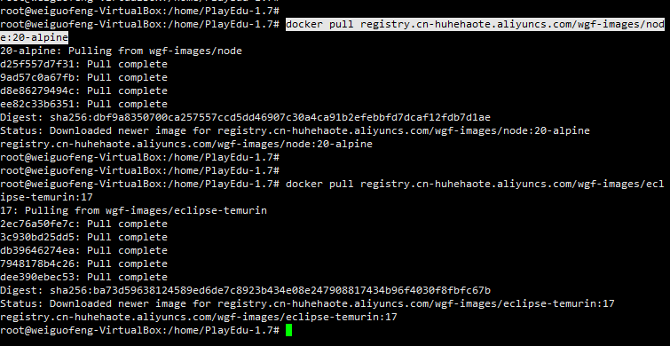


#### 	3、镜像存在build的时候报找不到镜像

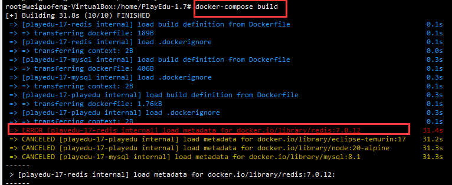

​			清理docker缓存

#### 	4、清理Docker缓存-磁盘空间不够

清理Docker缓存有时可以解决构建问题：

```
docker system prune -a
```

这将删除所有未使用的数据，包括所有停止的容器、所有未使用的网络、所有未被一个以上容器所使用的镜像和所有未使用的构建缓存。


#### 	5、问题处理

​			其实与镜像的名称是相关的

​			registry.cn-huhehaote.aliyuncs.com/wgf-images/redis并不能代表redis镜像

​			所以需要修改docker-compose和dockerfile文件

这样就可以进行构建了

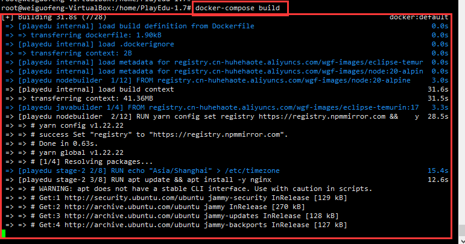


​	打包过程中在构建Maven时候报错

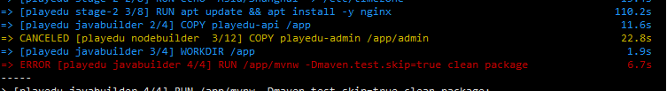


​		需要给项目中使用的mvnw添加权限 -- 本项目是在playedu-api中

```
	chmod +x mvnw
```


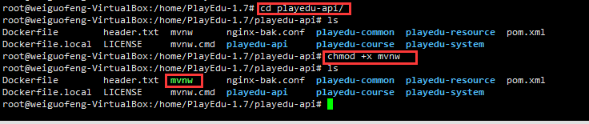


​		全部打包完成，大约需要20分钟

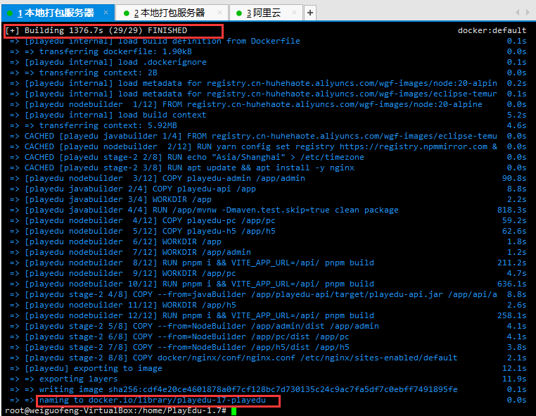

​	

​		可以看到打包完成的镜像

​			

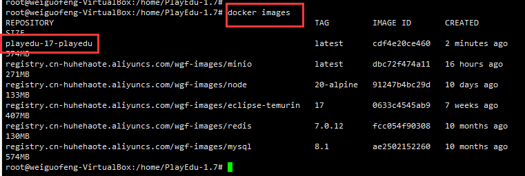


## 4、保存镜像

​		保存打包好的镜像

```
 docker save -o playedu.tar playedu-17-playedu
 
 
 
```

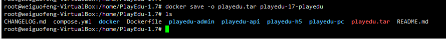


## 5、上传到阿里云镜像


## 6、更新项目最新镜像


## 7、加载本地镜像

​		导入镜像前删除之前的镜像

```	
docker rmi <image_id>
```


​		导入本地镜像

```
docker load -i playedu.tar

```

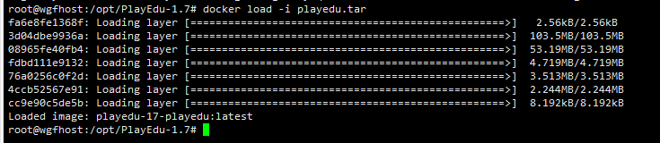

​	

​		修改compose文件

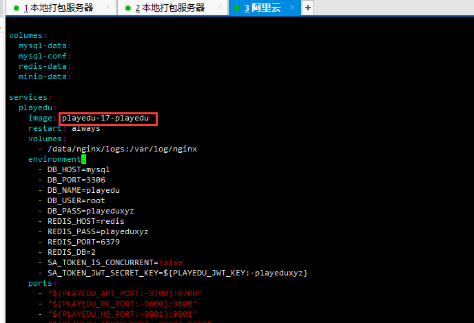


​		更新项目--docker-compose up -d playedu

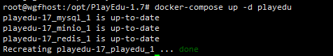


## 	8、域名解析

​		使用购买阿里云域名39.104.68.47

​		域名备案和ICP实名认证通过后才可以解析

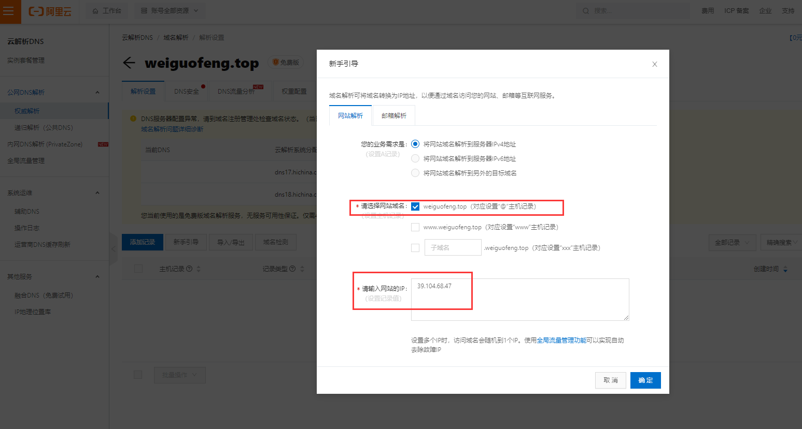


​			需要ICP备案认证https://beian.aliyun.com/pcContainer/siteInfo?baOrderId=2030449508085&orderType=1

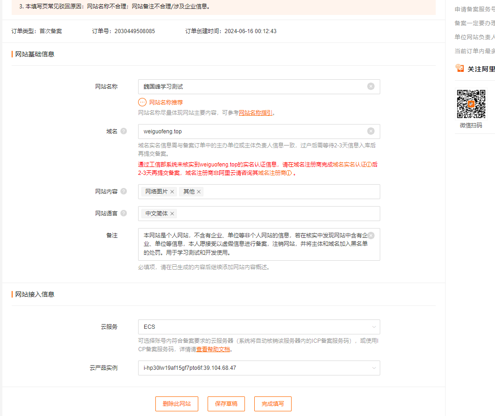


#### 		1、域名转发映射端口


​			参考知乎

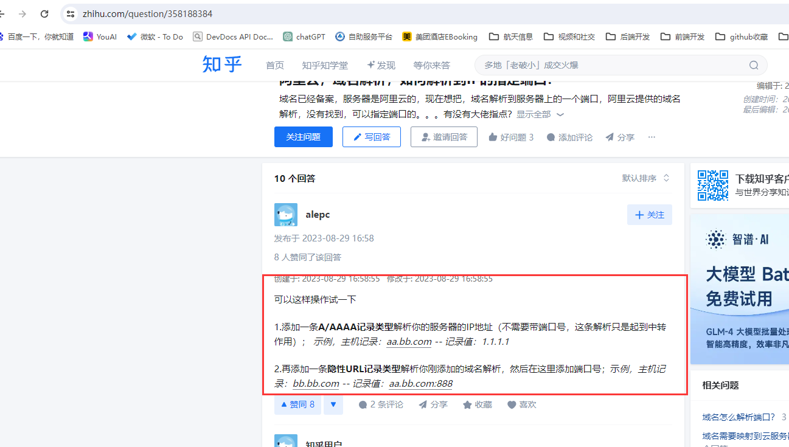


参考https://blog.csdn.net/weixin_40208374/article/details/133353980


