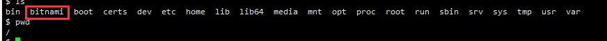
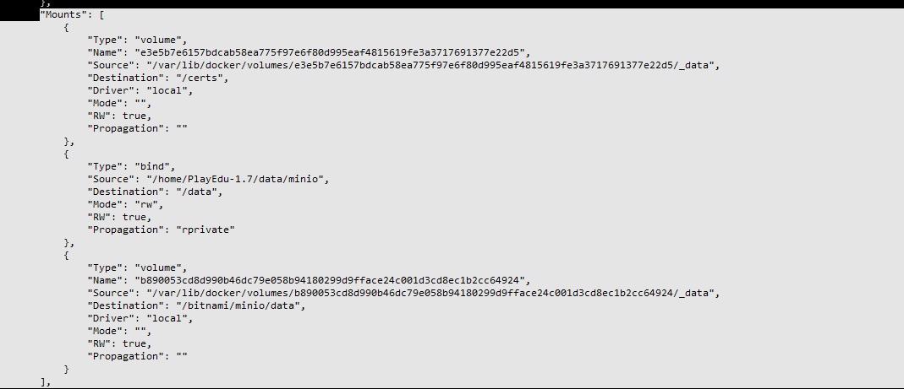
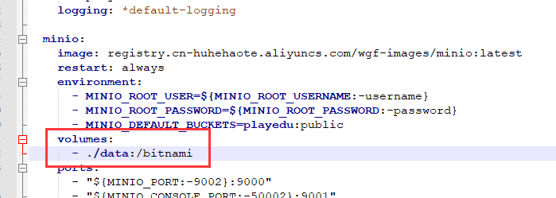
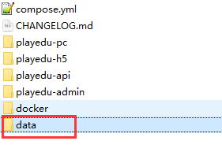
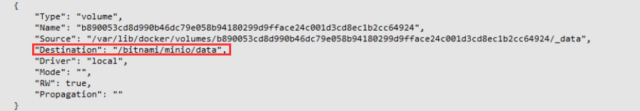

# 8、关于数据备份问题


## 	1、minio相关

​			目前minio默认是放在根路径下




​		这样是将宿主机的文件copy到容器bitnam文件夹中

```
docker cp /home cf1e3a339f35:/bitnami

```

​		

​		**将容器内容copy到本地**

```
docker cp cf1e3a339f35:/bitnami /home本地路径


```


​		minio在容器中默认的安装路径是/opt/bitnami/minio/bin/minio


## 2、容器进入

​			如果需要进入容器 docker exec -it b92f5020828c /bin/sh

​		进入容器如果不能使用tab提示，切换/bin/bash


## 3、容器检查

​			有时候我们需要检查一下容器 挂载目录等信息

检查输出中的 `Mounts` 部分

```
 sudo docker inspect 87fd43741396 容器id
```




##  4、存储卷持久化到宿主机

​	这个只需要我们修改docker-compose中的存储卷配置即可

​		前面的路径代表--宿主机路径，路径不存在的话 docker是会自动创建的，而且会给应有的权限

​		如果权限不放心--还是自己检查一下给最高权限

```
	# -R 是包括全部子文件夹
	chmod -R 777 文件夹
```



​			./data这个当前文件夹的data目录没有，但是重新更新启动后会自动创建--注意：**目录还是需要检查的可能没有完全创建**




## 		5、持久化的操作

#### 			1、停止容器

```
	docker-compose stop 容器名称
```


#### 			2、删除容器及卷

​					如果是线上环境操作记得备份 -- 操作容易发生问题

```
	docker rm -v 容器id
	# 使用 -v 是将volume也删除了
```


#### 			3、启动容器

```
	docker-compose up -d 容器名称
```


#### 			4、检查挂载存储卷

```
	docker inspect 容器id
	# 显示容器的检查详情 -- 在挂载Mount下显示挂载的卷
```


#### 			5、检查权限

```
	# 可能持久化权限问题导致项目有问题无法写入数据等，给最高权限
	chmod -R 777 文件夹
```


#### 			6、删除卷

​			这个操作你必须了解你删除的内容是什么，可能造成什么影响及备份和恢复具备这样的能力

​			否则不要操作

```
	docker volume rm 卷id --可以是多个卷id，逗号分割
	
	确定自己需要删除的卷
	docker volume ls
	
	删除卷
	docker volume rm volume_name volume_name
	
	
	删除容器及卷：
	docker rm -v container_name
```


### 6、分析问题

1. **多个挂载点**:

   - 容器内有多个路径被挂载到不同的主机路径或 Docker 卷上。
   - `/data` 路径是一个绑定挂载到 `/home/PlayEdu-1.7/data/minio`。
   - `/bitnami/minio/data` 路径是一个 Docker 卷挂载。

2. **数据保存问题**:

   - 如果 Minio 配置数据路径为 `/bitnami/minio/data`，而不是 `/data`，那么数据将不会保存到 `/home/PlayEdu-1.7/data/minio`。

     ​	因为已经存在相同的挂载点了

     

   - 我们需要确保 Minio 使用 `/data` 作为数据路径。

### 7、解决方案

1. **修改 Minio 数据路径**:
   - 确保 Minio 数据路径为 `/data`，并映射到宿主机目录。
2. **更新 Docker Compose 文件**:
   - 移除不必要的挂载点，确保只使用一个路径作为数据目录。


## 	以下是GTP建议

### 使用 Docker 存储卷

#### 优点

1. **简化管理**：
   - Docker 自动管理卷，简化了配置和备份。
   - 存储卷独立于容器生命周期，方便容器的启动、停止和重建。
2. **跨主机迁移**：
   - 使用 Docker 卷插件，可以在多个主机之间迁移数据。
3. **性能优化**：
   - 卷通常在 Docker 的存储层中进行优化，性能较好。

#### 缺点

1. **不透明**：
   - 卷的数据存储位置不直观，管理和访问不便。
2. **依赖 Docker**：
   - 数据依赖 Docker 的存储机制，迁移到非 Docker 环境可能复杂。

### 持久化到宿主机指定文件夹

#### 优点

1. **透明和易管理**：
   - 数据存储在指定路径，方便访问和管理。
   - 可以直接使用标准的文件系统工具进行备份和恢复。
2. **灵活性**：
   - 容器外的进程也可以直接访问这些数据。
   - 数据可以轻松迁移到其他环境（例如非 Docker 环境）。

#### 缺点

1. **配置复杂性**：
   - 需要手动配置挂载点和权限，增加配置和维护工作量。
2. **潜在的性能问题**：
   - 文件系统的性能可能受限于宿主机的 IO 性能和文件系统类型。

### 选择建议

1. **短期测试和开发**：
   - 使用 Docker 存储卷，可以快速部署和迭代，不需要复杂的配置。
2. **生产环境和长时间运行的服务**：
   - 持久化到宿主机指定文件夹，方便管理、备份和迁移。
   - 确保正确配置权限和路径，避免权限问题。


