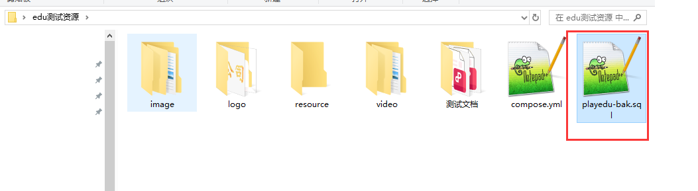
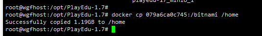
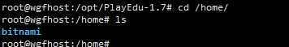

# 9、关于项目数据


​			原始：admin@playedu.xyz playedu


​			H5手机端学员地址：http://39.104.68.47:9801/ 账号 bb@qq.com 123456

​			前端PC学员地址：http://39.104.68.47:9800/ 账号 aa@qq.com 123456

​			后台管理地址：http://39.104.68.47:9900/  账号admin@qq.com 密码 weiguofeng

​			域名：weiguofeng.top 还未备案完成，备案完成即可使用域名访问

​			切勿上传大文件因使用测试服务器2核2G内存，3M带宽，大文件（大于1G）可能上传缓慢。


​	备份mysql文件--桌面




#### 	3、备份minio数据


​				将容器内容copy到本地

```
# /home本地宿主机路径
docker cp 079a6ca0c745:/bitnami /home


```


​		备份了1.2G内容







​						https://gitee.com/playeduxyz


