# 12.vuePress项目发布到github流水线发布

部署我们前端项目的思路：

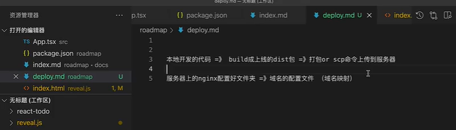

​	我们现在把build和打包dist，然后scp上传到服务器这几步操作--我们使用github Action来实现

​	我们终端执行 yarn build 进行编译构建

​	打好的包就是这个dist文件夹

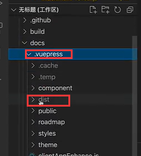

我们进入github ，然后点击项目，进入Action --new workflow 创建工作流，工作流就会把我们想做的事情给做了

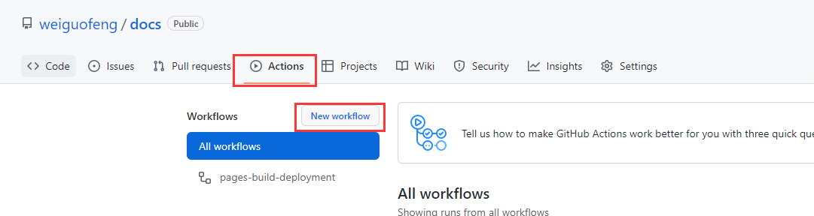

​	他里面就有很多默认的工作流模式，比如部署nodejs，或者是想部署在亚马逊的ES云上

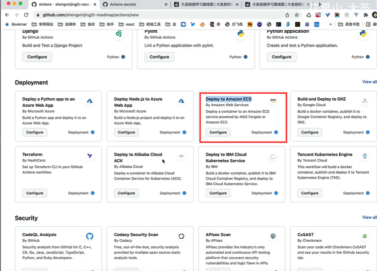

我们为了更加了解 使用  [set up a workflow yourself ](https://github.com/weiguofeng/docs/new/main?filename=.github%2Fworkflows%2Fmain.yml&workflow_template=blank)

​	这就相当于我们不使用他给的这些工作流，我们使用自己配置的-然后会给我们一个配置文件让我们自己写

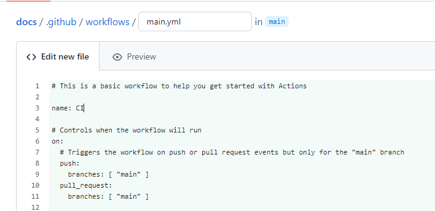

​	首先是 name：CI 我们可以改为deploy-website 给他定义一个名字

on：就是触发他的机制

​		push 就是推送代码的时候触发， main就是当main这个分支被推送代码的时候就会触发

​		pull的时候也会触发，这里我们可以把pull去掉

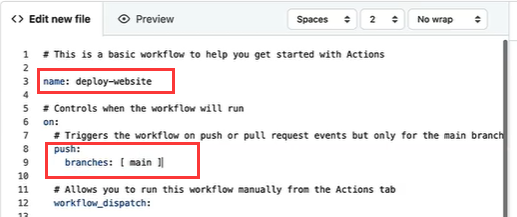

job：就是具体要执行的任务

​	build： runs-on：就是在哪个操作系统下进行构建

​	steps：这是具体步骤，我们真正改的就是这里的内容

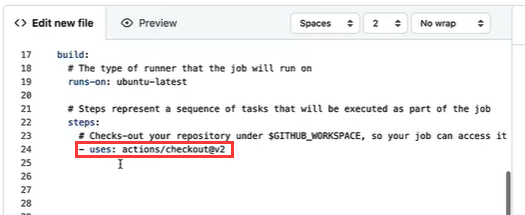

​	-uses：action/checkout@v2 是checkout我们当前的代码

​	-name：install nodejs 定义一个名字，每个任务都要有一个名字

​	-uses: 因为我们想要安装node，所以我们在右侧搜索一下node基本上都有我们需要的

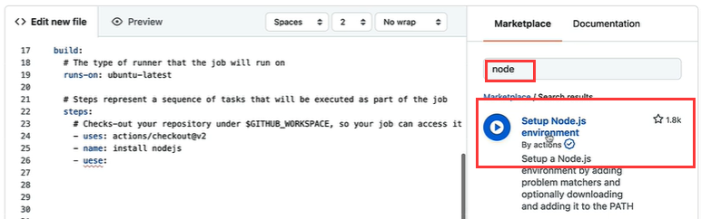

​		我们点击这个setup Node.js

然后下面这块就是我们需要安装node所需要的配置，我们copy

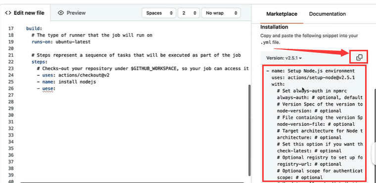

use：执行node版本

-with：就是需要安装的包

​		然后就是运行安装，构建，scp发送到服务器，指定服务器地址和密码--使用Action的变量方式

​		发送的端口是22，源是docs/ 编译后的文件使用变量的方式target：

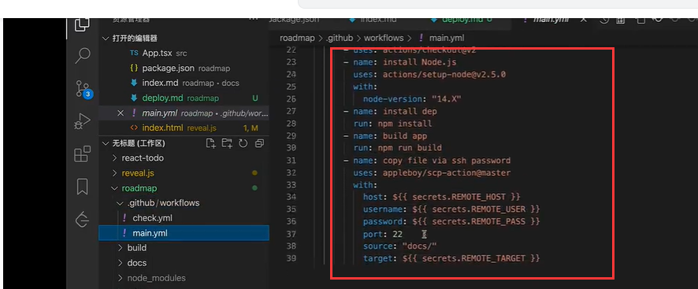

我们在github中，点小数点也可以对项目进行编辑，然后修改后也可以直接提交

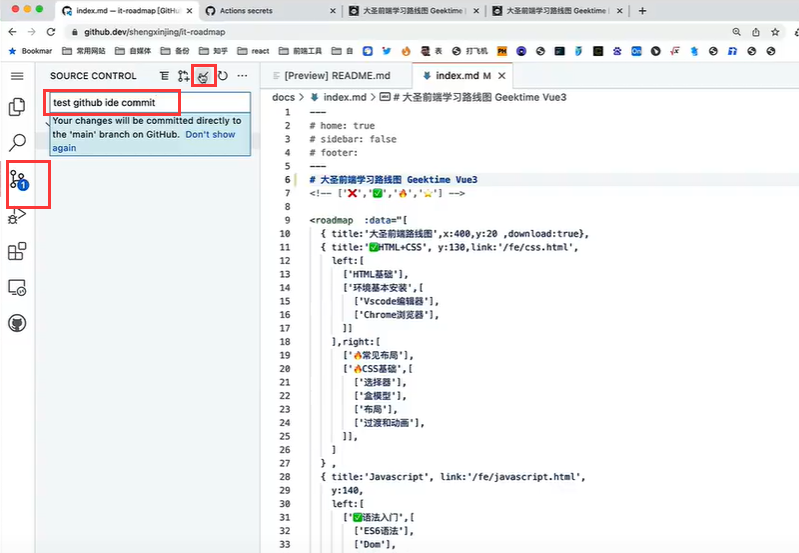

我们提交代码后就会有 工作流执行了

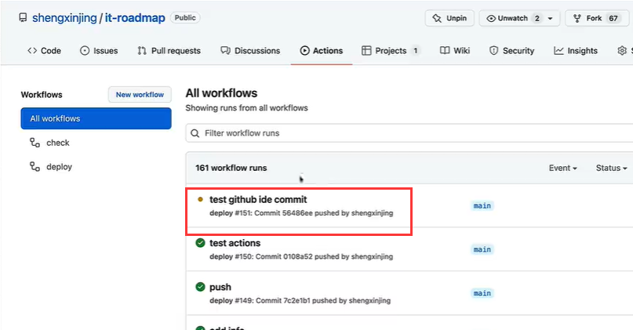

https://www.bilibili.com/video/BV1Ca411h7rx?spm_id_from=333.337.search-card.all.click&vd_source=243ad3a9b323313aa1441e5dd414a4ef

