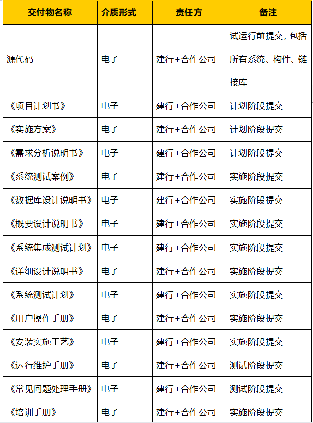
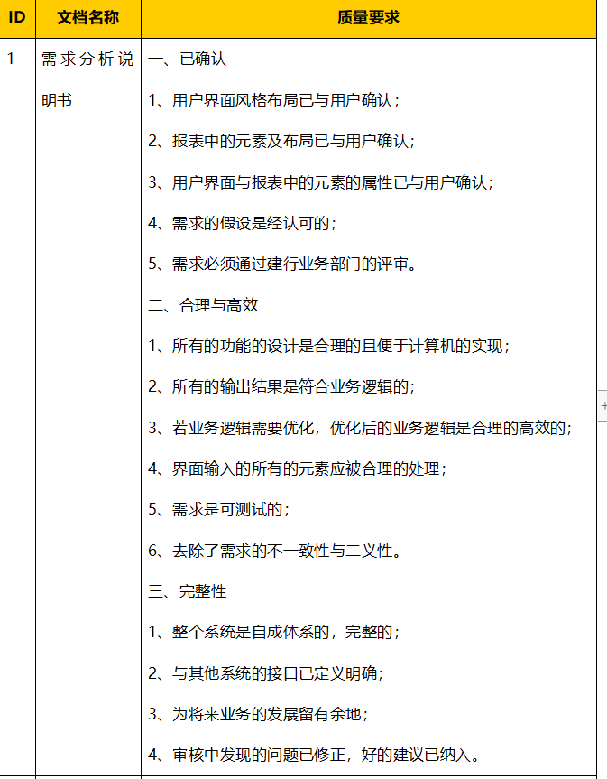
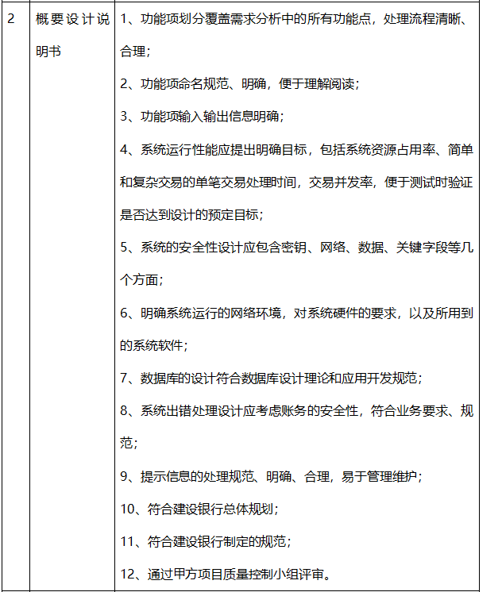
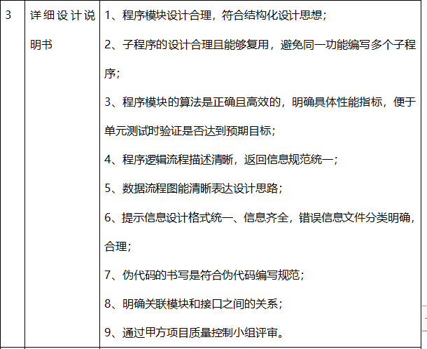
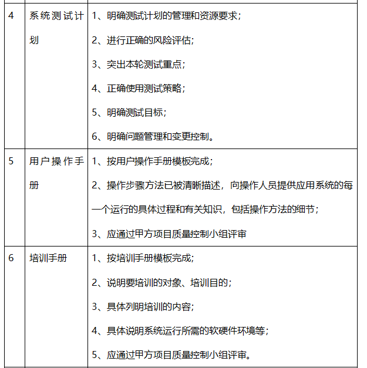
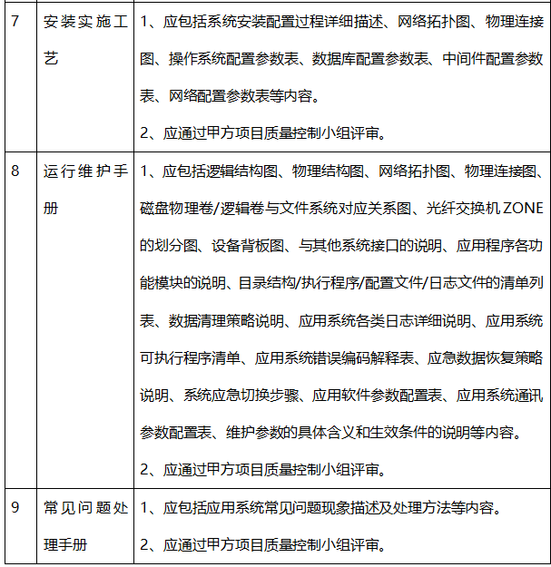

# 2021云迭代交付文档总结及要求

#### 1、服务目标

​			基础环境，网络，存储，硬件支持等，乙方为甲方提供上述全流程实施方案，包括设计、开发、测试、上线和支持服务，并提供全套源代码及相关**设计文档**等。

#### 2、工作内容

​		这里的工作内容项主要是在功能清单里面，《云融合管理开发服务功能清单》，《金融科技创新服务云平台开发服务功能清单》，工作的内容都是这俩个清单中的

​		这里要求的是--工作内容的设计文档，安装部署需要提供 **安装规程** 等资料

- 项目进度要求：工作计划文档
- 项目管理要求：项目组织，项目沟通管理及问题管理，风险管理，人力资源管理，变更管理，质量管理

#### 3、制度与规范

​			无需提供相关文档，按目前sow文档内的要求即可

#### 4、供应商及服务人员要求

​			按建总文件中的人员要求即可，无需相关文档

#### 5、工作计划

​			按服务周期计划T + * 为准

#### 6、工作成果及验收

​			保密要求，**提交件及质量标准**-这个是重点

​	以下内容都需要提交

​	这些提交件都是需要符合质量标准的--也就是说需要符合文档的 质量要求

概要设计说明书的要求

​	详细设计说明书的要求：

​		其他文件的要求：

#### 7、编写存在的疑问

​		云迭代的这个平台项目具体包括的项----SOW文档中的功能清单需要变动吗？这些功能清单都是干什么的，或者是包括什么项目，或者说是那些功能清单的子条数包括的是那个小的项目

​		例如：

​			1、《项目计划书》---具体编写什么项目的内容？还是好几个项目的合集，在原有uyun的项目计划上增加还是新编写

​			2：《需求分析说明书》---是否可以按uyun的需求分析说明书，如果增加需求--具体是那些需求，还是新写一个需求说明书--具体包括那些项目及需求的资料来源。

​			3：《实施方案》 -- 逻辑部署架构是否与提供的uyun有所区别，应用实施依赖说明 是否包括之前uyun的依赖

​			4：《系统测试案例》----具体包括那些测试案例文档？如：11.中国建设银行公有云运维管理平台_测试用例_V2.0.R16.90，-------所编写的项目包括那些项目，模块来源及项目内容。

​			5：《数据库设计说明书》-----是否包含原uyun的数据库设计及表ER图和表设计，也就是说在原有基础上改动增加还是 新的数据库设计--- 数据库设计包含那些数据库？

​			目前看到的暂时是这些问题，后续的文档还没有继续往下看

